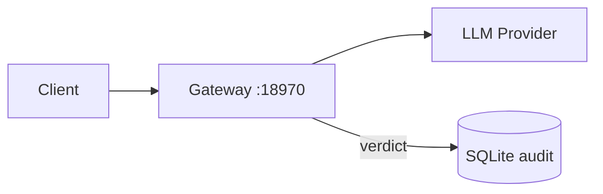

# docs-site Authoring Contract

**This file is the single source of truth for every MDX page under `docs-site/`.**

All subagents and contributors MUST read this file before writing any page. Any page that violates these rules will be rewritten.

---

## 1. Frontmatter (required on every page)

```yaml
---
title: "Human-readable title"
description: "One-sentence SEO/meta description."
order: 3
---
```

- `title`: sentence case, no trailing punctuation.
- `description`: single line, ends in a period, 140 chars or less.
- `order`: integer; determines sidebar position within the section folder.

---

## 2. Allowed MDX components

The rendering target is the `cisco-ai-defense.github.io` Next.js site (`next-mdx-remote` + Tailwind v4). Only components registered in `src/components/mdx/index.tsx` render.

| Component | Usage | Example |
|-----------|-------|---------|
| `<Callout type="tip\|info\|warning\|danger" title="optional">` | Advisories | See below |
| `<DocImage src="/docs-site/images/x.png" alt="..." />` | Screenshots | Only if image exists in `docs-site/images/` |
| `<VideoEmbed src="..." />` | Recordings | Rare; skip unless an asset exists |
| `<IdeInstallLinks />` | IDE-extension cards | Not applicable to DefenseClaw pages |
| `<RelatedProjects />` | Cross-repo project grid | Only on top-level index pages |
| Fenced code blocks | Everywhere | Always tag language |

### Callout conventions

| `type` | When to use |
|--------|-------------|
| `tip` | Best-practice recommendation, performance advice, useful trick |
| `info` | FYI, context, neutral pointer |
| `warning` | Footgun, easy-to-miss behavior, non-obvious default, performance cost |
| `danger` | Destructive action, irreversible command, security consequence |

```mdx
<Callout type="warning" title="Blocks the hot path">
  `defenseclaw-gateway policy reload` asks the sidecar to reload OPA policy data.
  In-flight admission decisions briefly queue until the reload completes (<2s).
</Callout>
```

### GFM tables

Tables are the canonical shape for any grid. Use them liberally for:

- CLI flag/option grids.
- Severity x scanner x action matrices.
- Environment variable references.
- Provider auth/capability matrices.
- OTEL metric inventories (instrument / type / unit / labels / cardinality).
- TUI panel/keybinding grids.
- Config file path inventories.

### Mermaid diagrams

Use fenced blocks with the `mermaid` language tag. Use them for:

- Request/data flow diagrams.
- Admission gate / decision trees.
- Policy reload state machines.
- Subcommand trees (large CLIs).

Mermaid rules (from the Cursor rendering contract):

- Do NOT use spaces in node IDs. Use `camelCase`, `PascalCase`, or `underscores`.
- When edge labels contain `()`, `[]`, `:`, `,` — wrap the label in double quotes.
- Use double quotes for node labels containing special characters.
- Avoid reserved IDs: `end`, `subgraph`, `graph`, `flowchart`.
- No `style`/`classDef`/`:::` — keep colors default so dark mode renders.
- No `click` syntax (disabled for security).

Minimal valid example:



### Code blocks

- Always tag the language: `bash`, `yaml`, `json`, `rego`, `go`, `python`, `typescript`, `toml`, `ini`, `sql`, `http`, `diff`.
- Use `bash` (never `sh`) for shell commands.
- Prefer full command output snippets over paraphrases.
- For multi-line commands, use `\` continuation — no trailing whitespace.

---

## 3. AUTOGEN sentinel convention

Generator-owned pages MUST have AUTOGEN blocks delimited by HTML comments (NOT MDX comments — MDX comments `{/* ... */}` get stripped in some renderers; HTML comments survive):

```mdx
## Reference

<!-- BEGIN AUTOGEN:cli_py:defenseclaw_skill -->
<!-- Do not edit by hand. Regenerate with `make docs-gen`. -->

| Flag | Default | Description |
|------|---------|-------------|
| `--help` | — | Show help and exit |

<!-- END AUTOGEN:cli_py:defenseclaw_skill -->

## Usage

Hand-written narrative goes here. Generators never touch content outside AUTOGEN blocks.
```

Rules:

1. The sentinel syntax is exactly `<!-- BEGIN AUTOGEN:<generator>:<key> -->` and `<!-- END AUTOGEN:<generator>:<key> -->`.
2. Generators splice content between BEGIN and END. Anything outside those markers is preserved.
3. Hand-written narrative MUST appear in a distinct `## Usage`, `## Examples`, or similar heading.
4. Never touch an AUTOGEN block manually. Run `make docs-gen` to regenerate.
5. CI runs `make docs-check` to detect drift.

Generator IDs:

| Generator ID | Owner |
|--------------|-------|
| `cli_py` | Python Click tree |
| `cli_go` | Go Cobra tree |
| `schemas` | `schemas/*.json` JSON Schema |
| `env_vars` | Repo-wide env var scan |
| `exit_codes` | Exit code inventory |
| `providers` | Provider adapter matrix |
| `api_routes` | Sidecar and proxy HTTP route map |
| `make_targets` | Makefile target inventory |
| `otel` | OTEL metric/span inventory |
| `rules` | Guardrail rule YAML inventory |
| `rego` | Rego module signatures |

---

## 4. Pinned facts (canonical values across every page)

| Fact | Value | Source |
|------|-------|--------|
| Default gateway port | **18970** | `internal/gateway/api.go`, `internal/cli/root.go` |
| Default guardrail proxy port | **4000** | `internal/gateway/proxy.go` |
| Go version | **1.26.2** | `go.mod` |
| Python version | **3.10 - 3.13** | `pyproject.toml` |
| Node.js version | **18+** (22.14+ or 24+ recommended for OpenClaw) | scripts |
| Install guardrail flag | `--enable-guardrail` (singular) | `cmd_init.py` |
| Config directory | `~/.defenseclaw/` | `cmd_init.py` |
| Audit DB | `~/.defenseclaw/audit.db` (SQLite) | `internal/audit/` |
| Guardrail proxy | `localhost:4000` (LiteLLM-compatible) | `internal/gateway/proxy.go` |

Never invent values. If you need a number and can't find it in code, omit it rather than guess.

---

## 5. Cross-link convention

- Use relative paths with leading slash: `/docs-site/guardrail/judge-vs-regex`.
- No file extensions in links.
- Every page should link to at least 2 related pages under a `## Related` or inline.

---

## 6. Journey page pattern

Role-based pages under `docs-site/journeys/` are navigational overlays over source-backed docs. They must not introduce new product facts that are not linked to reference pages or source files.

Use this section order:

1. `## Overview`
2. `## Goal`
3. `## Before you start`
4. `## First 30 minutes`
5. `## Production hardening`
6. `## Verify it worked`
7. `## Where to go next`
8. `## Related`

Journey pages should use compact tables, checklists, and real commands only. They should link to the detailed reference page instead of re-documenting every flag.

---

## 7. Operational usability pages

Pages that guide production rollout, troubleshooting, or cookbook execution must start from the user's next action rather than from implementation order.

Use these patterns:

- Put the checklist or decision tree before long explanations.
- Pair every command with the expected signal or follow-up.
- Include rollback guidance for mode changes, sink/webhook changes, and policy activation.
- Include an evidence table when the page prepares users for escalation, audit review, or production approval.
- Prefer minimal config excerpts over full config files so examples do not drift away from defaults.

---

## 8. Generated-from footer (required)

Every hand-written MDX page ends with:

```mdx
---

<!-- generated-from: path/to/source1.go, path/to/source2.py -->
```

The footer lists the exact source files inspected to produce the page. Subagents verify every listed path exists before emitting.

For fully-autogen'd pages (schemas reference, env-vars reference), omit the footer — the AUTOGEN sentinel already identifies the generator.

---

## 9. Non-goals

- NO emojis anywhere.
- NO copying prose from `docs/*.md` (that tree is stale and will be removed).
- NO invented flags, endpoints, or behavior. If code doesn't show it, don't document it.
- NO `<details>`/`<summary>` or collapsible widgets (not in the component set).
- NO tabs widget (not in the component set). Use side-by-side tables if comparing options.
- NO `<Tabs>`, `<Steps>`, `<CardGroup>`, `<Cards>` (Mintlify components — not available here).

---

## 10. Page structure template

```mdx
---
title: "Page Title"
description: "One-sentence description."
order: 1
---

## Overview

One-paragraph summary.

<Callout type="info">
  Key fact or pointer to a related page.
</Callout>

## Reference

<!-- BEGIN AUTOGEN:... -->
<!-- END AUTOGEN:... -->

## Usage / Examples / When to use

Narrative.

### Subsection

Details.

## Troubleshooting

| Symptom | Cause | Fix |
|---------|-------|-----|
| ... | ... | ... |

## Related

- [Page A](/docs-site/section/page-a)
- [Page B](/docs-site/section/page-b)

---

<!-- generated-from: internal/foo/bar.go, cli/defenseclaw/commands/cmd_baz.py -->
```
