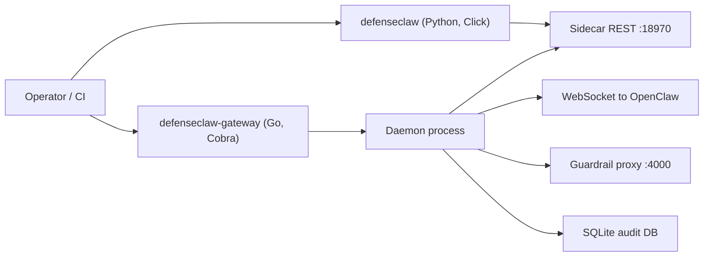

## Overview

DefenseClaw is two CLIs by design. The Python CLI (`defenseclaw`) is the operator surface for setup, credentials, scanner decisions, policy authoring, and local inventory. The Go CLI (`defenseclaw-gateway`) owns the sidecar process, CodeGuard source scans, policy reload/evaluation, audit export, sandbox runtime commands, and the full TUI. Everything the TUI does shells to one of these two binaries, so the command you run in CI is the same command an operator can run interactively.

## Which CLI for which job

| Task | Use | Command family | Operator note |
|------|-----|----------------|---------------|
| Initialize a fresh install | `defenseclaw` | `init`, `quickstart` | Creates `~/.defenseclaw/`, seeds policy, scanner, and audit defaults. |
| Start / stop / restart the sidecar | `defenseclaw-gateway` | `start`, `stop`, `restart` | These are Go-only lifecycle commands. |
| Check local install health | `defenseclaw` | `status`, `doctor`, `keys check` | Use before opening an incident or blaming policy. |
| Check running sidecar health | `defenseclaw-gateway` | `status`, `watchdog status` | Confirms the daemon and watchdog rather than local config only. |
| Manage config and credentials | `defenseclaw` | `config`, `settings`, `keys`, `setup` | Mutations are recorded through the Python audit path. |
| Review skills, MCPs, plugins, and tools | `defenseclaw` | `skill`, `mcp`, `plugin`, `tool`, `aibom` | The same commands back the TUI inventory panels. |
| Scan source code | `defenseclaw-gateway` | `scan code` | CodeGuard source scans are implemented in the Go gateway CLI. |
| Block, allow, disable, quarantine, restore | `defenseclaw` | `skill`, `mcp`, `plugin`, `tool` | These change local action state and should include a reason when the command supports one. |
| Validate and reload policy | both | `defenseclaw policy validate`, `defenseclaw-gateway policy reload` | Python validates/edit policy files; Go reloads the running sidecar. |
| Export audit data | `defenseclaw-gateway` | `audit export` | Writes JSONL from the local SQLite audit database. |
| Operate visually | `defenseclaw` or `defenseclaw-gateway` | `tui` | `defenseclaw tui` hands off to `defenseclaw-gateway tui`. |

Rule of thumb: if the action changes operator-owned configuration, scanner decisions, credentials, or policy files, start with `defenseclaw`. If the action manages the sidecar process, exports sidecar-owned audit rows, scans code, or refreshes a running policy engine, use `defenseclaw-gateway`.

<Callout type="warning" title="Daemon lifecycle is Go-only">
  Daemon lifecycle commands live on the gateway binary. Use `defenseclaw-gateway start`, `defenseclaw-gateway stop`, and `defenseclaw-gateway restart`.
</Callout>

## Daily operating loop

| Moment | Run | Why |
|--------|-----|-----|
| Start of shift | `defenseclaw status` | Human-readable environment, scanner, enforcement, audit, observability, and sidecar summary. |
| Before CI gates | `defenseclaw doctor --json-output` | Machine-readable prerequisite and connectivity report. |
| Before a policy change | `defenseclaw policy validate` | Catch broken YAML/Rego before reloading the sidecar. |
| After a policy change | `defenseclaw-gateway policy reload` | Apply validated policy to the running sidecar. |
| During an incident | `defenseclaw alerts --limit 50` | See the latest active audit alerts without opening the TUI. |
| During source review | `defenseclaw-gateway scan code ./src --json` | Produce CodeGuard findings in a script-friendly format. |
| Evidence handoff | `defenseclaw-gateway audit export --limit 1000 --output audit.jsonl` | Capture recent audit events for SIEM import or case notes. |

## Global conventions

Both CLIs follow the same conventions so scripts can assume:

- JSON output is command-specific; check the generated options table before scripting it.
- `--yes` is available on selected mutating commands that need confirmation bypass.
- Exit code `0` on success, specific codes for specific failure classes. See [Exit codes](/docs-site/reference/exit-codes).
- `--quiet` and `--verbose` are command-specific, not global flags.

## Related

- [Python CLI](/docs-site/cli/python-cli)
- [Gateway CLI](/docs-site/cli/gateway-cli)
- [Automation](/docs-site/cli/automation)
- [Shell completions](/docs-site/cli/shell-completions)
- [TUI CLI parity](/docs-site/tui/cli-parity)

---

<!-- generated-from: cli/defenseclaw/main.py, internal/cli/root.go -->
