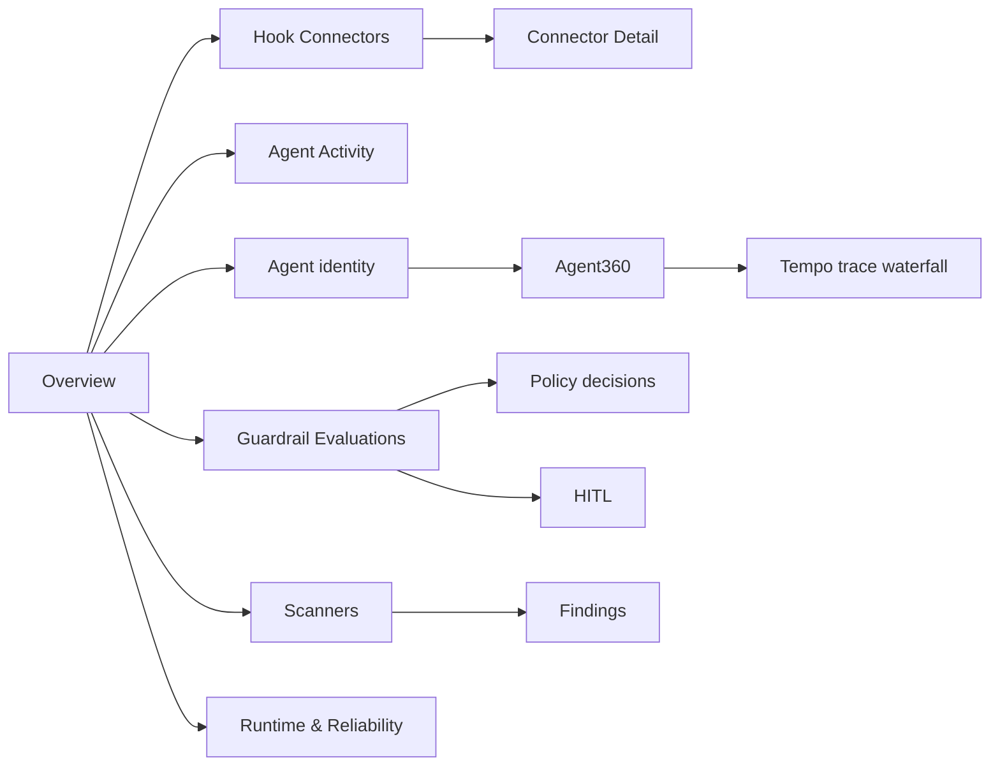

DefenseClaw provisions a focused catalog of 14 Grafana dashboards. Each board
has one job: start broad, select a connector, agent, rule, or execution, and
then move to the detail surface that owns that question. The catalog avoids
duplicating the same analysis across several boards.

## Start here

<Cards>
  <Card title="Platform overview" href="http://localhost:3000/d/defenseclaw-overview" description="Health, guardrails, findings, errors, and the links into every specialist board." />
  <Card title="Live agent activity" href="http://localhost:3000/d/defenseclaw-activity" description="Cross-agent prompts, model usage, tools, destinations, and session correlation." />
  <Card title="Agent360" href="http://localhost:3000/d/defenseclaw-agent-360" description="One agent or agent tree: lifecycle, models, tools, tokens, decisions, topology, and traces." />
  <Card title="Runtime & reliability" href="http://localhost:3000/d/defenseclaw-runtime" description="Process, SQLite, exporter, audit-sink, and canonical error health in one operations board." />
</Cards>

## Complete inventory

| Dashboard (UID) | Primary question | Audience | Signals | Why it exists |
| --- | --- | --- | --- | --- |
| **Overview** (`defenseclaw-overview`) | Is DefenseClaw healthy and enforcing as expected? | Operator, SOC, SRE | Prometheus, Loki | The landing board: KPIs, SLOs, guardrail outcomes, findings, errors, and links to owned detail views. |
| **Agent Activity (Live)** (`defenseclaw-activity`) | What are agents doing across the selected time range? | Developer, incident responder | Prometheus, Loki | Cross-agent prompt → model → tool → destination flow and session correlation. Finding, discovery, topology, and pipeline duplicates intentionally live elsewhere. |
| **Agent identity** (`defenseclaw-agent-identity`) | Which logical agents and instances have been observed? | AI platform, inventory owner | Prometheus, Loki | Runtime Agent Directory, identity confidence, instance churn, and the one-click entry into Agent360. |
| **Agent360** (`defenseclaw-agent-360`) | What happened inside this agent, execution, or full descendant tree? | Developer, SOC, AI platform | Prometheus, Loki, Tempo | The deepest correlated drill-down: lifecycle phases, decisions and recovery, tokens, cost, tools, network activity, directed flow, dependency topology, and trace waterfall. |
| **AI Agent Usage & Detection** (`defenseclaw-ai-discovery`) | Which AI products, skills, MCP servers, and dependencies exist? | Asset owner, security | Prometheus, Loki, Tempo | Continuous discovery inventory, confidence, detector health, and scan traces. |
| **Hook Connectors** (`defenseclaw-connectors`) | Which connectors are active, quiet, slow, or drifting? | Operator, integration owner | Prometheus, Loki | Cross-connector comparison and the route into Connector Detail. |
| **Connector Detail** (`defenseclaw-connector-detail`) | Why is one connector behaving differently? | Integration owner | Prometheus, Loki | Connector-scoped hooks, latency, outcomes, tokens, findings, and recent events. |
| **Guardrail Evaluations** (`defenseclaw-security`) | What did guardrails allow, alert, confirm, or block? | SOC, policy owner | Prometheus, Loki | Verdict funnel, severity, latency, connector comparison, and raw decision detail. |
| **Policy decisions** (`defenseclaw-policy-decisions`) | Which policy or egress branch caused the action? | Policy owner, SOC | Prometheus, Loki | Decision and network-egress analysis, including observe-mode would-block outcomes. |
| **HITL** (`defenseclaw-hitl`) | Where did a human approval enter the flow, and what was the outcome? | Approver, SOC | Prometheus, Loki | Chat and execution approval funnels plus the corresponding event stream. |
| **Findings** (`defenseclaw-findings`) | Which rule fired, against what target, and how often? | Detection engineer, SOC | Prometheus, Loki | Rule-level ranking, first/last seen, target attribution, and finding-to-verdict correlation. |
| **Scanners (Ops)** (`defenseclaw-scanners`) | Are scanner executions healthy and producing expected findings? | Detection engineer, SRE | Prometheus | Sparse-safe rolling scan counts, duration, errors, quarantine actions, and operational finding trends. Queue depth is omitted because scanners currently execute synchronously and do not emit a durable queue series. |
| **Proxy & LLM Guard** (`defenseclaw-traffic`) | What is happening on proxy/router deployments? | Proxy operator, SRE | Prometheus, Loki, Tempo | HTTP, tool, guardrail, GenAI, and trace telemetry that only exists when proxy/router mode is active. |
| **Runtime & Reliability** (`defenseclaw-runtime`) | Is the local process, database, exporter, or audit pipeline unhealthy? | SRE, operator | Prometheus, Loki | One truthful operations board for runtime, SQLite, exporter freshness/errors, audit delivery, and gateway errors. |

## Retain, consolidate, and remove decisions

- **Retain the 14 boards above.** Each owns a distinct operator question or a
  deliberate overview → detail drill-down; none is a renamed duplicate.
- **Runtime and Reliability stay consolidated.** The former standalone
  Reliability dashboard duplicated process/exporter panels and has been
  retired from both fresh installs and upgrades.
- **Scanners no longer shows queue depth.** Scanner execution is synchronous
  today and the queue instrument has no producer, so that panel could never
  truthfully populate. Rolling scan count/duration panels remain because they
  are backed by emitted counters and histograms.
- **Proxy & LLM Guard and HITL are conditional, not broken.** Proxy panels need
  proxy/router mode; chat/execution approval panels need those approval paths.
  They remain separate because combining them with always-on hook telemetry
  would obscure which enforcement surface generated the event.
- **Agent Activity and Agent360 intentionally differ.** Activity answers
  cross-agent “what is happening now?” questions; Agent360 owns one selected
  agent/execution, recovery path, topology, and trace waterfall.

The old standalone **Reliability** board was consolidated into **Runtime &
Reliability**. Panels that merely relabeled goroutines or exporter errors as
queue depth, panics, configuration errors, or circuit state were removed; a
zero from an unrelated metric is more dangerous than an honest absence.

## How the drill-down works




Agent and trace identifiers are rendered as direct data links. Selecting an
Agent ID preserves the time range and opens the reusable Agent360 board.
Selecting a Trace ID sets the `trace` variable on the same dashboard and
populates the Tempo waterfall without losing the connector, agent, lifecycle,
or execution filters.


## Which backend owns each answer

| Backend | Best for | Dashboard behavior |
| --- | --- | --- |
| Prometheus | Totals, rates, quantiles, current state, inventory | Counter totals use the selected range, so a completed gateway run remains visible even when it is no longer exporting. |
| Loki | Inputs/outputs, commands, reasons, decisions, ordered recovery | Empty means no matching event occurred in the selected range and filters. |
| Tempo | One request or execution path and parent/child span timing | Trace panels populate only after selecting a valid Trace ID or when matching spans exist. |

## Read empty values correctly

DefenseClaw does not invent telemetry.

| Display | Meaning |
| --- | --- |
| **0** | The signal is instrumented and the selected range contains zero matching events. |
| **No data** | The panel is conditional (for example HITL, failures, or proxy-only traffic) and no matching series or event exists for the current filters. |
| **Not reported** | The connector/provider did not report that field, most commonly token usage or cost. It is not equivalent to zero. |

If a global panel is unexpectedly empty while raw events are visible, widen
the time range first. Historical token totals and model/provider breakdowns
use range functions, so they continue to render after the gateway process
stops. Then run the syntax/datasource audit:

```bash
python scripts/check_grafana_dashboards.py --live
```

For a panel-by-panel data inventory over the last 48 hours, run:

```bash
python scripts/check_grafana_dashboards.py --inventory --inventory-hours 48
```

The inventory reports **Data**, **Zero**, **Empty**, **Interactive**, **Static**,
and **Error** separately for every dashboard. Static panels are intentional
text/instructions. It uses the representative `codex`
connector and all agent IDs: connector-detail queries exercise a real
single-selection value, while trace waterfalls that need an explicit agent or
trace selection are classified as interactive instead of broken.

The live audit checks Grafana health and asks Prometheus, Loki, and Tempo to
parse every retained query. Conditional panels may return no rows, but malformed queries, missing
datasources, empty dashboard rows, dangling drill-down links, stale packaged
copies, and instant-only historical token queries fail the audit.

The standalone command works in a pristine source checkout before generated
CLI data exists. `make check` first generates the CLI mirror and then runs the
same audit with `--require-packaged`, making source/package drift a required CI
failure.

## Source of truth and upgrades

Dashboard JSON is owned by
`bundles/local_observability_stack/grafana/dashboards/` and copied into the CLI
package by `make _bundle-data`. `defenseclaw setup local-observability up`
refreshes the host-mounted stack by default, so upgrades pick up removed,
renamed, and corrected dashboards. Use `--no-refresh-config` only when you
intentionally preserve operator-edited local files.
