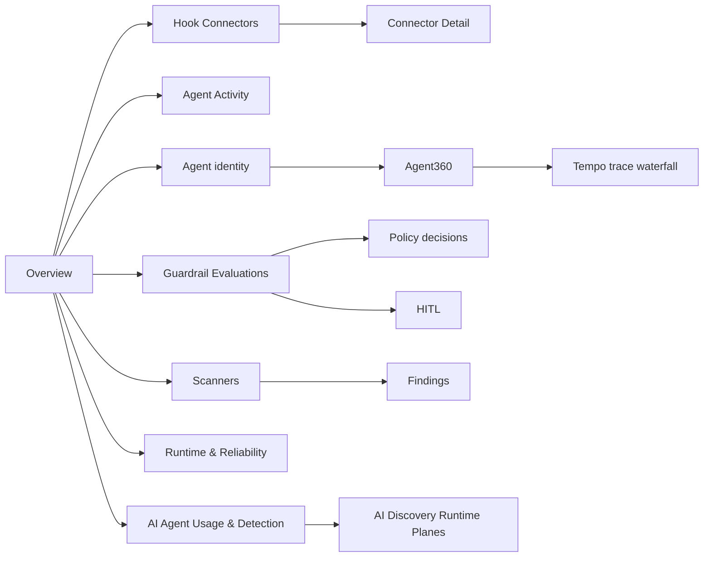

DefenseClaw provisions a focused catalog of 16 Grafana dashboards. Each board
has one job: start broad, select a connector, agent, rule, or execution, and
then move to the detail surface that owns that question. The catalog avoids
duplicating the same analysis across several boards.

## Start here

<Cards>
  <Card title="Platform overview" href="http://localhost:3000/d/defenseclaw-overview" description="Health, guardrails, findings, errors, and the links into every specialist board." />
  <Card title="Live agent activity" href="http://localhost:3000/d/defenseclaw-activity" description="Cross-agent prompts, model usage, tools, destinations, and session correlation." />
  <Card title="Agent360" href="http://localhost:3000/d/defenseclaw-agent-360" description="One agent or tree: initial and follow-up prompts, grouped per-agent model/tool work, directed lineage, outcomes, decisions, and traces." />
  <Card title="Blocked Events & Analysis" href="http://localhost:3000/d/defenseclaw-blocked-events" description="Enforced and would-block decisions, exact rule IDs, post-redaction evidence, recurring signatures, and investigation pivots." />
  <Card title="Runtime & reliability" href="http://localhost:3000/d/defenseclaw-runtime" description="Process, SQLite, exporter, destination delivery, and canonical error health in one operations board." />
</Cards>

## Complete inventory

| Dashboard (UID) | Primary question | Audience | Signals | Why it exists |
| --- | --- | --- | --- | --- |
| **Overview** (`defenseclaw-overview`) | Is DefenseClaw healthy and enforcing as expected? | Operator, SOC, SRE | Prometheus, Loki | The landing board: KPIs, SLOs, guardrail outcomes, findings, errors, and links to owned detail views. |
| **Agent Activity (Live)** (`defenseclaw-activity`) | What are agents doing across the selected time range? | Developer, incident responder | Prometheus, Loki | Cross-agent prompt → model → tool → destination flow and session correlation. Finding, discovery, topology, and pipeline duplicates intentionally live elsewhere. |
| **Agent identity** (`defenseclaw-agent-identity`) | Which logical agents and instances have been observed? | AI platform, inventory owner | Prometheus, Loki | Runtime Agent Directory, identity confidence, instance churn, and the one-click entry into Agent360. |
| **Agent360** (`defenseclaw-agent-360`) | What happened inside this agent, execution, or full descendant tree? | Developer, SOC, AI platform | Prometheus, Loki, Tempo | The deepest correlated drill-down: lifecycle phases, initial/grouped follow-up prompts, decisions and recovery, tokens, cost, network activity, per-agent provider/model and tool-family summaries, and trace waterfall. |
| **Blocked Events & Analysis** (`defenseclaw-blocked-events`) | What was blocked, which rules drove it, and which events recur? | SOC, policy owner, incident responder | Prometheus, Loki | Enforced versus observe-mode decisions, all exported verdict rule IDs, projected tool context, exact recurring signatures, and correlation pivots into Agent360, Findings, and Policy Decisions. |
| **AI Agent Usage & Detection** (`defenseclaw-ai-discovery`) | Which AI products, skills, MCP servers, and dependencies exist? | Asset owner, security | Prometheus, Loki, Tempo | Continuous discovery inventory, confidence, detector health, and scan traces. |
| **AI Discovery Runtime Planes** (`defenseclaw-ai-runtime`) | What actually ran on this host, and could the sensors see it? | Asset owner, security | Prometheus, Loki | [Runtime-plane](/docs/ai-discovery/runtime-planes) findings next to the discovery inventory, with sensor coverage first so a blind host is not read as clean. |
| **Hook Connectors** (`defenseclaw-connectors`) | Which connectors are active, quiet, slow, or drifting? | Operator, integration owner | Prometheus, Loki | Cross-connector comparison and the route into Connector Detail. |
| **Connector Detail** (`defenseclaw-connector-detail`) | Why is one connector behaving differently? | Integration owner | Prometheus, Loki | Connector-scoped hooks, latency, outcomes, tokens, findings, and recent events. |
| **Guardrail Evaluations** (`defenseclaw-security`) | What did guardrails allow, alert, confirm, or block? | SOC, policy owner | Prometheus, Loki | Verdict funnel, severity, latency, connector comparison, and raw decision detail. |
| **Policy decisions** (`defenseclaw-policy-decisions`) | Which policy or egress branch caused the action? | Policy owner, SOC | Prometheus, Loki | Decision and network-egress analysis, including observe-mode would-block outcomes. |
| **HITL** (`defenseclaw-hitl`) | Where did a human approval enter the flow, and what was the outcome? | Approver, SOC | Prometheus, Loki | Chat and execution approval funnels plus the corresponding event stream. |
| **Findings** (`defenseclaw-findings`) | Which rule fired, against what target, and how often? | Detection engineer, SOC | Prometheus, Loki | Rule-level ranking, first/last seen, target attribution, and finding-to-verdict correlation. |
| **Scanners (Ops)** (`defenseclaw-scanners`) | Are scanner executions healthy and producing expected findings? | Detection engineer, SRE | Prometheus | Sparse-safe rolling scan counts, duration, errors, quarantine actions, and operational finding trends. Queue depth is omitted because scanners currently execute synchronously and do not emit a durable queue series. |
| **Proxy & LLM Guard** (`defenseclaw-traffic`) | What is happening on proxy/router deployments? | Proxy operator, SRE | Prometheus, Loki, Tempo | HTTP, tool, guardrail, GenAI, and trace telemetry that only exists when proxy/router mode is active. |
| **Runtime & Reliability** (`defenseclaw-runtime`) | Is the local process, database, exporter, or destination delivery unhealthy? | SRE, operator | Prometheus, Loki | One truthful operations board for runtime, SQLite, exporter freshness/errors, destination delivery, and gateway errors. |

## How the drill-down works

```mermaid
flowchart LR
  O[Overview] --> C[Hook Connectors]
  C --> CD[Connector Detail]
  O --> A[Agent Activity]
  O --> I[Agent identity]
  I --> A360[Agent360]
  A360 --> T[Tempo trace waterfall]
  O --> G[Guardrail Evaluations]
  G --> P[Policy decisions]
  G --> H[HITL]
  O --> S[Scanners]
  S --> F[Findings]
  O --> R[Runtime & Reliability]
  O --> D[AI Agent Usage & Detection]
  D --> RP[AI Discovery Runtime Planes]
```

Agent and trace identifiers are rendered as direct data links. Selecting an
Agent ID preserves the time range and opens the reusable Agent360 board.
Selecting a Trace ID sets the `trace` variable on the same dashboard and
populates the Tempo waterfall without losing the connector, agent, lifecycle,
or execution filters.

The Agent360 lifecycle DAG is also interactive: click a node or edge for its
count, identity fields, and time-range-preserving drill-down links to the raw
records. See the [Agent360 guide](/docs/observability/agent360) for how nodes
are grouped.

## Which backend owns each answer

| Backend | Best for | Dashboard behavior |
| --- | --- | --- |
| Prometheus | Totals, rates, quantiles, current state, inventory | Counter totals use the selected range, so a completed gateway run remains visible even when it is no longer exporting. |
| Loki | Lifecycle DAG, cross-request chronology, inputs/outputs, commands, reasons, decisions, ordered recovery | Empty means no matching event occurred in the selected range and filters. |
| Tempo | One request-bounded operation and its parent/child span timing | Trace panels populate only after selecting a valid Trace ID or when matching spans exist. |

The dashboards do not apply their own masking, redaction, or field hiding.
DefenseClaw centrally redacts before canonical OTEL export, and Grafana displays or
links every field present in the received projection, including content when the
producer supplies it. It cannot recover a field removed or transformed before
export.

## Read empty values correctly

DefenseClaw does not invent telemetry.

| Display | Meaning |
| --- | --- |
| **0** | The signal is instrumented and the selected range contains zero matching events. |
| **No data** | The panel is conditional (for example HITL, failures, or proxy-only traffic) and no matching series or event exists for the current filters. |
| **Not reported** | The connector/provider did not report that field, most commonly token usage or cost. It is not equivalent to zero. |

If a global panel is unexpectedly empty while raw events are visible, widen
the time range first. Historical token totals and model/provider breakdowns
use range functions, so they continue to render after the gateway process
stops.

## Source of truth and upgrades

Dashboard JSON ships with DefenseClaw. `defenseclaw setup local-observability up`
refreshes the host-mounted stack by default, so upgrades pick up removed,
renamed, and corrected dashboards. Use `--no-refresh-config` only when you
intentionally preserve operator-edited local files.
