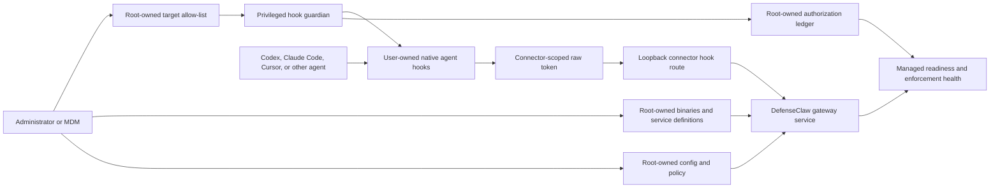

Enterprise deployment is for endpoints where DefenseClaw policy must be controlled by administrators, not by the interactive user running Codex, Claude Code, Cursor, Antigravity, or another AI agent.

<Callout title="Managed mode boundary">
Set `deployment_mode: managed_enterprise` when DefenseClaw is installed as an operating-system service. In this mode, `config.yaml` is treated as an administrator-owned policy file and runtime HTTP PATCH changes are rejected.
</Callout>

<Callout title="Exact tamper-resistance guarantee">
An AI agent running as a standard, non-privileged user cannot stop the system service, replace the root-owned DefenseClaw binary, edit administrator policy, read service-side scoped credentials, or forge the root-owned guardian authorization record. The same user still owns the AI application's native config and per-user hook files, so it can create a short local bypass window by editing or deleting those files. The guardian detects and repairs that drift; prevention requires MDM, EDR, application control, or filesystem policy that denies the user write access.
</Callout>

## Security model at a glance

Enterprise hardening separates **policy authority**, **inspection runtime**, and **user-agent integration**:



The gateway is intentionally unable to write broadly into user homes. The guardian is the only privileged component that repairs allow-listed per-user integrations, and it does not discover arbitrary users or applications on its own.

### Threat model

| Actor | Assumed capability | Expected result |
| --- | --- | --- |
| AI agent or shell running as the protected user | Read/write files owned by that user; start and kill that user's processes | Cannot modify the system service, binaries, managed config, service token store, or guardian authorization. Can tamper with user-owned hook/config files until the guardian repairs them. |
| Another unprivileged local user | Access permitted by normal UNIX permissions or macOS ACLs | Cannot read protected runtime state or scoped service credentials; cannot repair or authorize another user's hooks. |
| Endpoint administrator, root, MDM, or a process with equivalent privilege | Full machine administration | Can install, upgrade, disable, or remove DefenseClaw. DefenseClaw does not attempt to defend the machine from its trusted administrator. |
| Compromised gateway process | Service identity plus the gateway unit's sandbox | Can write only its declared runtime/log paths; cannot write user homes, managed config, binaries, kernel settings, devices, or arbitrary host paths under the packaged Linux unit. |
| Compromised guardian process | Root with a bounded service sandbox and five Linux capabilities | Can repair declared user-home footprints and guardian state. Risk is reduced through the explicit target manifest, trusted path checks, syscall filtering, SUID/SGID restrictions, and narrow writable paths. |

### Security goals and non-goals

**The managed deployment is designed to:**

- keep configuration, policy, binaries, service definitions, and authorization under administrator control;
- prevent runtime API clients from downgrading `managed_enterprise` or changing security-critical topology;
- give each connector a credential accepted only by that connector's hook/notify routes;
- fail managed readiness until every configured hook connector has trusted guardian coverage;
- reject unsafe owners, modes, ACLs, symlinks, reparse points, path escapes, malformed manifests, and unsupported hook contracts;
- repair authorized user-owned hook drift without continuously rewriting unchanged files;
- report guardian failures and connector enforcement truthfully instead of claiming protection after partial setup.

**It is not designed to:**

- protect the host from root, an MDM administrator, or an AI agent that has been given unrestricted sudo/admin credentials;
- make user-owned native agent configuration immutable without an external endpoint-control policy;
- guarantee zero-time repair after a user edits or deletes a hook;
- convert hook-native connectors into an inline network proxy when the vendor integration is lifecycle-hook based;
- silently create application profiles for users who have never initialized the native agent.

## Why a standard AI agent cannot permanently remove DefenseClaw

The durable controls live outside the agent user's authority:

1. **The gateway is a system service.** It runs as the dedicated `defenseclaw` identity, not as the interactive Codex or Claude Code user. Killing the agent process does not kill the gateway.
2. **The executable and service definition are administrator-owned.** A standard user cannot replace `/opt/defenseclaw/bin/defenseclaw-gateway`, edit the systemd unit, replace `/Library/DefenseClaw/bin/defenseclaw-gateway`, or unload a system LaunchDaemon.
3. **Policy is administrator-owned and mode-pinned.** The service sets `DEFENSECLAW_DEPLOYMENT_MODE=managed_enterprise`; changing a user environment variable or user config cannot downgrade the running service.
4. **Runtime mutation is denied.** Authenticated non-admin clients receive HTTP 403 for managed-enterprise config changes. Security-critical changes require an administrator edit and service restart.
5. **Guardian authorization is root-owned.** Service-writable status is not sufficient to authorize repair or claim readiness. The gateway trusts the separate administrator-owned authorization record.
6. **Per-user credentials are narrow.** Reading a user's `.hook-<connector>.token` grants only that connector's hook route, not status, config, policy, scan, or cross-connector API access.
7. **Per-user drift is repaired.** The event-driven Linux watcher and periodic backstop restore canonical hooks, helper files, scoped tokens, modes, and supported native config entries after an authorized target is changed.

The important qualifier is **permanently**. A standard user—or an AI agent executing tools as that user—can delete a user-owned hook and invoke the agent before repair completes. On Linux with the event-driven watcher enabled, repairs were observed in hundreds of milliseconds during testing, but that is an observed implementation result, not a hard real-time guarantee. The Linux periodic backstop and the packaged macOS periodic reconcile have longer repair windows. If a threat model requires the hook to be impossible for the user to modify, enforce the native agent config and hook directory with MDM/EDR/application-control policy and ensure the AI agent has no path to sudo, root shells, privileged package managers, service control, or policy-exemption tools.

### Administrative controls required around the agent

- Do not grant passwordless sudo or local administrator rights to the account used by the AI agent.
- Do not expose root-capable MCP servers, terminal wrappers, deployment keys, or remote-management credentials to the agent.
- Restrict `systemctl`, `launchctl`, package installation, kernel/debug tooling, and endpoint-security exclusions through normal OS policy.
- Use a separate administrator or MDM channel for DefenseClaw upgrades and guardian manifest changes.
- Treat a host-level root compromise as an endpoint incident; reinstall or attest the endpoint rather than relying on in-process repair.

## Hardening controls

| Control | What it protects | Enforcement behavior |
| --- | --- | --- |
| Managed mode pin | Deployment mode and administrator authority | The service environment pins `managed_enterprise`; user config cannot downgrade it. |
| Trusted config path | Managed config and policy inputs | Rejects unsafe ownership, writable ancestors, symlinks, and platform-specific ACL/DACL or reparse-point hazards. |
| Root-owned binaries and units | Executable integrity and startup | Standard users cannot replace the gateway, guardian, systemd units, or LaunchDaemons. |
| Gateway service sandbox | Host filesystem, devices, kernel, namespaces, and process visibility | Linux gateway runs with `NoNewPrivileges=true`, an empty capability set, strict filesystem protection, private devices/tmp, filtered syscalls, and hidden non-service processes. |
| Explicit guardian manifest | Privileged repair scope | Root chooses exact user/connector/version targets; no broad home-directory enumeration. |
| Root-owned authorization ledger | Managed readiness claims | A target is enforcement-covered only after a privileged successful reconcile writes trusted authorization. |
| Connector-scoped hook token | API least privilege and connector isolation | Token is accepted only for the matching hook/notify route and cannot authorize management APIs or another connector. |
| Raw scoped-token format | Service/hook format consistency | The service validator and generated hook consume the same raw file; inherited generic gateway credentials cannot shadow it. |
| Hook contract pinning | Vendor lifecycle compatibility | Action-mode installation rejects unknown or drifted agent hook contracts unless an administrator explicitly opts into exploratory drift. |
| Filesystem footprint validation | Hook/config path integrity | Rejects path escapes, unsafe parents, foreign owners, special files, and first-install writable/symlinked targets. |
| Authorized repair | Post-install user tamper | After trusted authorization, target-owned symlinks can be removed and unsafe target-owned modes—including SUID/SGID/sticky bits—are normalized before canonical reinstall. |
| Atomic, idempotent writes | Partial updates and watcher loops | Same-directory replacement prevents partial files; unchanged bytes, modes, ownership, backups, and contracts preserve mtimes and do not retrigger the watcher. |
| Truthful startup and health | Partial-success false assurance | Scoped-token, setup, contract, and verification failures publish error state and prevent managed enforcement from being reported as ready. |

## What moves to system scope

| Surface | Linux path | macOS path | Owner |
| --- | --- | --- | --- |
| Binaries | `/opt/defenseclaw/bin` | `/Library/DefenseClaw/bin` | root/admin |
| Config | `/etc/defenseclaw/config.yaml` | `/Library/Application Support/DefenseClaw/config.yaml` | root/admin |
| Runtime state | `/var/lib/defenseclaw` | `/Library/Application Support/DefenseClaw/runtime` | `defenseclaw` service identity |
| Logs | `/var/log/defenseclaw` | `/Library/Logs/DefenseClaw` | service identity |
| Linux service | `/etc/systemd/system/defenseclaw-gateway.service` | n/a | root |
| macOS service | n/a | `/Library/LaunchDaemons/com.defenseclaw.gateway.plist` | root |

User-owned agent configuration remains in user space. Examples include `~/.codex/config.toml`, `~/.claude/settings.json`, and `~/.gemini/settings.json`. DefenseClaw can only harden those files by installing and repairing hooks through a privileged enterprise controller; users still own the agent's native configuration file.

## Recommended rollout sequence

Use a staged deployment rather than enabling action mode everywhere at once:

1. **Inventory endpoints and agent versions.** Record OS, interactive user, home directory, connector, native config path, and exact agent version.
2. **Deploy the system service in observe mode.** Validate config ownership, loopback listeners, service sandboxing, audit output, and operational monitoring.
3. **Initialize each agent profile as the user.** The native agent must create its config before the privileged guardian performs a first installation.
4. **Create the root-owned guardian allow-list.** Add only known users and connectors. Pin the version used for hook-contract validation.
5. **Run one manual reconcile.** Review JSON/status output and resolve every failed target before enabling the watcher.
6. **Enable event-driven and periodic repair.** On Linux, run the watcher plus timer. On macOS, the packaged LaunchDaemon performs periodic reconcile; use MDM/EDR for stronger native-config prevention.
7. **Move selected connectors to action mode.** Confirm allow and deterministic block events, then monitor error/block counters and guardian health.
8. **Run the adversarial validation plan.** Use a dedicated test endpoint and account; see [Linux enterprise hardening validation](/docs/setup/enterprise-hardening-validation).

### Prerequisites

- A supported DefenseClaw build and its matching packaging files.
- Root or MDM access through a channel unavailable to the protected AI agent.
- A dedicated non-login `defenseclaw` service identity.
- An initialized native config for every protected user/connector.
- A policy decision for response failure mode and availability behavior.
- Central collection for service health, guardian failures, and audit events.
- No passwordless sudo or root-capable tool integration exposed to the AI agent account.

## Linux systemd layout

The Linux design uses three privilege domains:

| Component | Identity | Writable scope | Purpose |
| --- | --- | --- | --- |
| Gateway | `defenseclaw:defenseclaw` | `/var/lib/defenseclaw`, `/var/log/defenseclaw`, `/run/defenseclaw` | Inspection, policy, audit, hook API, and health. |
| Guardian reconcile/watch | root with bounded unit restrictions | Allow-listed user homes plus guardian/runtime state | Install and repair native user hooks after trusted path validation. |
| AI agent | Interactive standard user | Its normal user profile | Invoke native hooks; cannot manage the system service or administrator assets. |

Create a service user and the managed directories:

```bash
sudo useradd --system --home /var/lib/defenseclaw --shell /usr/sbin/nologin defenseclaw
sudo install -d -o root -g defenseclaw -m 0750 /etc/defenseclaw
sudo install -d -o root -g root -m 0750 /etc/defenseclaw/hook-guardian
sudo install -d -o root -g root -m 0755 /opt/defenseclaw/bin
sudo install -d -o defenseclaw -g defenseclaw -m 0750 /var/lib/defenseclaw /var/log/defenseclaw
sudo install -d -o root -g root -m 0755 /var/lib/defenseclaw-hook-guardian
```

Install the binaries and service files:

```bash
sudo install -o root -g root -m 0755 defenseclaw-gateway /opt/defenseclaw/bin/defenseclaw-gateway
sudo install -o root -g root -m 0755 defenseclaw /opt/defenseclaw/bin/defenseclaw
sudo install -D -o root -g root -m 0644 packaging/systemd/defenseclaw-gateway.service /etc/systemd/system/defenseclaw-gateway.service
sudo install -D -o root -g root -m 0644 packaging/systemd/defenseclaw-hook-guardian@.service /etc/systemd/system/defenseclaw-hook-guardian@.service
sudo install -D -o root -g root -m 0644 packaging/systemd/defenseclaw-hook-guardian.service /etc/systemd/system/defenseclaw-hook-guardian.service
sudo install -D -o root -g root -m 0644 packaging/systemd/defenseclaw-hook-guardian-watch.service /etc/systemd/system/defenseclaw-hook-guardian-watch.service
sudo install -D -o root -g root -m 0644 packaging/systemd/defenseclaw-hook-guardian.timer /etc/systemd/system/defenseclaw-hook-guardian.timer
```

Before starting anything, verify that no path in the binary/config/unit chain is writable by the protected user:

```bash
namei -l /opt/defenseclaw/bin/defenseclaw-gateway
namei -l /etc/defenseclaw
stat -c '%U:%G %a %n' \
  /opt/defenseclaw/bin/defenseclaw-gateway \
  /etc/systemd/system/defenseclaw-gateway.service \
  /etc/systemd/system/defenseclaw-hook-guardian-watch.service
```

Create `/etc/defenseclaw/config.yaml`:

```yaml
config_version: 6
deployment_mode: managed_enterprise
data_dir: /var/lib/defenseclaw
audit_db: /var/lib/defenseclaw/audit.db
judge_bodies_db: /var/lib/defenseclaw/judge_bodies.db
plugin_dir: /var/lib/defenseclaw/plugins
policy_dir: /var/lib/defenseclaw/policies
gateway:
  device_key_file: /var/lib/defenseclaw/device.key
  api_bind: 127.0.0.1
  api_port: 18970
  config_reload:
    mode: hot
guardrail:
  enabled: true
  mode: observe
  scanner_mode: both
application_protection:
  enabled: false
```

For an initial rollout, use `guardrail.mode: observe`, validate telemetry and guardian coverage, then change to `action` through the administrator-owned file and restart the service. Do not use a user-writable overlay config to stage enterprise policy.

Set ownership and start the service:

```bash
sudo chown root:defenseclaw /etc/defenseclaw/config.yaml
sudo chmod 0640 /etc/defenseclaw/config.yaml
namei -l /etc/defenseclaw/config.yaml
stat -c '%U:%G %a %n' /etc/defenseclaw/config.yaml
sudo systemctl daemon-reload
sudo systemctl enable --now defenseclaw-gateway.service
```

Confirm the packaged environment pin and sandbox are active:

```bash
sudo systemctl show defenseclaw-gateway.service \
  -p User -p Group -p Environment -p NoNewPrivileges \
  -p CapabilityBoundingSet -p ProtectSystem -p ProtectHome \
  -p ReadOnlyPaths -p ReadWritePaths
sudo systemd-analyze security defenseclaw-gateway.service
sudo ss -ltnp | grep 18970
```

The API listener must be loopback-only. A security exposure score is a comparative systemd signal, not an attestation; review the actual properties and your distribution's systemd version.

The packaged unit sets:

```bash
DEFENSECLAW_HOME=/var/lib/defenseclaw
DEFENSECLAW_CONFIG=/etc/defenseclaw/config.yaml
```

`DEFENSECLAW_CONFIG` lets the service keep administrator policy in `/etc` while runtime state remains in `/var/lib`.

The unit also pins `StateDirectoryMode=0750`, `RuntimeDirectoryMode=0750`, and `LogsDirectoryMode=0750`; do not rely on systemd's default directory modes for secret-bearing runtime state. It enables a restrictive service sandbox (`ProtectSystem=strict`, `ProtectHome=true`, private devices/tmp, kernel and control-group protections, hidden non-service `/proc` entries, the `@system-service` syscall allow-list, no realtime scheduling, no SUID/namespace escalation, and an empty capability bounding set). If your deployment needs host-wide user discovery or hook repair, run that as the enterprise guardian component rather than widening the gateway service sandbox.

## Per-user hook guardian

The managed gateway service must not write directly to `/home`. To install or repair hook-native connectors for real interactive users, run the short-lived guardian command as an administrator:

### Prepare the user profile

First installation is intentionally conservative. The guardian requires the native application config to exist and refuses to invent a profile for a user who has never run the agent.

| Connector | Typical native config | Preparation check |
| --- | --- | --- |
| Codex | `~/.codex/config.toml` | Launch Codex once as the user, then verify the file is user-owned and not group/other writable. |
| Claude Code | `~/.claude/settings.json` | Launch Claude Code once as the user, then verify the file is user-owned and not group/other writable. |
| Gemini CLI | `~/.gemini/settings.json` | Initialize Gemini CLI and verify the settings file before adding the target. |
| Other hook-native connectors | Connector-specific native hook config | Consult the connector page and confirm the declared config surface exists. |

Collect the exact version using the same binary the user invokes. In managed action mode, version information is part of the hook-contract decision:

```bash
sudo -u ubuntu -H /path/to/codex --version
sudo -u alice -H /path/to/claude --version

sudo -u ubuntu -H stat -c '%U:%G %a %n' /home/ubuntu/.codex/config.toml
sudo -u alice -H stat -c '%U:%G %a %n' /home/alice/.claude/settings.json
```

Do not copy a root-owned placeholder into the user's profile. The native config should be owned by the target user; the guardian validates that ownership and then patches only the connector-owned entries.

### Bootstrap one target

```bash
sudo DEFENSECLAW_CONFIG=/etc/defenseclaw/config.yaml \
  /opt/defenseclaw/bin/defenseclaw-gateway enterprise hooks install \
  --user ubuntu \
  --connector codex \
  --agent-version "codex-cli 0.142.0" \
  --json
```

Use `--user-home`, `--uid`, and `--gid` only for directory-backed or nonstandard identity systems where normal user lookup is unavailable. Keep `--data-dir`, `--api-addr`, and `--proxy-addr` at their managed-config defaults unless the packaged deployment intentionally uses different paths or ports.

The guardian command:

- targets an explicit user via `--user` or `--user-home`;
- rejects proxy/plugin connectors;
- refuses first-time install when the agent hook config file is missing;
- rejects hook config paths outside the target home, including unsafe symlink escapes;
- writes a raw connector-scoped hook token, not the gateway administrator token, into the user's hook runtime;
- preserves the user's ownership on patched hook files and per-user hook scripts;
- applies the same action-mode hook-contract validation as gateway startup.

The corresponding service-side token remains in the managed runtime and is validated for owner, mode, path, ACL/DACL, and symlink/reparse safety before authentication. The per-user sidecar uses the same raw token format. Generated hooks prefer the scoped sidecar over an inherited generic gateway token, so a stale shell environment cannot silently cross the connector boundary.

### Authorization and readiness

A successful privileged reconcile writes two different records:

| Record | Trust | Purpose |
| --- | --- | --- |
| `<data_dir>/hook_guardian_state.json` | Service/runtime status | Last run, manifest, target counts, and per-target errors displayed by `defenseclaw status`. |
| `DEFENSECLAW_HOOK_GUARDIAN_AUTH_DIR/protected_targets.json` | Root-owned authorization | Durable list of successfully protected targets trusted by managed readiness. |

The gateway does not treat the service-writable status file as authorization. Managed hook enforcement is reported ready only when the trusted authorization record covers every configured target. Partial coverage remains starting/non-enforcing and includes an actionable health hint.

The guardian units set `NoNewPrivileges=false` deliberately. Each reconcile
temporarily adopts the target user's effective UID/GID so connector files are
created with the user's ownership, then returns to root to process the next
allow-listed target. Linux otherwise prevents the long-lived guardian from
regaining its bounded `CAP_SETUID` after that credential drop. The units still
limit capabilities to `CAP_CHOWN`, `CAP_DAC_OVERRIDE`, `CAP_FOWNER`,
`CAP_SETGID`, and `CAP_SETUID`, retain the `@system-service` syscall filter,
deny SUID/SGID creation, and restrict writable paths to user homes and the two
guardian state directories.

For scheduled repair, create `/etc/defenseclaw/hook-guardian/<user>.env`:

```bash
DEFENSECLAW_GUARDIAN_CONNECTOR=codex
DEFENSECLAW_GUARDIAN_AGENT_VERSION="codex-cli 0.142.0"
```

Then run the template unit:

```bash
sudo systemctl start defenseclaw-hook-guardian@ubuntu.service
```

The template unit is useful for a single user/connector bootstrap. For ongoing fleet management, prefer the manifest-driven reconcile and watcher because they produce one aggregate state and authorization record.

Run one guardian invocation per user and connector. The template intentionally has narrower scope than a full root shell: it runs as root so it can repair user-owned files, sets `UMask=0077`, and limits its capability bounding set to ownership, DAC file access, and the credential drop used for per-user setup (`CAP_CHOWN`, `CAP_DAC_OVERRIDE`, `CAP_FOWNER`, `CAP_SETGID`, `CAP_SETUID`). It needs write access to user homes so it can repair hook files and to `/var/lib/defenseclaw` so the shared CLI startup can open the audit DB and write guardian state. Do not remove `ProtectHome=true` from the always-on gateway service to solve per-user hooks.

For periodic multi-user repair, create an explicit allow-list at `/etc/defenseclaw/hook-guardian/targets.yaml`:

```yaml
version: 1
targets:
  - user: ubuntu
    connector: codex
    agent_version: "codex-cli 0.142.0"
  - user: ubuntu
    connector: claudecode
    agent_version: "2.1.187 (Claude Code)"
  - user: alice
    connector: claudecode
    agent_version: "Claude Code v2.1.144"
  - user: disabled-user
    connector: codex
    enabled: false
```

The manifest parser rejects unknown fields, unsupported versions, duplicate YAML documents, and incomplete enabled targets. `user_home`, `uid`, `gid`, and `data_dir` are available for controlled nonstandard layouts. `enabled: false` keeps a target in source control without reconciling it; removing or disabling a target stops future repair but does not automatically uninstall existing native hook entries.

Then run reconcile manually, enable the event-driven watcher, and keep the timer as a periodic backstop:

```bash
sudo DEFENSECLAW_CONFIG=/etc/defenseclaw/config.yaml \
  /opt/defenseclaw/bin/defenseclaw-gateway enterprise hooks reconcile \
  --manifest /etc/defenseclaw/hook-guardian/targets.yaml \
  --json

sudo systemctl enable --now defenseclaw-hook-guardian-watch.service
sudo systemctl enable --now defenseclaw-hook-guardian.timer
```

The manifest is an administrator-owned allow-list. The guardian does not enumerate every local user by default, so it will not write into service accounts, stale profiles, or users outside the enterprise policy.

`defenseclaw-hook-guardian-watch.service` watches only directories derived from the manifest and each connector's declared hook/runtime footprint. When a user edits or deletes a watched hook config, hook script, token sidecar, or generated helper, the watcher debounces the event and re-runs the same hardened reconcile path. First-time installs still refuse symlinks, bad owners, group/other-writable files, and missing app configs. After a target has a root-owned authorization record, the watcher may remove target-owned symlinks and normalize target-owned modes before reinstalling the canonical footprint; foreign-owned paths and unsafe parent directories remain hard failures. The timer keeps a periodic repair backstop for missed filesystem events, reboot catch-up, and deployments that choose not to run the watcher.

The watcher ignores its own lock-file housekeeping, and the installer preserves unchanged bytes, ownership, modes, backups, contract timestamps, and mtimes. A settled target should therefore remain quiet instead of entering a self-generated `fsnotify` loop.

### Repair semantics

| Condition | First install | Previously authorized repair |
| --- | --- | --- |
| Native config missing | Refuse | Refuse unless the connector's declared repair contract permits recreating a previously managed surface. |
| Path escapes the target home | Refuse | Refuse. |
| Parent is unsafe or foreign-owned | Refuse | Refuse. |
| Target-owned symlink in managed footprint | Refuse | Remove the symlink and install the canonical file; do not modify the symlink target. |
| Target-owned group/other-writable mode | Refuse | Normalize to the expected mode, then reinstall. |
| Target-owned SUID/SGID/sticky bits | Refuse or fail validation | Remove special bits through exact mode normalization. |
| Foreign-owned hook/config file | Refuse | Refuse; authorization never grants permission to replace another principal's object. |
| Unchanged canonical file | Install once | No-op; preserve mtime and avoid watcher churn. |

### Failure and availability behavior

- A malformed, unreadable, or untrusted service-side scoped token makes that connector's guardrail health error and rejects hook authentication.
- Connector-scoped token failure is isolated: a Codex token problem does not authorize or invalidate Claude Code's route.
- Response-layer failures follow the configured hook fail mode. Action-mode deployments normally use fail closed.
- Gateway-unreachable and missing-token behavior follows the documented availability contract. The default avoids bricking the agent; `DEFENSECLAW_STRICT_AVAILABILITY=1` opts into stricter behavior but is not a durable anti-tamper control if the user can change its own environment.
- A user-owned token or hook may be changed before the guardian repairs it. Use endpoint controls when the required property is prevention rather than bounded recovery.

Each reconcile run writes `/var/lib/defenseclaw/hook_guardian_state.json`. `defenseclaw status` reads that file and reports the last manifest path, run time, target counts, and per-user repair failures under `Hook guardian`.

## macOS LaunchDaemon layout

Install the binary under `/Library/DefenseClaw/bin`, create the managed config and guardian manifest under `/Library/Application Support/DefenseClaw`, then install both packaged LaunchDaemons. Create the `defenseclaw` service account and group before running these commands. The managed config must set `data_dir: "/Library/Application Support/DefenseClaw/runtime"` so mutable service state stays separate from the administrator-owned config.

Create the non-login service identity through your MDM, directory service, or endpoint bootstrap package. Use a stable UID/GID that does not collide with local users, hide it from the login UI, and do not grant interactive login or administrator membership. Account creation differs across enterprise macOS management products, so the packaged plist intentionally assumes the identity already exists.

```bash
sudo install -d -o root -g wheel -m 0755 /Library/DefenseClaw/bin
sudo install -d -o root -g defenseclaw -m 0750 "/Library/Application Support/DefenseClaw"
sudo install -d -o defenseclaw -g defenseclaw -m 0750 "/Library/Application Support/DefenseClaw/runtime"
sudo install -d -o root -g defenseclaw -m 0750 "/Library/Application Support/DefenseClaw/hook-guardian"
sudo install -d -o root -g defenseclaw -m 0750 "/Library/Application Support/DefenseClaw/hook-guardian-state"
sudo install -d -o defenseclaw -g defenseclaw -m 0750 /Library/Logs/DefenseClaw
sudo install -o root -g wheel -m 0755 defenseclaw-gateway /Library/DefenseClaw/bin/defenseclaw-gateway
sudo install -o root -g defenseclaw -m 0640 config.yaml "/Library/Application Support/DefenseClaw/config.yaml"
sudo install -o root -g defenseclaw -m 0640 packaging/systemd/hook-guardian-targets.example.yaml "/Library/Application Support/DefenseClaw/hook-guardian/targets.yaml"
sudo install -o root -g wheel -m 0644 packaging/launchd/com.defenseclaw.gateway.plist /Library/LaunchDaemons/com.defenseclaw.gateway.plist
sudo install -o root -g wheel -m 0644 packaging/launchd/com.defenseclaw.hook-guardian.plist /Library/LaunchDaemons/com.defenseclaw.hook-guardian.plist
sudo launchctl bootstrap system /Library/LaunchDaemons/com.defenseclaw.gateway.plist
sudo launchctl bootstrap system /Library/LaunchDaemons/com.defenseclaw.hook-guardian.plist
sudo launchctl enable system/com.defenseclaw.gateway
sudo launchctl enable system/com.defenseclaw.hook-guardian
```

The gateway LaunchDaemon runs as `defenseclaw:defenseclaw`; the root-owned base directory and config are group-readable, while runtime and log directories are service-owned. `/Library/Application Support/DefenseClaw/hook-guardian-state` is the root-owned authorization-record directory selected by `DEFENSECLAW_HOOK_GUARDIAN_AUTH_DIR`; it is distinct from `hook_guardian_state.json`, which the guardian writes under the configured `data_dir`. The hook guardian remains a separate privileged job so it can drop credentials and repair explicitly allow-listed user hooks. Both jobs pin `DEFENSECLAW_HOME`, `DEFENSECLAW_CONFIG`, `WorkingDirectory`, and `Umask=077`, and both should be installed in the system domain from an administrator shell.

The packaged macOS guardian runs a reconcile every 300 seconds. It is a periodic repair backstop, not the Linux `fsnotify` watcher. For a shorter repair window or prevention, deploy an MDM/EDR policy that monitors or locks the native agent config and DefenseClaw hook footprint.

Verify the system-domain jobs and filesystem trust:

```bash
sudo launchctl print system/com.defenseclaw.gateway
sudo launchctl print system/com.defenseclaw.hook-guardian
sudo stat -f '%Su:%Sg %OLp %N' \
  /Library/DefenseClaw/bin/defenseclaw-gateway \
  "/Library/Application Support/DefenseClaw/config.yaml" \
  /Library/LaunchDaemons/com.defenseclaw.gateway.plist \
  /Library/LaunchDaemons/com.defenseclaw.hook-guardian.plist
sudo lsof -nP -iTCP:18970 -sTCP:LISTEN
sudo tail -n 100 /Library/Logs/DefenseClaw/gateway.err.log
sudo tail -n 100 /Library/Logs/DefenseClaw/hook-guardian.err.log
```

macOS does not apply the Linux systemd sandbox directives. Use code-signing/notarization policy, MDM file ownership and ACL enforcement, launchd system-domain control, Endpoint Security/EDR, and restricted local-admin membership as the surrounding endpoint boundary.

## Security behavior

Managed mode changes the runtime contract:

- `config.yaml` is the only live configuration source.
- The gateway validates managed config ownership and permissions before loading.
- `/v1/guardrail/config` PATCH is rejected in managed mode; administrators edit the managed config file. Hot reload applies the explicitly reloadable observability, sink, webhook, notification, and identity-metadata fields. Connector topology, gateway listeners, deployment/storage identity, scanners, policies, and other substantive runtime changes require a service restart; `gateway.config_reload.mode: restart` makes that the default for managed edits.
- Standard users cannot stop a system service, edit root-owned binaries, or write to administrator-owned config and policy files.
- Hook credentials written into user-space agent configs must be scoped to hook submission only; never use a machine admin token in user-readable hook files.
- The gateway service sandbox intentionally prevents broad host mutation. Per-user hook installation and repair belong to the guardian, MDM, or endpoint-management layer.
- User-owned native agent config files are repair-enforced, not immutable. The event-driven guardian closes the normal edit/delete window by repairing watched tamper events quickly, and the timer provides a periodic backstop. If your deployment requires prevention rather than repair, pair DefenseClaw with an endpoint-control mechanism that can lock the native agent config surface.

### Restart-required controls

Managed hot reload is intentionally narrow. Observability destinations and explicitly reloadable metadata may update without restart. Connector topology, listeners, deployment/storage identity, scanners, policies, and other substantive enforcement controls require a service restart. This prevents the process from entering a mixed state where policy says one thing but already-started connector guards enforce another.

Use the platform's administrator channel.

On Linux, edit the root-owned config and restart the system services:

```bash
sudoedit /etc/defenseclaw/config.yaml
sudo systemctl restart defenseclaw-gateway.service
sudo systemctl start defenseclaw-hook-guardian.service
```

On macOS, edit the root-owned config, kick-start the gateway LaunchDaemon, and run the guardian LaunchDaemon immediately instead of waiting for its next periodic reconcile:

```bash
sudoedit "/Library/Application Support/DefenseClaw/config.yaml"
sudo launchctl kickstart -k system/com.defenseclaw.gateway
sudo launchctl kickstart -k system/com.defenseclaw.hook-guardian
```

Do not use the user CLI or HTTP PATCH as an enterprise automation shortcut; managed mode rejects that path by design.

## Automatic application protection

Automatic application protection remains hook-native only. First activation requires a real hook config surface, such as an existing `~/.codex/config.toml`.

In managed enterprise mode, automatic multi-user hook installation is intentionally fail-safe inside the gateway service. Leave `application_protection.enabled: false` in managed service configs and use the guardian command or endpoint-management tooling for user hooks. The gateway service account is not the Codex/Claude Code user, and it usually has a `nologin` shell; installing hooks into the service account's home does not protect real interactive users.

Expected managed behavior:

- Discover supported apps for each real login user.
- Skip users without an existing hook config surface.
- Patch eligible user hook files through the privileged guardian.
- Preserve original file owner, group, and mode.
- Store authoritative application-protection state under the managed data directory.
- Report per-user hook drift and repair failures in `defenseclaw status`.

## Per-user hook connectors

The hardened gateway runs at system scope, but Codex, Claude Code, Cursor, and similar agents still read hook configuration from the interactive user's home directory. A working enterprise deployment therefore has two layers:

1. The system service owns `/etc/defenseclaw/config.yaml`, `/opt/defenseclaw/bin`, and `/var/lib/defenseclaw`.
2. A privileged installer or endpoint-management policy writes the hook entry into each targeted user's native agent config, such as `/home/alice/.codex/config.toml`.

Do not use the service account's home directory as the hook target for user protection. The hook script may live in the user's DefenseClaw home or another managed per-user location, but it must post only to the local gateway hook endpoint using a hook-scoped token. The gateway accepts that token only for the matching connector hook/notify routes; it does not authorize status, policy reload, config mutation, scans, or other sidecar APIs. Standard users can still edit files they own; preventing hook removal requires the enterprise guardian, MDM profile, filesystem ACL policy, or equivalent endpoint-control mechanism.

## Day-2 operations

### Add a user or connector

1. Install and initialize the native agent as the user.
2. Record the exact binary path and version.
3. Add one manifest target per user/connector pair.
4. Run manual reconcile with `--json`.
5. Confirm the target appears in both guardian status and trusted coverage.
6. Exercise one allow and one deterministic block event.

Multiple connectors for the same user must have separate manifest entries. They share the hook directory but use `.hook-<connector>.token` credentials, so setup or rotation for one connector does not overwrite another connector's credential.

### Change an agent version

Update `agent_version` in the root-owned manifest before or with the endpoint agent upgrade. Run a manual reconcile and review hook-contract output. In action mode, unknown contract drift is a hard error unless an administrator explicitly opts into exploratory drift. Do not set `DEFENSECLAW_ALLOW_HOOK_CONTRACT_DRIFT=1` as a persistent fleet default.

### Remove a user from management

Removing or disabling a manifest target stops future reconciliation; it is not an uninstall command. Before removing the target:

1. Use the connector's supported teardown or your endpoint-management package to remove DefenseClaw-owned native entries.
2. Verify the native config no longer references DefenseClaw.
3. Remove or disable the manifest entry.
4. Reconcile the remaining manifest and confirm trusted coverage contains only intended targets.
5. Remove the local account through normal identity lifecycle management.

### Upgrade DefenseClaw

Use an atomic administrator-controlled replacement and restart both trust domains:

```bash
sudo install -o root -g root -m 0755 defenseclaw-gateway \
  /opt/defenseclaw/bin/defenseclaw-gateway.new
sudo mv /opt/defenseclaw/bin/defenseclaw-gateway.new \
  /opt/defenseclaw/bin/defenseclaw-gateway
sudo systemctl daemon-reload
sudo systemctl restart defenseclaw-gateway.service
sudo systemctl start defenseclaw-hook-guardian.service
```

Re-run status, an allow/block contract check, and the service-sandbox inspection after every upgrade. If packaging units changed, install the new units before `daemon-reload` and compare local overrides deliberately.

### Respond to guardian failures

Do not repeatedly chmod or chown a failing target until you understand the trust error. Common causes are:

| Symptom | Likely cause | Administrator action |
| --- | --- | --- |
| `manifest trust check failed` | Manifest or ancestor is writable/untrusted, symlinked, or has unsafe ownership | Restore root ownership and strict modes; replace symlinked paths with real administrator-owned files. |
| `owner uid does not match target` | Config/hook was copied by root or another user | Determine provenance; restore the correct target owner only if the file is legitimate. |
| `group/other writable` on first install | Native config or hook surface is unsafe | Remove extra write bits before the first authorized install. |
| `hook contract drift` | Agent version differs from the declared/known contract | Pin the real version, update DefenseClaw if support exists, or keep the target out of action mode. |
| HTTP 401 from one hook | Scoped token missing, malformed, unreadable, or drifted | Inspect service health and scoped-token trust without printing the token; reconcile after restoring trusted mode/owner. |
| One connector fails while another works | Expected connector credential isolation | Repair only the failing connector; do not replace all credentials with a shared token. |
| Watcher repeatedly reconciles unchanged files | Non-canonical external writer, lock noise, or version mismatch | Inspect journal events and mtimes; confirm the current binary includes idempotent reconciliation fixes. |

### Incident containment

If an AI agent obtains root/admin privilege, treat the endpoint as compromised. Collect service/unit hashes, managed config, guardian authorization, audit logs, and EDR telemetry; isolate the endpoint; restore from a trusted package; rotate relevant external credentials; and re-attest the machine. A successful root attacker can remove any local control, including DefenseClaw.

## Verify

```bash
sudo systemctl --no-pager --full status defenseclaw-gateway.service
sudo systemctl --no-pager --full status defenseclaw-hook-guardian-watch.service
sudo systemctl --no-pager --full status defenseclaw-hook-guardian.timer
sudo env DEFENSECLAW_CONFIG=/etc/defenseclaw/config.yaml \
  DEFENSECLAW_HOME=/var/lib/defenseclaw \
  /opt/defenseclaw/bin/defenseclaw status
sudo env DEFENSECLAW_CONFIG=/etc/defenseclaw/config.yaml \
  /opt/defenseclaw/bin/defenseclaw-gateway enterprise hooks reconcile \
  --manifest /etc/defenseclaw/hook-guardian/targets.yaml \
  --json
```

Run full status from an administrator shell or from a support account that is allowed to read the managed config. Standard users should not need read access to secret-bearing `/etc/defenseclaw/config.yaml`; expose limited health through your endpoint-management tooling if users need self-service visibility. Configuration and service management require administrator privileges.

Expected evidence:

- gateway service active under the dedicated service identity;
- hook API listening only on loopback;
- managed deployment mode visible in service environment and status;
- guardrail running, connector state healthy, and enforcement enabled where configured;
- `guardian_verified: true` only after trusted target coverage;
- every enabled manifest target successful in guardian state;
- service-side scoped token files mode `0600` and not readable by protected users;
- root-owned config, binary, units, manifest, and authorization ledger unchanged by unprivileged tamper attempts;
- user-owned hook tamper repaired within the organization's measured and accepted recovery window;
- no continuing reconciles after the repaired footprint settles.

See [Linux enterprise hardening validation](/docs/setup/enterprise-hardening-validation) for a lab-safe test plan and evidence template.

## Production checklist

- [ ] AI agent users are standard users without passwordless sudo/admin rights.
- [ ] Gateway and guardian binaries come from the approved build and are root-owned.
- [ ] Managed config, policy, units/plists, manifest, and authorization directory have trusted path chains.
- [ ] Gateway service runs as the dedicated service identity, not root and not the AI user.
- [ ] Linux gateway sandbox properties match the packaged unit or a reviewed stricter override.
- [ ] Guardian target manifest contains only explicit, current user/connector/version pairs.
- [ ] First reconcile succeeds for every enabled target before action mode is enabled.
- [ ] Watcher and periodic backstop are enabled according to OS capabilities.
- [ ] Scoped token files are connector-specific; no automation copies a shared gateway token into user hooks.
- [ ] Status and central monitoring alert on guardian errors, connector errors, repeated repair, and enforcement downgrade.
- [ ] Allow/block tests and adversarial tamper tests are recorded for the deployed version.
- [ ] MDM/EDR controls cover native config immutability if bounded repair is not sufficient.
- [ ] Upgrade and incident-response procedures use an administrator channel unavailable to the AI agent.
