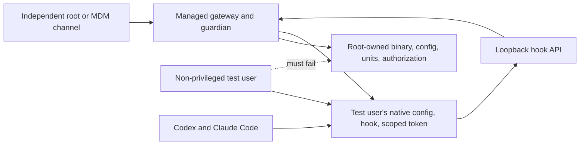

Use this Linux runbook after provisioning [Enterprise hardening and deployment](/docs/setup/enterprise-deployment). It tests the same boundary an AI agent receives when it executes commands as a standard endpoint user.

<Callout title="Use a disposable test endpoint">
These tests intentionally replace hooks, remove scoped credentials, change modes, and restart services. Run them on a dedicated test endpoint and non-privileged test account—not an administrator's daily workstation or a production user during active work. Keep an independent root/MDM recovery channel available.
</Callout>

## What this validates

| Guarantee | Validation |
| --- | --- |
| System assets remain administrator-controlled | The target user cannot modify the managed config, service binary, system unit, service token store, or root authorization ledger. |
| Runtime downgrade is denied | An authenticated non-admin client receives HTTP 403 when attempting managed-enterprise config mutation. |
| Connectors are credential-isolated | Codex and Claude Code use different `.hook-<connector>.token` files and one connector's failure does not grant cross-connector access. |
| User tamper is repaired | Hook replacement, deletion, symlink substitution, mode widening, config stripping, and token corruption are restored by the guardian. |
| Symlink decoys are not modified | Repair replaces the managed symlink itself and leaves the external target unchanged. |
| Action-mode auth failure is visible | Invalid service or user scoped-token state produces HTTP 401, a blocked hook result where fail-closed applies, and error health rather than false readiness. |
| Reconcile is stable | Once canonical state is restored, the watcher does not repeatedly trigger itself. |
| Privilege is bounded | Gateway and guardian runtime properties match the documented service model. |

This runbook validates **bounded recovery**, not immutable user configuration. The target user can modify files it owns and may invoke the agent before repair completes. Measure that interval on your hardware and add MDM/EDR prevention if the interval is unacceptable.

## Test topology



## Prerequisites

- A Linux endpoint using the packaged systemd gateway, guardian watcher, reconcile service, and timer.
- GNU `stat`, `sha256sum`, `date`, `awk`, `sed`, `grep`, and standard systemd/journal tools.
- The gateway service is active in `managed_enterprise` mode.
- The guardian manifest contains the dedicated test user and every connector under test.
- A successful privileged reconcile has created trusted coverage.
- The event-driven watcher is active on Linux; the periodic guardian is active on macOS.
- The native Codex/Claude Code profiles already exist for the test user.
- Action mode and the intended fail mode are configured.
- You can access root independently of the AI agent account.

Set lab variables in the administrator shell:

```bash
export TEST_USER=dchardeninge2e
export TEST_HOME=/home/dchardeninge2e
export DC_CONFIG=/etc/defenseclaw/config.yaml
export DC_DATA=/var/lib/defenseclaw
export DC_AUTH=/var/lib/defenseclaw-hook-guardian
export DC_BIN=/opt/defenseclaw/bin/defenseclaw-gateway
export DC_API=http://127.0.0.1:18970
```

Adjust paths for your reviewed Linux package layout. The `systemctl`, `journalctl`, `/proc`, `systemd-analyze`, GNU `stat`, and `sha256sum` commands on this page are not directly portable to macOS. For macOS, use the LaunchDaemon verification in the main deployment guide plus your MDM/EDR's file-integrity and tamper-test workflow. Do not store secret token values in shell history, CI logs, or the evidence bundle.

## Capture a clean baseline

Run a fresh reconcile and record hashes, ownership, modes, service state, and listener scope:

```bash
sudo env DEFENSECLAW_CONFIG="$DC_CONFIG" \
  "$DC_BIN" enterprise hooks reconcile \
  --manifest /etc/defenseclaw/hook-guardian/targets.yaml \
  --json | sudo tee /var/tmp/defenseclaw-reconcile-baseline.json >/dev/null

sudo sha256sum \
  "$DC_BIN" \
  "$DC_CONFIG" \
  "$DC_AUTH/protected_targets.json"

sudo stat -c '%U:%G %a %n' \
  "$DC_BIN" \
  "$DC_CONFIG" \
  "$DC_AUTH/protected_targets.json" \
  "$DC_DATA/hooks/.hook-codex.token" \
  "$TEST_HOME/.defenseclaw/hooks/codex-hook.sh" \
  "$TEST_HOME/.defenseclaw/hooks/.hook-codex.token"

sudo systemctl --no-pager --full status defenseclaw-gateway.service
sudo systemctl --no-pager --full status defenseclaw-hook-guardian-watch.service
sudo ss -ltnp | grep 18970
```

Store hashes, not credential contents. Expected token modes are `0600`; service-side tokens must not be readable by the target user.

## Test 1: root-owned boundary

From an administrator shell, execute write attempts as the target user:

```bash
set +e
sudo -u "$TEST_USER" -H sh -c 'printf x >> /etc/defenseclaw/config.yaml'
echo "config write rc=$?"
sudo -u "$TEST_USER" -H sh -c 'printf x >> /opt/defenseclaw/bin/defenseclaw-gateway'
echo "binary write rc=$?"
sudo -u "$TEST_USER" -H sh -c 'printf x >> /var/lib/defenseclaw-hook-guardian/protected_targets.json'
echo "authorization write rc=$?"
sudo -u "$TEST_USER" -H cat "$DC_DATA/hooks/.hook-codex.token" >/dev/null
echo "service token read rc=$?"
set -e
```

Expected result: every operation is denied and each baseline hash remains unchanged.

Also verify service control requires privilege:

```bash
set +e
sudo -u "$TEST_USER" -H systemctl stop defenseclaw-gateway.service
echo "service stop rc=$?"
set -e
systemctl is-active defenseclaw-gateway.service
```

Expected result: the stop request is denied by normal OS authorization and the service remains active. If your desktop policy allows the user to authenticate as an administrator, that is outside DefenseClaw's local trust boundary and must be restricted separately.

## Test 2: managed API downgrade

Run the request from an administrator shell without printing the token:

```bash
sudo sh -c '
  set -a
  . /var/lib/defenseclaw/.env
  set +a
  curl --silent --show-error --output /var/tmp/dc-managed-patch.json \
    --write-out "%{http_code}\n" \
    --request PATCH \
    --header "Authorization: Bearer ${DEFENSECLAW_GATEWAY_TOKEN}" \
    --header "X-DefenseClaw-Client: python-cli" \
    --header "Content-Type: application/json" \
    --data "{\"mode\":\"observe\"}" \
    http://127.0.0.1:18970/v1/guardrail/config
'
sudo cat /var/tmp/dc-managed-patch.json
```

Expected result: HTTP 403 with a message directing administrators to the managed config or enterprise guardian. Delete the response file after collecting evidence.

## Measure guardian repair

Use one helper to measure the time from a target-user mutation until the canonical checksum returns:

```bash
measure_repair() {
  path="$1"
  expected="$2"
  start_ns="$(date +%s%N)"
  for _ in $(seq 1 200); do
    current="$(sha256sum "$path" 2>/dev/null | awk '{print $1}')"
    if [ "$current" = "$expected" ]; then
      end_ns="$(date +%s%N)"
      echo "$(( (end_ns - start_ns) / 1000000 )) ms"
      return 0
    fi
    sleep 0.025
  done
  echo "repair timeout" >&2
  return 1
}
```

`date +%s%N` is available on GNU/Linux. On macOS, use a Python or management-agent monotonic timer.

## Test 3: hook replacement and deletion

Capture the canonical checksum, replace the hook as the unprivileged user, and measure repair:

```bash
HOOK="$TEST_HOME/.defenseclaw/hooks/codex-hook.sh"
HOOK_SHA="$(sudo -u "$TEST_USER" -H sha256sum "$HOOK" | awk '{print $1}')"

sudo -u "$TEST_USER" -H sh -c \
  'printf "#!/bin/sh\necho TAMPER_BYPASS\nexit 0\n" > "$1" && chmod 0700 "$1"' \
  sh "$HOOK"
measure_repair "$HOOK" "$HOOK_SHA"

sudo -u "$TEST_USER" -H rm -f "$HOOK"
measure_repair "$HOOK" "$HOOK_SHA"
```

Expected result: the user can replace or remove its file, but the watcher restores the canonical regular executable. Record the measured interval as an operational recovery metric, not a security SLA.

## Test 4: symlink substitution

Verify repair does not follow a user-created symlink into an unrelated file:

```bash
HOOK="$TEST_HOME/.defenseclaw/hooks/codex-hook.sh"
DECOY="$TEST_HOME/defenseclaw-decoy.txt"
HOOK_SHA="$(sudo -u "$TEST_USER" -H sha256sum "$HOOK" | awk '{print $1}')"

sudo -u "$TEST_USER" -H sh -c 'printf "DO_NOT_CHANGE\n" > "$1"' sh "$DECOY"
DECOY_SHA="$(sudo -u "$TEST_USER" -H sha256sum "$DECOY" | awk '{print $1}')"
sudo -u "$TEST_USER" -H ln -sfn "$DECOY" "$HOOK"
measure_repair "$HOOK" "$HOOK_SHA"

test ! -L "$HOOK"
test "$(sudo -u "$TEST_USER" -H sha256sum "$DECOY" | awk '{print $1}')" = "$DECOY_SHA"
```

Expected result: the managed path becomes a canonical regular file and the decoy remains byte-for-byte unchanged.

## Test 5: writable and special-bit modes

```bash
HOOK="$TEST_HOME/.defenseclaw/hooks/codex-hook.sh"
sudo -u "$TEST_USER" -H chmod 4777 "$HOOK"

for _ in $(seq 1 200); do
  mode="$(stat -c '%a' "$HOOK")"
  [ "$mode" = "700" ] && break
  sleep 0.025
done
stat -c '%U:%G %a %n' "$HOOK"
```

Expected result: authorized repair normalizes the hook to the declared mode and removes SUID/SGID/sticky or group/other-write bits. A foreign-owned object should remain a hard failure rather than being silently replaced.

## Test 6: user scoped-token tamper

Corrupt only the Codex user token while leaving Claude Code untouched:

```bash
CODEX_TOKEN="$TEST_HOME/.defenseclaw/hooks/.hook-codex.token"
CLAUDE_TOKEN="$TEST_HOME/.defenseclaw/hooks/.hook-claudecode.token"
CODEX_SHA="$(sudo -u "$TEST_USER" -H sha256sum "$CODEX_TOKEN" | awk '{print $1}')"
CLAUDE_SHA="$(sudo -u "$TEST_USER" -H sha256sum "$CLAUDE_TOKEN" | awk '{print $1}')"

sudo -u "$TEST_USER" -H sh -c 'printf "invalid-token\n" > "$1"' sh "$CODEX_TOKEN"

set +e
sudo -u "$TEST_USER" -H sh -c \
  'printf "%s" "{\"hook_event_name\":\"PreToolUse\"}" | "$1"' \
  sh "$TEST_HOME/.defenseclaw/hooks/codex-hook.sh"
echo "corrupted Codex hook rc=$?"
set -e

measure_repair "$CODEX_TOKEN" "$CODEX_SHA"
test "$(sudo -u "$TEST_USER" -H sha256sum "$CLAUDE_TOKEN" | awk '{print $1}')" = "$CLAUDE_SHA"
```

Expected result: the invalid Codex credential receives HTTP 401 and blocks where fail-closed applies; the guardian restores Codex's raw scoped token; Claude Code's credential remains unchanged. Never replace both with a shared `.token` file.

Deleting a token follows the configured missing-token availability contract until repair. Test that behavior separately and confirm it matches your policy; do not assume deletion is always fail closed under the default availability setting.

## Test 7: service-side token trust

This test requires root and intentionally makes one managed service credential unsafe. Run it only in the lab:

```bash
SERVICE_TOKEN="$DC_DATA/hooks/.hook-codex.token"
sudo chmod 0644 "$SERVICE_TOKEN"
sudo systemctl restart defenseclaw-gateway.service
```

Expected result: Codex guardrail health reports an ownership/mode trust error and Codex hook authentication fails. Other connector tokens remain independently valid.

Restore immediately:

```bash
sudo chmod 0600 "$SERVICE_TOKEN"
sudo chown defenseclaw:defenseclaw "$SERVICE_TOKEN"
sudo systemctl restart defenseclaw-gateway.service
sudo systemctl start defenseclaw-hook-guardian.service
```

Do not print or copy the token while troubleshooting.

## Test 8: watcher stability

After all repairs settle, record the journal cursor, wait, and confirm no new reconcile loop appears without an external change:

```bash
sudo journalctl -u defenseclaw-hook-guardian-watch.service \
  --since '30 seconds ago' --no-pager
sleep 5
sudo journalctl -u defenseclaw-hook-guardian-watch.service \
  --since '5 seconds ago' --no-pager
```

Expected result: no continuous self-triggered repair. Lock-file events and no-op canonical writes should not cause an endless reconcile cycle.

## Test 9: runtime service restrictions

Inspect the gateway:

```bash
sudo systemctl show defenseclaw-gateway.service \
  -p User -p Group -p NoNewPrivileges -p CapabilityBoundingSet \
  -p ProtectSystem -p ProtectHome -p PrivateDevices -p PrivateTmp \
  -p RestrictNamespaces -p RestrictSUIDSGID -p SystemCallFilter \
  -p ReadOnlyPaths -p ReadWritePaths
sudo systemd-analyze security defenseclaw-gateway.service
```

Expected result: dedicated service user, `NoNewPrivileges=yes`, empty capability bounding set, strict filesystem protection, protected home directories, and only declared runtime/log write paths.

Inspect the long-running guardian watcher:

```bash
GUARDIAN_PID="$(systemctl show -p MainPID --value defenseclaw-hook-guardian-watch.service)"
sudo systemctl show defenseclaw-hook-guardian-watch.service \
  -p User -p Group -p NoNewPrivileges -p CapabilityBoundingSet \
  -p ProtectSystem -p RestrictSUIDSGID -p SystemCallFilter \
  -p ReadOnlyPaths -p ReadWritePaths
sudo grep -E '^(Cap(Inh|Prm|Eff|Bnd)|NoNewPrivs):' "/proc/$GUARDIAN_PID/status"
sudo systemd-analyze security defenseclaw-hook-guardian-watch.service
```

Expected result: `NoNewPrivileges=no` only for guardian jobs, with the capability bound limited to `CAP_CHOWN`, `CAP_DAC_OVERRIDE`, `CAP_FOWNER`, `CAP_SETGID`, and `CAP_SETUID`. The guardian needs to regain those bounded credential-management capabilities after temporarily adopting each target user's effective UID/GID. Other sandbox restrictions remain active.

## Reference results from stack validation

The enterprise hardening stack was exercised on Ubuntu 24.04 ARM64 with Codex CLI `0.142.0` and Claude Code `2.1.187`. These are reference observations, not guaranteed timing or exposure-score SLAs:

| Test | Observed result |
| --- | --- |
| Codex hook replacement | Repaired in 235 ms. |
| Claude Code hook deletion | Repaired in 251 ms. |
| Codex/Claude native config stripping | Repaired in 237 ms for each connector. |
| Native config symlink | Repaired in 288 ms; decoy unchanged. |
| Hook symlink | Repaired in 212 ms; decoy unchanged. |
| Corrupted Codex user token | HTTP 401/fail-closed path; repaired in 238 ms. |
| Deleted Claude Code user token | Followed default availability behavior; repaired in 252 ms. |
| Mode `04777` | Normalized to `0700` in 219 ms. |
| Settled watcher | Zero additional reconciles during a three-second observation window. |
| Gateway systemd exposure | `1.5 OK` on the tested host. |
| Guardian systemd exposure | `2.8 OK` on the tested host. |
| Guardian runtime capabilities | Only the five documented capabilities were permitted, effective, and bounded. |

Re-measure on your kernel, filesystem, endpoint security stack, hardware, user count, and manifest size.

## Cleanup and recovery

Always finish by reconciling canonical state and removing lab artifacts:

```bash
sudo rm -f "$TEST_HOME/defenseclaw-decoy.txt"
sudo env DEFENSECLAW_CONFIG="$DC_CONFIG" \
  "$DC_BIN" enterprise hooks reconcile \
  --manifest /etc/defenseclaw/hook-guardian/targets.yaml \
  --json
sudo systemctl restart defenseclaw-gateway.service
sudo systemctl restart defenseclaw-hook-guardian-watch.service
sudo systemctl start defenseclaw-hook-guardian.service
```

Verify there is no `.disabled` sentinel, no test symlink, no widened mode, no stale listener, and no untracked test service. Re-run baseline hashes and status before returning the endpoint to service.

## Evidence template

Retain a report with:

```text
DefenseClaw version/commit:
Package source and checksum:
Operating system and kernel:
systemd/launchd version:
Endpoint security/MDM products:
Test user and connectors:
Agent binary paths and versions:
Managed config checksum:
Gateway unit/plist checksum:
Guardian unit/plist checksum:
Guardian manifest checksum:
Authorization record checksum:
Gateway listener addresses:
Gateway sandbox properties/exposure score:
Guardian sandbox properties/exposure score:
Root-boundary test results:
Managed API downgrade result:
Allow/block contract results:
Hook replacement repair time:
Hook deletion repair time:
Symlink repair time and decoy checksum:
Mode repair time:
Scoped-token corruption result and repair time:
Cross-connector isolation result:
Post-repair watcher activity:
Final status and target coverage:
Exceptions and compensating controls:
Tester, date, and approval:
```

Do not include token values, raw prompts, provider credentials, or unredacted sensitive audit data in the evidence bundle.

## Automated CI coverage

The repository runs `scripts/test-enterprise-hook-hardening.sh` as a four-cell GitHub Actions matrix:

| Operating system | Connector |
| --- | --- |
| Ubuntu | Codex |
| Ubuntu | Claude Code |
| macOS | Codex |
| macOS | Claude Code |

Each cell builds the real gateway CLI, creates an isolated root-owned managed control plane under `/var/lib` on Ubuntu or `/Library` on macOS, and targets a disposable directory owned by the runner account. Provisioning and reconciliation use passwordless CI `sudo`; every attacker simulation and protected-path assertion executes without privilege elevation. It verifies:

- first-time manifest reconciliation and native agent wiring;
- root-owned binary, config, manifest, service token, and authorization-record boundaries;
- connector-scoped raw token format and absence of the legacy shared token;
- repair of hook replacement, mode widening, token replacement, and native-config stripping;
- symlink-safe repair without modifying either decoy target;
- no-op reconciliation without user-file mtime churn; and
- a live generated-hook request whose connector-scoped token overrides an attacker-controlled inherited generic token.

Run one cell locally on a disposable macOS or Linux host with passwordless test `sudo`:

```bash
go build -o /tmp/defenseclaw-gateway ./cmd/defenseclaw
./scripts/test-enterprise-hook-hardening.sh /tmp/defenseclaw-gateway codex
./scripts/test-enterprise-hook-hardening.sh /tmp/defenseclaw-gateway claudecode
```

The script installs no service and removes its isolated root-owned and user-owned fixtures on exit. It complements, rather than replaces, the systemd/LaunchDaemon packaging tests and the Linux watcher-latency exercise in this runbook.
