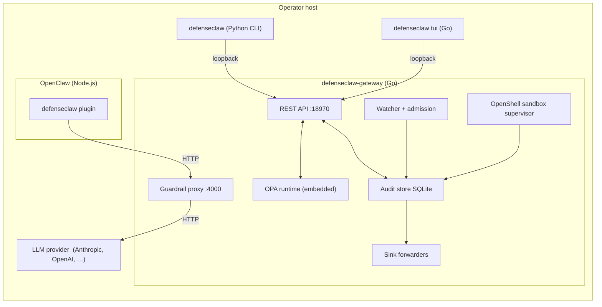

## Overview

DefenseClaw is a three-process system glued together by well-defined network and disk contracts. This page lays out what each process owns, what talks to what, and how data moves end to end.

## Process topology

## Who owns what

| Process | Responsibilities | Never does |
|---------|------------------|------------|
| `defenseclaw` (Python CLI) | Operator UX, on-disk config writes, interactive wizards | Never touches the audit DB directly, never loads Rego |
| `defenseclaw-gateway` (Go sidecar) | All decisions, all storage, all networking | Never prompts the user, never writes to `config.yaml` |
| `defenseclaw tui` (Go) | Visual layer over the sidecar API | Never short-circuits decisions |
| OpenClaw plugin (Node/TS) | Intercept `fetch`, route to guardrail proxy, attach correlation IDs | Never inspects content itself |

Invariant: the CLI, TUI, and plugin contain **no security decisions** — all decision logic is in the sidecar. This means the sidecar is the single audit point and the single thing to patch when security policy changes.

## Data flow: a prompt

1. User types in an agent.
2. OpenClaw calls LLM provider → intercepted by the DefenseClaw plugin.
3. Plugin rewrites the request to point at `127.0.0.1:4000`, adds `X-DC-Target-URL`, forwards provider auth as `X-AI-Auth`, and attaches any `X-DefenseClaw-*` correlation headers it has.
4. Guardrail proxy receives the request, reads body, calls `Inspect(direction=prompt)`.
5. Inspect pipeline:
   - consult verdict cache by content hash
   - miss → apply rule-pack regex triagers → collect findings
   - if strategy includes judge → call LLM judge → collect judge findings
   - combine → apply suppressions → compute action via `guardrail.rego`
6. Result is written to the audit store and enqueued for sink forwarding.
7. If action is `allow` or `warn`, proxy forwards to the real provider.
8. Provider responds → guardrail runs the same pipeline on the completion (and, for streaming, on each chunk).
9. Proxy returns to plugin → plugin returns to OpenClaw → agent continues.

Every stage emits an OTel span in a single trace keyed by the correlation ID.

## Data flow: a skill install

1. User (or OpenClaw installer) writes files under `~/.openclaw/skills/<name>/`.
2. Watcher notices the create events.
3. Watcher invokes the skill scanner in subprocess isolation.
4. Scanner returns a `ScanVerdict`.
5. `admission.rego` is evaluated with `input = {scope: "skill", verdict: ...}`.
6. Result:
   - `allow` → watcher records snapshot for drift detection.
   - `warn` → same as allow, but emits a warning event.
   - `block` → watcher quarantines the skill (moves to `~/.defenseclaw/quarantine/`).
7. Event is written to the audit store and forwarded.

## Boundaries and contracts

These boundaries exist so individual processes can be restarted independently:

- CLI ↔ Sidecar: loopback HTTP on port 18970. CLI retries on transient failures where command code implements retry behavior.
- Sidecar ↔ OPA: in-process (OPA is embedded via CGO-free Go bindings).
- Sidecar ↔ Audit store: SQLite WAL, single writer.
- Sidecar ↔ Sinks: async queue; sinks run in their own goroutines with backoff.
- Plugin ↔ Guardrail proxy: HTTP on port 4000. The plugin marks the intended upstream with `X-DC-Target-URL`.

## Failure isolation

- Sidecar crash → local REST calls fail and intercepted plugin traffic cannot reach the guardrail proxy until the sidecar restarts.
- CLI crash → sidecar unaffected.
- Sink outage → events queue locally; once queue fills, oldest forwarded events are dropped but audit DB is lossless.
- OPA compile failure → reload is rejected; running policy continues unchanged.
- Judge timeout or provider error is handled inside the guardrail inspector and recorded through gateway/audit telemetry paths.

## Related

- [Inspection pipeline](/docs-site/developer/inspection-pipeline)
- [RPC contract](/docs-site/developer/rpc-contract)
- [Telemetry contract](/docs-site/developer/telemetry-contract)
- [Policy lifecycle](/docs-site/policy/lifecycle)

---

<!-- generated-from: cmd/defenseclaw/main.go, internal/cli/root.go, internal/gateway/api.go, internal/gateway/proxy.go, internal/gateway/guardrail.go, internal/gateway/rpc.go, internal/gateway/client.go, internal/watcher/watcher.go, cli/defenseclaw/main.py, extensions/defenseclaw/src/fetch-interceptor.ts -->
