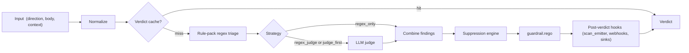

## Overview

The inspection pipeline is the heart of the guardrail. This page documents its stages, what each stage is allowed to do, and the guarantees the pipeline promises its callers.

## Stages

## Stage contracts

Each stage has an input type, an output type, and a maximum latency budget. The pipeline enforces these.

| Stage | Input | Output | Budget |
|-------|-------|--------|--------|
| Normalize | Raw `InspectInput` | `NormalizedInput` (UTF-8 safe, bounded size) | 1 ms |
| Verdict cache | NormalizedInput | cached verdict or miss | 0.1 ms |
| Regex triage | NormalizedInput | `[]Finding` | 10 ms |
| LLM judge | NormalizedInput + regex findings | `[]Finding` | 1500 ms (budget; default timeout) |
| Combine | Two finding sets | Merged + deduped | 0.1 ms |
| Suppression | Findings + context | Possibly-reduced findings | 0.5 ms |
| Rego | Findings + mode + direction | Action + reason | 1 ms |
| Post-hooks | Verdict | (side effects) | async |

Exceeding a budget does not fail the pipeline — it records a `slow` event. But consistent breaches are a signal that a rule pack or a judge has regressed.

## Invariants

- **Every input produces exactly one verdict**, even on error. Errors become `action=allow` (fail-open) or `action=block` (fail-closed) based on `guardrail.fail_mode`.
- **Verdicts are idempotent**. The same input (content hash + direction + strategy + pack_version) always produces the same verdict, barring judge non-determinism (which is handled by the judge client retry + sampling policy).
- **Decisions never depend on time of day**. No stage reads the wall clock for decision-making; only for timestamps in the resulting event.
- **The pipeline never stores request bodies persistently**. Only hashes and (optionally, redacted) fingerprints go to disk.
- **No stage can mutate policy**. Policy is read-only during inspection; hot-reloads land between inspections.

## Concurrency

The pipeline is embarrassingly parallel across requests. Per-request it's single-threaded through regex and judge stages (both internally batched), then fans out on the post-hooks.

The sidecar runs one pipeline per incoming HTTP handler goroutine. Backpressure is applied at the proxy level (see [guardrail.max_in_flight](/docs-site/guardrail/configuration)).

## Extensibility points

| Hook | When | Signature |
|------|------|-----------|
| `BeforeNormalize` | First | `func(ctx, *InspectInput) error` |
| `AfterTriage` | After regex triage | `func(ctx, *InspectInput, *[]Finding) error` |
| `BeforeJudge` | Before judge (can suppress the judge) | `func(ctx, *InspectInput, []Finding) (skip bool, err error)` |
| `AfterCombine` | After combine | `func(ctx, *Verdict) error` |
| `OnVerdict` | Final | `func(ctx, *Verdict)` |

Hooks are registered at sidecar startup and are the extension surface for in-tree scanners.

## Observability

Every stage produces an OTel span with the stable name `guardrail.<stage>`. Span attributes include `correlation_id`, `direction`, `strategy`, and `pack_version`. Metrics emit per-stage latency histograms under `defenseclaw_guardrail_stage_duration_seconds{stage="..."}`.

## Related

- [Architecture](/docs-site/developer/architecture)
- [Telemetry contract](/docs-site/developer/telemetry-contract)
- [Verdict cache](/docs-site/guardrail/verdict-cache)

---

<!-- generated-from: internal/gateway/guardrail.go, internal/gateway/triage_normalize.go, internal/gateway/llm_judge.go, internal/guardrail/suppress.go -->
