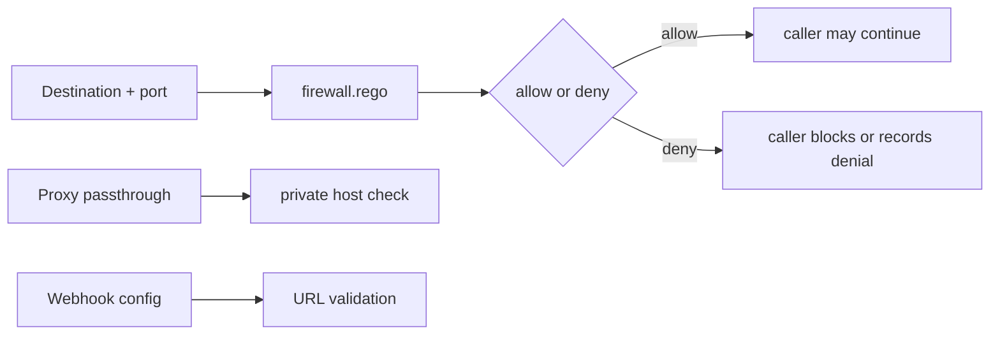

## Overview

DefenseClaw has two firewall-related layers:

- A pure-Go firewall config/compiler package that can turn `firewall.yaml` into platform rules for pfctl or iptables.
- A Rego-backed policy evaluator exposed by the sidecar for destination decisions.

The gateway also emits structured egress events for guardrail proxy passthrough decisions and applies SSRF defenses in webhook delivery and LLM-shaped passthrough handling.

## Three concerns

| Concern | Mechanism | Page |
|---------|-----------|------|
| "Can this destination be reached?" | `policy.EvaluateFirewall` plus `policies/rego/firewall.rego` | [Rules](/docs-site/firewall/rules) |
| "What outbound connections are visible?" | `internal/firewall.Observe` and gateway egress records | [Egress observer](/docs-site/firewall/egress-observer) |
| "Can a URL point back inside the host?" | Webhook URL validation and proxy private-host checks | [SSRF protection](/docs-site/firewall/ssrf-protection) |

## Decision flow

## Relationship to the guardrail

The guardrail inspects LLM content. The firewall policy evaluates destination metadata: target type, destination, port, and protocol. These are separate checks in source, and the docs should not imply that every guardrail request is automatically compiled into OS-level firewall state.

## Related

- [Guardrail architecture](/docs-site/guardrail/architecture)
- [Notification queue](/docs-site/guardrail/notification-queue)
- [Webhook dispatcher](/docs-site/observability/webhook-dispatcher)

---

<!-- generated-from: internal/firewall/config.go, internal/firewall/compiler.go, internal/firewall/observe.go, internal/firewall/status.go, internal/gateway/api.go, internal/gateway/proxy.go, internal/gateway/webhook.go, internal/gateway/shape.go, policies/rego/firewall.rego -->
