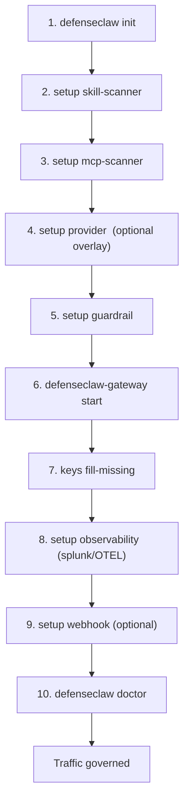

## Overview

This walkthrough takes DefenseClaw from installed binaries to a governed workstation: local state exists, policy packs are seeded, the sidecar is running, the guardrail can inspect LLM traffic, scanners can evaluate skills and MCP servers, and audit events land locally with optional SIEM forwarding. Every step links to a dedicated page with flags, verification, and rollback.

<Callout type="info">
  If you have not yet installed the binaries, start at [Install methods](/docs-site/installation/index). This page assumes `defenseclaw` and `defenseclaw-gateway` are on `PATH`.
</Callout>

## Pick a setup route

| Route | Use when | Main command | Tradeoff |
|-------|----------|--------------|----------|
| Quickstart | You want a safe lab default with no prompts | `defenseclaw quickstart --non-interactive --yes` | Fastest path; uses observe mode, local scanner, and no judge unless you pass flags. |
| Guided setup | You are onboarding a human operator | `defenseclaw init --enable-guardrail` | Prompts for guardrail choices and patches OpenClaw when its config exists. |
| Explicit setup | You are writing runbooks or CI | Run the step table below | More commands, but every decision is visible and repeatable. |

<Callout type="warning" title="OpenClaw can be the blocker">
  If OpenClaw has not created `~/.openclaw/openclaw.json`, DefenseClaw can still initialize local state, but `setup guardrail` cannot patch OpenClaw until that file exists.
</Callout>

## The 10-step happy path



Most setup commands are idempotent: they preserve existing config and print the current value before mutating. Treat `keys fill-missing` and mode changes as intentional writes to `~/.defenseclaw/.env` or `config.yaml`.

## Step-by-step

| # | Command | What it does | Page |
|---|---------|--------------|------|
| 1 | `defenseclaw init` | Creates `~/.defenseclaw/`, seeds policies, initializes SQLite audit DB, generates the Ed25519 device key, writes default config | [init](/docs-site/first-setup/init) |
| 2 | `defenseclaw setup skill-scanner` | Verifies the `skill_scanner` Python SDK is importable, applies scanner defaults | [skill-scanner](/docs-site/first-setup/setup-skill-scanner) |
| 3 | `defenseclaw setup mcp-scanner` | Verifies the `mcpscanner` SDK (needs Python ≥ 3.11), configures default analyzers | [mcp-scanner](/docs-site/first-setup/setup-mcp-scanner) |
| 4 | `defenseclaw setup provider add --name internal-llm --domain https://llm.example.com` | Adds internal/self-hosted LLM domains to the passthrough allow-list (only if you run one) | [provider](/docs-site/first-setup/setup-provider) |
| 5 | `defenseclaw setup guardrail` | Installs the OpenClaw plugin, patches `~/.openclaw/openclaw.json` to route LLM traffic through the guardrail on **4000** | [guardrail](/docs-site/first-setup/setup-guardrail) |
| 6 | `defenseclaw-gateway start` | Spawns the Go sidecar as a background daemon, binds REST on **18970** and guardrail on **4000** | [gateway](/docs-site/first-setup/setup-gateway) |
| 7 | `defenseclaw keys fill-missing` | Prompts for every REQUIRED-but-unset credential, persists to `~/.defenseclaw/.env` at mode `0600` | [provider keys](/docs-site/first-setup/setup-provider) |
| 8 | `defenseclaw setup observability add splunk-hec` | Attaches Splunk O11y, HEC, Datadog, Honeycomb, New Relic, Grafana Cloud, or a generic OTLP/HTTP sink | [observability](/docs-site/first-setup/setup-observability) / [Splunk](/docs-site/first-setup/setup-splunk) |
| 9 | `defenseclaw setup webhook add slack` | Adds a chat/incident webhook (Slack, PagerDuty, Webex, or generic HMAC) | [webhook](/docs-site/first-setup/setup-webhook) |
| 10 | `defenseclaw doctor` | End-to-end preflight: binary paths, config, plugin presence, OpenClaw wiring, key resolution | [doctor](/docs-site/cli/commands/doctor) |

## Minimum command set

Use this when you want the shortest explicit path that still leaves clear checkpoints:

```bash
defenseclaw init
defenseclaw setup guardrail --non-interactive --mode observe --scanner-mode local --port 4000
defenseclaw-gateway start
defenseclaw status
defenseclaw doctor
```

Expected outcome:

| After | You should see |
|-------|----------------|
| `init` | `~/.defenseclaw/config.yaml`, `~/.defenseclaw/audit.db`, policy files, and a device key. |
| `setup guardrail` | Guardrail enabled in `config.yaml`; OpenClaw config patched if available; warnings printed if the plugin/config was missing. |
| `defenseclaw-gateway start` | A PID and log path under `~/.defenseclaw/`. |
| `status` | Scanner availability, audit counts, observability destinations, and sidecar state. |
| `doctor` | PASS/WARN/FAIL/SKIP grouped by config, scanners, services, credentials, observability, and webhooks. |

## Zero-prompt alternative

For CI and first-run automation use [`defenseclaw quickstart`](/docs-site/cli/commands/quickstart), which runs steps 1, 5, and 6 non-interactively with `mode=observe`, `scanner=local`, and no judge, then prints a summary of which REQUIRED API keys are still missing. It is the same code path invoked by `make all` and `curl | bash` after install.

<Callout type="tip" title="Start in observe before action">
  The guardrail ships with `mode=observe` so findings are logged but never blocked. Leave it in observe for 24–72h, review the [Audit store](/docs-site/observability/audit-store) for false positives, tune your [suppressions](/docs-site/guardrail/suppressions), then flip to `mode=action` with `defenseclaw setup guardrail --mode action --non-interactive`.
</Callout>

## Verify everything is wired

```bash
defenseclaw status
defenseclaw doctor
curl -s http://127.0.0.1:18970/health | jq .
```

`status` prints sidecar PID, guardrail mode, scanner mode, and active sinks. `doctor` exercises every external dependency (OpenClaw config, plugin, device key, sink tokens) and exits non-zero when any check fails so it's safe in CI.

## Decision points before production

| Decision | Start with | Move forward when |
|----------|------------|-------------------|
| Guardrail enforcement | `observe` | Audit review shows acceptable false-positive volume; then use `defenseclaw setup guardrail --mode action --non-interactive`. |
| Scanner backend | `local` | Remote Cisco AI Defense endpoint and `CISCO_AI_DEFENSE_API_KEY` are reachable; then use `setup guardrail --scanner-mode remote` or scanner setup pages. |
| LLM judge | Off | Regex findings are noisy or semantic intent matters; then configure `--judge-model`, `--judge-api-base`, and `--judge-api-key-env`. |
| SIEM export | Local SQLite only | The sidecar is healthy; then add observability sinks and re-run `defenseclaw doctor`. |

## Related

- [Install methods](/docs-site/installation/index)
- [CLI overview](/docs-site/cli/index)
- [Guardrail overview](/docs-site/guardrail/index)
- [Audit store](/docs-site/observability/audit-store)

---

<!-- generated-from: cli/defenseclaw/commands/cmd_init.py, cli/defenseclaw/commands/cmd_setup.py, cli/defenseclaw/commands/cmd_quickstart.py, cli/defenseclaw/commands/cmd_keys.py, internal/cli/daemon.go -->
