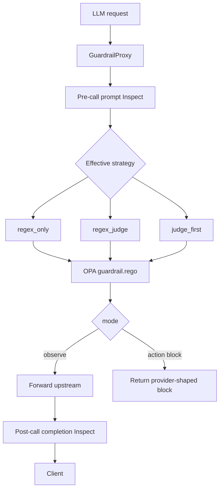

## Overview

The guardrail runtime is centered on `internal/gateway/proxy.go::GuardrailProxy`. The proxy owns the HTTP surface, provider forwarding, streaming handling, action-mode block responses, webhook dispatch for block events, and `NotificationQueue` injection. `internal/gateway/guardrail.go::GuardrailInspector` owns scanner decisions.

## Proxy responsibilities

| Responsibility | Source symbol | Source-backed behavior |
|----------------|---------------|------------------------|
| Listen address | `guardrailListenAddr` | Binds `guardrail.port` on `guardrail.host` / effective host. Default port is `4000`. |
| OpenAI-compatible routes | `Run` | Registers `/v1/chat/completions`, `/chat/completions`, `/v1/models`, `/models`, and health routes. |
| Provider-native passthrough | `handlePassthrough` | Uses `X-DC-Target-URL` for provider-native POST routes. Unknown LLM-shaped domains are blocked unless `allow_unknown_llm_domains` is enabled. |
| Pre-call inspection | `handleChatCompletion` | Inspects prompt text before calling the upstream provider. |
| Post-call inspection | `handleNonStreamingRequest`, `handleStreamingRequest` | Inspects completion text after the provider response. |
| Runtime updates | `applyRuntime` | Applies `mode`, `scanner_mode`, and `block_message` from `guardrail_runtime.json`. |
| Notifications | `enqueueBlockNotification` | Pushes sanitized block context into `NotificationQueue`. |

## Inspector responsibilities

`GuardrailInspector.Inspect` selects the effective strategy for `prompt`, `completion`, or `tool_call`. It starts a strategy span, executes the selected path, and then calls `finalize`, which evaluates `policies/rego/guardrail.rego` when a policy directory is configured.

| Strategy | Source function | What runs |
|----------|-----------------|-----------|
| `regex_only` | `inspectRegexOnly` | Local patterns/rule engine, optional Cisco AI Defense depending on `scanner_mode`. |
| `regex_judge` | `inspectRegexJudge` | Triage patterns, full rule engine safety net, optional judge adjudication, optional no-signal judge sweep, optional Cisco AI Defense. |
| `judge_first` | `inspectJudgeFirst` | Judge and triage run in parallel; regex/rule engine remains a safety net and fallback if the judge fails. |

<Callout type="info" title="The judge does not replace regex">
  Even `judge_first` still merges high-signal regex findings and full rule-engine findings. The regex path is a safety net, not only a triage shortcut.
</Callout>

## Rule-pack loading

`internal/guardrail/rulepack.go::LoadRulePack` loads:

| File | Role |
|------|------|
| `suppressions.yaml` | Pre-judge strips, PII finding suppressions, and tool-specific suppressions. |
| `sensitive-tools.yaml` | Tool-result inspection settings. |
| `judge/injection.yaml` | Prompt-injection judge prompt and categories. |
| `judge/pii.yaml` | PII judge prompt and categories. |
| `judge/tool-injection.yaml` | Tool-injection judge prompt and categories. |
| `rules/*.yaml` | Deterministic regex rules used by `ScanAllRules`. |

If a disk file is missing or corrupt, the loader falls back to the embedded defaults in `internal/guardrail/defaults/`.

## OPA finalization

After scanners produce a merged verdict, `GuardrailInspector.finalize` builds a `policy.GuardrailInput` and evaluates `policies/rego/guardrail.rego`. The Rego policy uses `data.guardrail.severity_rank`, `block_threshold`, `alert_threshold`, and `cisco_trust_level` to choose `allow`, `alert`, or `block`.

## Related

- [Configuration](/docs-site/guardrail/configuration)
- [Judge vs regex](/docs-site/guardrail/judge-vs-regex)
- [Streaming](/docs-site/guardrail/streaming)

---

<!-- generated-from: internal/config/config.go, internal/gateway/proxy.go, internal/gateway/guardrail.go, internal/gateway/llm_judge.go, internal/guardrail/rulepack.go, internal/guardrail/defaults/suppressions.yaml, policies/rego/guardrail.rego -->
