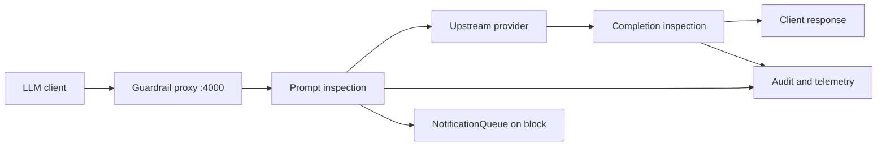

## Overview

The guardrail is a Go proxy on the default loopback port `4000`. It receives LLM traffic, inspects request prompts before the upstream call, inspects completions after the upstream call, and records a `ScanVerdict` with `action`, `severity`, `reason`, `findings`, and scanner attribution. In `observe` mode findings are logged and traffic continues. In `action` mode a `block` verdict is returned in-band.

The local guardrail path is built around `internal/gateway/guardrail.go::GuardrailInspector`. It can run deterministic regex/rule-pack checks, optional Cisco AI Defense remote inspection, optional LLM judge checks, and final OPA policy evaluation through `policies/rego/guardrail.rego`.



<Callout type="warning" title="Observe and action are different">
  The scanner can produce `action=block` in both modes. The proxy only enforces that block when `guardrail.mode` is `action`; `observe` keeps the request flowing and records the verdict.
</Callout>

## Inspection surfaces

| Surface | Runtime direction | Code path | Notes |
|---------|-------------------|-----------|-------|
| Request messages | `prompt` | `GuardrailProxy.handleChatCompletion` -> `Inspect` | Runs before the upstream model call. |
| Non-streaming response text | `completion` | `handleNonStreamingRequest` -> `Inspect` | Runs after the model response is available. |
| Streaming response text | `completion` | `handleStreamingRequest` -> `InspectMidStream` and final `Inspect` | Mid-stream checks are regex-only; final inspection runs after accumulation. |
| OpenAI-format tool calls | `tool_call` | `inspectToolCalls` -> `ScanAllRules` | High or critical tool-call findings block in action mode. |
| Gateway tool results | `completion` | `EventRouter.inspectToolResult` | Only configured sensitive tools are inspected. |

## Common rollout choices

| You need | Start with | Why |
|----------|------------|-----|
| Baseline visibility without user impact | `guardrail.mode: observe` | Records findings while allowing traffic through. |
| Low-latency deterministic blocking | `regex_only` plus `mode: action` | Avoids judge calls on the hot path. |
| Better intent detection for prompts | `regex_judge` on prompt traffic | Regex triage stays cheap while the judge can validate ambiguous hits. |
| Semantic review of tool arguments | `detection_strategy_tool_call: regex_judge` | Tool calls often need intent and argument context. |
| Strict incident containment | `mode: action` and stricter rule pack | Enforces high and critical local findings in-band. |

## Operator workflow

1. Configure guardrail in observe mode.

```bash
defenseclaw setup guardrail --mode observe --detection-strategy regex_judge --non-interactive
```

2. Confirm the sidecar and proxy are healthy.

```bash
defenseclaw-gateway status
defenseclaw doctor --json-output
```

3. Review audit, gateway logs, and false positives before switching to action mode.

4. Enable enforcement once the expected traffic is clean.

```bash
defenseclaw setup guardrail --mode action --restart --non-interactive
```

## Detection defaults

The code defaults are set in `internal/config/defaults.go` and mirrored by `internal/config/config.go`.

| Key | Default | Meaning |
|-----|---------|---------|
| `guardrail.enabled` | `false` | The proxy does not bind unless enabled. |
| `guardrail.mode` | `observe` | Verdicts are recorded but not enforced. |
| `guardrail.scanner_mode` | `both` | Local rules and Cisco AI Defense can both contribute when configured. |
| `guardrail.detection_strategy` | `regex_judge` | Global strategy when a direction-specific override is absent. |
| `guardrail.detection_strategy_completion` | `regex_only` | Completion path uses the deterministic path by default. |
| `guardrail.judge_sweep` | `true` | `regex_judge` can run a full judge sweep when regex triage found no signal. |
| `guardrail.stream_buffer_bytes` | `1024` | Initial streaming text buffer before first action-mode flush. |

## Core pages

| Page | What it covers |
|------|----------------|
| [Architecture](/docs-site/guardrail/architecture) | Proxy, inspector, rules, judge, OPA, and runtime update boundaries. |
| [Configuration](/docs-site/guardrail/configuration) | Actual `guardrail.*` keys in `GuardrailConfig`. |
| [Rule packs](/docs-site/guardrail/rule-packs) | Built-in YAML packs and generated rule inventory. |
| [Writing rules](/docs-site/guardrail/writing-rules) | The rule YAML shape loaded by `internal/guardrail/rulepack.go`. |
| [Suppressions](/docs-site/guardrail/suppressions) | Pre-judge strips, PII suppressions, and tool suppressions. |
| [Sensitive tools](/docs-site/guardrail/sensitive-tools) | Tool-result inspection settings. |
| [Judge vs regex](/docs-site/guardrail/judge-vs-regex) | Strategy trade-offs and the exact decision path. |
| [Verdict cache](/docs-site/guardrail/verdict-cache) | The process-local LLM judge verdict cache. |
| [Multi-turn](/docs-site/guardrail/multi-turn) | `ContextTracker` bounds and current runtime limits. |
| [Notification queue](/docs-site/guardrail/notification-queue) | The 50-item TTL system-message queue used after blocks. |
| [Providers](/docs-site/guardrail/providers) | Provider catalog and adapter matrix. |
| [Streaming](/docs-site/guardrail/streaming) | Initial buffering, mid-stream scans, and block chunks. |
| [Tuning](/docs-site/guardrail/tuning) | Source-backed knobs for observe, action, strategy, and policy thresholds. |
| [Troubleshooting](/docs-site/guardrail/troubleshooting) | Failure modes that map to real code paths. |

## Related

- [Setup: LLM guardrail](/docs-site/first-setup/setup-guardrail)
- [API endpoints](/docs-site/api/endpoints)
- [Observability: OTEL spec](/docs-site/observability/otel-spec)

---

<!-- generated-from: internal/config/config.go, internal/config/defaults.go, internal/gateway/guardrail.go, internal/gateway/proxy.go, internal/gateway/llm_judge.go, internal/gateway/router.go, internal/gateway/notifications.go, internal/guardrail/verdict_cache.go, policies/rego/guardrail.rego -->
