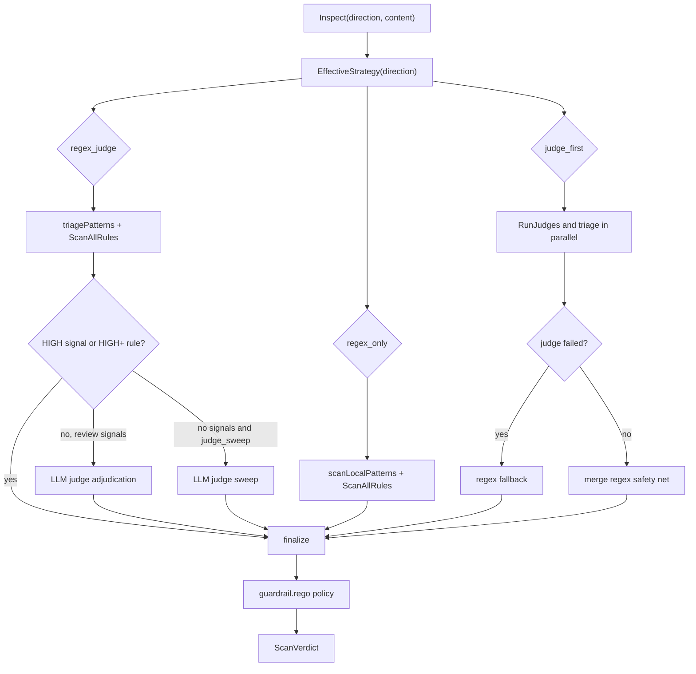

## Overview

`GuardrailInspector.Inspect` chooses one of three strategy functions based on `guardrail.detection_strategy` and the flat per-direction overrides. The default global strategy is `regex_judge`, completion defaults to `regex_only`, and `judge_sweep` defaults to `true`.

## Mode matrix

| Mode | Latency | Cost per call | False-positive rate | Blocks mid-stream | Deterministic | Best for |
|------|---------|---------------|---------------------|-------------------|---------------|----------|
| `regex_only` | Local regex/rule path | $0 LLM spend | Higher on ambiguous patterns | Yes, through `InspectMidStream` | Yes | Known-bad strings, secrets, sensitive paths, dangerous commands |
| `regex_judge` | Local regex first; judge only for review signals or no-signal sweep when enabled | Judge spend only when adjudication or sweep runs | Lower when judge is available | Mid-stream still regex-only | Semi-deterministic | Balanced default for prompt and tool-call traffic |
| `judge_first` | LLM judge path plus regex safety net | Judge spend on every eligible inspection | Lowest semantic miss rate, provider-dependent | Mid-stream still regex-only | No | Semantic intent detection and high-risk deployments |

<Callout type="warning" title="regex_judge can still judge no-signal content">
  With `guardrail.judge_sweep: true`, `inspectRegexJudge` runs `RunJudges` when triage produced no signals. That default improves recall but adds judge cost beyond "judge only on regex hits."
</Callout>

## Decision path

## Strategy details

### `regex_only`

`inspectRegexOnly` runs `scanLocalPatterns`, which includes built-in triage patterns and the full rule engine. If `scanner_mode` is `remote` or `both` and Cisco AI Defense is configured, the remote scanner can be merged too. High or critical local findings produce `action=block`; lower findings alert.

### `regex_judge`

`inspectRegexJudge` separates triage signals into high-confidence and needs-review groups.

| Case | Behavior |
|------|----------|
| High-signal triage | Builds an immediate local-triage verdict. |
| High or critical rule-engine finding | Blocks immediately after optional Cisco merge. |
| Needs-review signals | Calls `LLMJudge.AdjudicateFindings`; judge failure falls back to a medium alert. |
| No signals and `judge_sweep=true` | Calls `LLMJudge.RunJudges` for full classification. |

### `judge_first`

`inspectJudgeFirst` runs the judge and triage concurrently. If the judge fails or returns an error verdict, the inspector falls back to `regex_only`. If the judge succeeds, high-signal regex and high or critical rule-engine findings are still merged into the judge verdict.

## Streaming semantics

`InspectMidStream` is fixed to `inspectRegexOnly`. Streaming output can therefore be blocked in action mode by deterministic patterns, but the LLM judge is reserved for pre-call and final post-call content.

## Cache keying

The LLM judge cache is process-local. `internal/guardrail/verdict_cache.go` builds keys from `kind`, `model`, `direction`, and `content`. A generation counter is stored with each entry and incremented by `Invalidate`, so entries produced before a rule-pack or policy reload become misses without needing an O(n) clear.

## Tuning knobs

| Knob | Source | Use |
|------|--------|-----|
| `guardrail.detection_strategy` | `GuardrailConfig` | Global fallback strategy. |
| `guardrail.detection_strategy_prompt` | `GuardrailConfig` | Prompt override. |
| `guardrail.detection_strategy_completion` | `GuardrailConfig` | Completion override; default `regex_only`. |
| `guardrail.detection_strategy_tool_call` | `GuardrailConfig` | Tool-call override. |
| `guardrail.judge_sweep` | `GuardrailConfig` | Whether `regex_judge` judges no-signal content. |
| `data.guardrail.block_threshold` | `policies/rego/data.json` | Rego threshold for final block decisions. |
| `data.guardrail.alert_threshold` | `policies/rego/data.json` | Rego threshold for final alert decisions. |

## Related

- [Rule packs](/docs-site/guardrail/rule-packs)
- [Suppressions](/docs-site/guardrail/suppressions)
- [Verdict cache](/docs-site/guardrail/verdict-cache)
- [Streaming](/docs-site/guardrail/streaming)

---

<!-- generated-from: internal/config/config.go, internal/config/defaults.go, internal/gateway/guardrail.go, internal/gateway/llm_judge.go, internal/guardrail/verdict_cache.go, policies/rego/guardrail.rego, policies/rego/data.json -->
