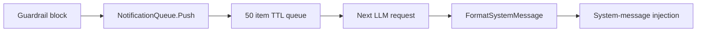

## Overview

`internal/gateway/notifications.go::NotificationQueue` is not a webhook dispatcher. It is a small in-process queue of recent enforcement notifications. When the proxy blocks a prompt, completion, or sensitive tool result, it pushes a sanitized `SecurityNotification`. Later LLM requests call `FormatSystemMessage` and prepend a system message so the model sees the enforcement context.

## Source-backed behavior

| Property | Value |
|----------|-------|
| TTL | `2m` (`notificationTTL`) |
| Maximum size | `50` entries (`maxNotificationQueueSize`) |
| Overflow | Drops oldest entries by slicing to the newest 50. |
| Drain behavior | `ActiveNotifications` prunes expired entries but does not drain active ones. |
| Message prefix | `[DEFENSECLAW SECURITY ENFORCEMENT]` |

## Injection sites

| Source | Behavior |
|--------|----------|
| `GuardrailProxy.enqueueBlockNotification` | Pushes sanitized block details before or while writing a block response. |
| `handleChatCompletion` | Prepends a system message when `FormatSystemMessage` returns content. |
| `handlePassthrough` | Attempts provider-specific passthrough injection and logs a skip when the surface is not supported. |
| `EventRouter.inspectToolResult` | Pushes alert notifications for sensitive tool-result findings. |

## What is separate

The proxy also has a `WebhookDispatcher` field and emits webhooks for block events in `recordTelemetry`. That is separate from `NotificationQueue`; webhook retry, sink routing, and HMAC payload formats belong in observability/webhook documentation, not on this page.

## Related

- [Streaming](/docs-site/guardrail/streaming)
- [Tuning](/docs-site/guardrail/tuning)
- [Observability: webhook dispatcher](/docs-site/observability/webhook-dispatcher)

---

<!-- generated-from: internal/gateway/notifications.go, internal/gateway/proxy.go, internal/gateway/router.go -->
