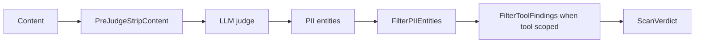

## Overview

Suppressions are loaded from `suppressions.yaml` into `SuppressionsConfig`. They are used by the LLM judge path, not as a general pre-filter for every deterministic rule-pack match.



## Schema

```yaml
version: 1

pre_judge_strips:
  - id: STRIP-SYSTEM-SENDER
    pattern: '\b(cli|system|bot|admin)\b'
    context: "System sender metadata injected by agent framework"
    applies_to: [pii]

finding_suppressions:
  - id: SUPP-PHONE-EPOCH
    finding_pattern: JUDGE-PII-PHONE
    entity_pattern: '^\d{10}$'
    condition: is_epoch
    reason: "Unix timestamp, not phone number"

tool_suppressions:
  - tool_pattern: '^(graph_auth_status|session_status|get_status)$'
    suppress_findings: [JUDGE-PII-USER]
    reason: "Status check tools return expected system metadata"
```

## Pre-judge strips

| Field | Required | Meaning |
|-------|----------|---------|
| `id` | yes | Stable strip identifier. |
| `pattern` | yes | Regex to remove from judge input. |
| `context` | yes | Human-readable justification. |
| `applies_to` | no | Judge type filter. Empty means all judge types; otherwise values must match the judge type passed by code, such as `pii` or `injection`. |

`PreJudgeStripContent` replaces matching text with an empty string. It is applied before PII judge calls in `RunJudges` and before adjudication by category in `AdjudicateFindings`.

## Finding suppressions

| Field | Required | Meaning |
|-------|----------|---------|
| `id` | yes | Stable suppression identifier. |
| `finding_pattern` | yes | Literal or anchored regex-style pattern matched against the judge finding ID. |
| `entity_pattern` | yes | Regex matched against the PII entity value. |
| `condition` | no | Additional named predicate. |
| `reason` | yes | Audit-friendly justification. |

Supported conditions are implemented in `internal/guardrail/suppress.go`:

| Condition | Returns true when |
|-----------|-------------------|
| `is_epoch` | The value is a plausible Unix timestamp. |
| `is_platform_id` | The value looks like a messaging platform numeric ID and not a NANP phone number. |

## Tool suppressions

Tool suppressions apply only when a judge run is scoped to a tool name. `FilterToolFindings` matches `tool_pattern` and suppresses exact finding IDs listed in `suppress_findings`. The emitted suppression ID is `tool:<tool name>`.

## Audit-safe placeholders

When documenting examples, escape placeholder text as `&lt;SUPP-ID&gt;` rather than writing raw uppercase angle-bracket text. Raw placeholders can be parsed as unsupported MDX components.

## Related

- [Writing rules](/docs-site/guardrail/writing-rules)
- [Sensitive tools](/docs-site/guardrail/sensitive-tools)
- [Judge vs regex](/docs-site/guardrail/judge-vs-regex)

---

<!-- generated-from: internal/guardrail/rulepack.go, internal/guardrail/suppress.go, internal/gateway/llm_judge.go, internal/guardrail/defaults/suppressions.yaml, policies/guardrail/default/suppressions.yaml -->
