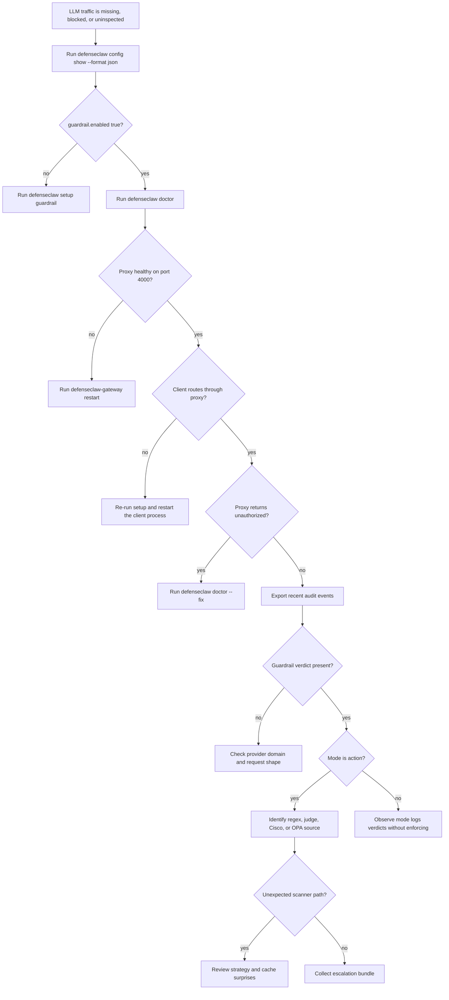

## Overview

Most guardrail issues reduce to one of four layers: the proxy is not enabled or reachable, the provider request is not routed through the proxy, the scanner strategy is not doing what you expect, or the rule pack/judge path is degraded.

## Quick checks

| Symptom | Source-backed check | Likely fix |
|---------|---------------------|------------|
| Proxy never starts | `guardrail.enabled` is false or port `4000` is unavailable. | Run `defenseclaw setup guardrail` or free the port. |
| Fresh install has no proxy | Guardrail was not selected during initialization. | Re-run setup, or initialize with `defenseclaw init --enable-guardrail`. |
| Proxy returns unauthorized | Proxy auth did not match `X-DC-Auth` or `Authorization` expectations. | Re-sync the local gateway token and restart the client process. |
| Unknown provider is blocked | `handlePassthrough` did not match a known provider domain and `allow_unknown_llm_domains` is false. | Add provider config or explicitly enable unknown LLM-shaped domains. |
| Everything is blocked in action mode | A high or critical local finding, judge finding, or OPA result is producing `action=block`. | Switch to observe while tuning rules or OPA thresholds. |
| Judge never runs | `guardrail.judge.enabled` is false, no model is configured, no API key is available, or the provider cannot be constructed. | Configure top-level `llm:` or `guardrail.judge.llm:`. |
| Completion streaming leaks before block | Mid-stream checks happen after the initial buffer and every 500 accumulated characters. | Reduce sensitive completion risk by keeping completion strategy deterministic and reviewing rule coverage. |
| Notification repeats on later requests | `NotificationQueue` does not drain active entries; they persist for two minutes. | Wait for TTL expiry or adjust the block source. |

## Diagnostic decision tree

## Strategy surprises

| Surprise | Explanation |
|----------|-------------|
| `regex_judge` used the judge even though no regex hit | `judge_sweep` defaults to true. |
| `judge_first` still blocked on a regex rule | Regex/rule findings remain a safety net and are merged into judge results. |
| Completion defaults differ from prompts | `detection_strategy_completion` defaults to `regex_only`; prompt and tool-call inherit the global `regex_judge` unless overridden. |
| Observe mode shows `action=block` | The scanner verdict can be block-shaped; observe mode prevents enforcement, not detection. |

## Cache surprises

| Symptom | Explanation |
|---------|-------------|
| Repeated judge calls still happen | The cache is only for judge outcomes with identical `kind`, `model`, `direction`, and `content`. |
| Hits disappear after reload | `Invalidate` increments the cache generation, so older entries become misses. |
| No config key controls cache size | `GuardrailConfig` has no verdict-cache block. |

## Rule-pack problems

| Symptom | Explanation |
|---------|-------------|
| A custom rule file is ignored | `LoadRulePack` reads `rules/*.yaml` under the configured `rule_pack_dir`. Confirm the directory shape and file extension. |
| Bad regex does not crash startup | `Validate` logs a warning and runtime matching skips invalid patterns. |
| Suppression does not apply | Pre-judge strips apply to judge inputs; PII finding suppressions apply to judge PII entities; tool suppressions apply only during scoped tool-result judging. |

## What to collect before escalation

| Evidence | Command | What to look for |
|----------|---------|------------------|
| Guardrail health | `defenseclaw doctor --json-output > doctor.json` | `guardrail`, `Sidecar API`, `Guardrail proxy`, and LLM API key checks. |
| Effective guardrail config | `defenseclaw config show --format json > config.redacted.json` | `guardrail.enabled`, `guardrail.mode`, `guardrail.port`, `guardrail.scanner_mode`, strategy overrides, and judge config. |
| Recent verdicts | `defenseclaw-gateway audit export --limit 1000 --output audit-events.jsonl` | `guardrail-block`, `guardrail-warn`, `guardrail-allow`, and action/severity transitions. |
| Structured proxy logs | `tail -n 1000 ~/.defenseclaw/gateway.jsonl > gateway.tail.jsonl` | Verdict, judge, egress, and schema events tied to the failing request. |
| Policy compile result | `defenseclaw-gateway policy validate > policy-validate.txt` | Rego compilation errors or missing `data.json` keys. |
| Runtime status | `defenseclaw-gateway status > gateway-status.txt` | Whether the sidecar process is the one using the edited config. |

When the failure depends on a provider request, include the provider name, endpoint hostname, and whether the client was using streaming. Do not include raw prompts, completions, provider API keys, or webhook secrets.

## Related

- [Configuration](/docs-site/guardrail/configuration)
- [Streaming](/docs-site/guardrail/streaming)
- [Verdict cache](/docs-site/guardrail/verdict-cache)
- [Notification queue](/docs-site/guardrail/notification-queue)

---

<!-- generated-from: cli/defenseclaw/commands/cmd_doctor.py, cli/defenseclaw/commands/cmd_config.py, cli/defenseclaw/commands/cmd_setup.py, cli/defenseclaw/commands/cmd_init.py, internal/cli/audit_export.go, internal/cli/policy.go, internal/config/config.go, internal/config/defaults.go, internal/gateway/api.go, internal/gateway/proxy.go, internal/gateway/guardrail.go, internal/gateway/llm_judge.go, internal/gateway/notifications.go, internal/audit/sinks/sinks.go, internal/gatewaylog/writer.go, internal/guardrail/rulepack.go, internal/guardrail/suppress.go, internal/guardrail/verdict_cache.go -->
