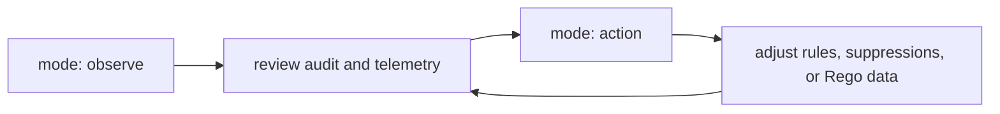

## Overview

Guardrail tuning is smaller than the previous docs implied. The code exposes mode, scanner mode, flat detection-strategy overrides, judge settings, rule-pack directory, stream buffer size, and OPA data thresholds. It does not expose `action_threshold`, nested `strategy`, nested `multi_turn`, or nested `streaming` blocks under `guardrail:`.

## Safe rollout shape



| Phase | Source-backed setting | Goal |
|-------|-----------------------|------|
| Observe | `guardrail.mode: observe` | Record alerts without enforcing blocks. |
| Tighten detection | `detection_strategy*`, `judge_sweep`, `scanner_mode` | Increase or decrease local, judge, and remote scanner participation. |
| Tune deterministic rules | `rule_pack_dir` and rule YAML | Add, remove, or change regex rules and suppressions. |
| Tune final policy | `policies/rego/data.json` guardrail thresholds | Change OPA block/alert threshold data when using Rego policy evaluation. |
| Enforce | `guardrail.mode: action` | Enforce scanner or OPA `block` decisions in-band. |

## Before changing knobs

Collect the current state first so the change has a clean before/after:

```bash
defenseclaw config show --format yaml
defenseclaw-gateway status
defenseclaw doctor --json-output
```

Use the config output to verify the active mode and strategy, then use `status` and `doctor` to catch sidecar/provider issues that look like guardrail tuning problems.

## Symptom-driven tuning

| Symptom | First change to consider | Verification |
|---------|--------------------------|--------------|
| Too many obvious false positives | Tighten the matching rule or add a targeted suppression. | Re-run the same prompt or tool call in observe mode. |
| Judge costs are too high | Keep completion on `regex_only`; disable `judge_sweep` if no-signal sweeps are too expensive. | Compare audit volume before and after the config change. |
| Prompt-injection intent is missed | Use `regex_judge` or `judge_first` for prompt direction only. | Check that prompt findings include scanner attribution. |
| Streaming responses feel delayed | Keep completion strategy deterministic and avoid raising buffering beyond the default need. | Test a streaming prompt and inspect response timing. |
| Blocking is too aggressive | Move back to `observe`, adjust rules or Rego data, then return to `action`. | Confirm new verdicts record without enforcement before re-enabling action. |

## Strategy tuning

| Setting | Useful adjustment |
|---------|-------------------|
| `guardrail.detection_strategy` | Set the global default to `regex_only`, `regex_judge`, or `judge_first`. |
| `guardrail.detection_strategy_prompt` | Use `regex_judge` or `judge_first` when prompt intent matters most. |
| `guardrail.detection_strategy_completion` | Default is `regex_only`; keep it there when streaming latency matters. |
| `guardrail.detection_strategy_tool_call` | Use a judge-backed mode if tool-call arguments need semantic review. |
| `guardrail.judge_sweep` | Turn off only when no-signal judge cost is more important than recall. |

<Callout type="warning" title="Blocking threshold is not guardrail.action_threshold">
  Local scanner code blocks high and critical findings. Final OPA policy uses
  `data.guardrail.block_threshold` and `data.guardrail.alert_threshold`.
  There is no `guardrail.action_threshold` key in `GuardrailConfig`.
</Callout>

## Rule and suppression tuning

| Need | Change |
|------|--------|
| A known false positive in judge PII output | Add a targeted `finding_suppressions` entry. |
| Metadata should never reach the judge | Add a narrow `pre_judge_strips` entry. |
| A tool result is noisy below a volume threshold | Adjust `min_entities_for_alert` in `sensitive-tools.yaml`. |
| A regex rule is too broad | Tighten its `pattern`, lower its `severity`, or remove it from the selected rule pack. |
| A whole pack should change | Point `guardrail.rule_pack_dir` at a different complete rule-pack directory. |

## Policy data knobs

`policies/rego/guardrail.rego` reads `data.guardrail`:

| Data key | Default in `policies/rego/data.json` | Effect |
|----------|--------------------------------------|--------|
| `severity_rank` | `NONE=0`, `LOW=1`, `MEDIUM=2`, `HIGH=3`, `CRITICAL=4` | Converts scanner severity strings into comparable ranks. |
| `block_threshold` | `3` | Rank at or above this blocks in action mode. |
| `alert_threshold` | `2` | Rank at or above this alerts when not blocking. |
| `cisco_trust_level` | `full` | Controls whether Cisco AI Defense findings are authoritative, advisory, or ignored. |

## Related

- [Configuration](/docs-site/guardrail/configuration)
- [Judge vs regex](/docs-site/guardrail/judge-vs-regex)
- [Suppressions](/docs-site/guardrail/suppressions)
- [Rule packs](/docs-site/guardrail/rule-packs)

---

<!-- generated-from: internal/config/config.go, internal/config/defaults.go, internal/gateway/guardrail.go, internal/guardrail/rulepack.go, policies/rego/guardrail.rego, policies/rego/data.json -->
