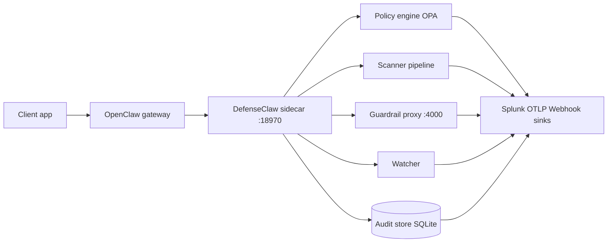

DefenseClaw is the enterprise governance layer for [OpenClaw](https://github.com/openclaw/openclaw): a control plane that wraps the agent runtime so skills, MCP servers, plugins, tools, and LLM traffic are scanned, admitted, and audited before and during execution. OpenClaw remains the agent runtime; DefenseClaw is the governance shell that constrains what that runtime may load, call, and emit. It is built for platform and security teams who must govern agentic AI like any other production workload—without blocking developers on manual review for every change.

The product pairs a Python operator CLI (`defenseclaw`) with a Go **gateway sidecar** (`defenseclaw-gateway`) that attaches to the OpenClaw gateway over WebSocket, enforces policy on live `tool_call` / `tool_result` traffic, exposes a local REST API on **18970**, and optionally fronts upstream LLMs through a **LiteLLM-compatible** guardrail proxy on **4000**. SQLite holds the default audit trail; OPA/Rego backs admission; scanners cover skills, MCP, plugins, static code (CodeGuard), and ClawShield-style checks, plus AIBOM outputs—forwarding outcomes to Splunk, OTLP, and webhooks when configured. Default guardrail rule packs ship under `policies/guardrail/default/rules/` (categories such as secrets, command injection, C2, cognitive exploits, enterprise data, local patterns, sensitive paths, and trust exploitation—each YAML pack is versioned like any other policy artifact).

## Architecture at a glance



The sidecar is the integration point: it mirrors gateway events, runs the inspection and policy stack, persists audit rows, and ships telemetry to enterprise sinks. The guardrail proxy sits on the LLM path when enabled so prompts and completions are inspected in-band. The REST surface is intentionally local-first—operators and IDE extensions call it on loopback while the WebSocket leg stays pinned to OpenClaw's gateway contract.

### Quick reference (pinned facts)

| Item | Canonical value |
|------|-----------------|
| Gateway REST listen | **18970** (`gateway.api_port`) |
| Guardrail proxy | **4000** (`guardrail.port`), OpenAI-compatible / LiteLLM-friendly |
| Audit database | `~/.defenseclaw/audit.db` (SQLite) |
| Config and state dir | `~/.defenseclaw/` |
| Init flag for guardrail wiring | `--enable-guardrail` (singular) |
| Go toolchain | **1.26.2** (see `go.mod`) |
| Python support | **3.10 – 3.13** (see `pyproject.toml`) |

## Start here

Most operators only need three choices before they touch the command line: how to install, whether to enable the guardrail now, and whether to run in observe or action mode.

| Your situation | Start with | Expected outcome |
|----------------|------------|------------------|
| You want a release install on a workstation | [Install methods](/docs-site/installation/index) | `defenseclaw` and `defenseclaw-gateway` are on `PATH`; `defenseclaw doctor` can run. |
| You already cloned the repo | [Prerequisites](/docs-site/installation/prerequisites), then `make all` | Local Python, Go, and plugin artifacts are built from source. |
| You are validating a first lab | [Zero to governed](/docs-site/first-setup/index) | Config, policy packs, sidecar, and guardrail are wired in observe mode. |
| You are preparing production | [Production readiness](/docs-site/production-readiness) | Guardrail, policy, audit, sink, rollback, and evidence gates are checked before action mode. |
| You are fixing an existing install | [Verify install](/docs-site/installation/verify-install) | The failing layer is narrowed to binary, config, sidecar, guardrail, OpenClaw, key, or sink. |

<Callout type="tip" title="Default rollout posture">
  Start with `observe` mode. It records verdicts without blocking traffic, which gives security teams a clean tuning window before switching to `action`.
</Callout>

## Choose by role

If you already know your responsibility, use a role journey instead of reading the site front to back.

| Role | Best first page | What it helps you finish |
|------|-----------------|--------------------------|
| Platform engineer | [Platform engineer journey](/docs-site/journeys/platform-engineer) | Install binaries, initialize state, run the sidecar, choose sandbox posture, and verify health. |
| Security team | [Security team journey](/docs-site/journeys/security-team) | Roll out observe-first guardrails, validate policy, wire alerts, and prepare incident workflows. |
| Developer | [Developer journey](/docs-site/journeys/developer) | Scan skills/MCP/plugins/code, understand schemas, and extend scanners or integrations safely. |

## Common jobs

Use these pages when you know the outcome you need more than the subsystem name.

| Job | Page | Use it when |
|-----|------|-------------|
| Prove the deployment is ready | [Production readiness](/docs-site/production-readiness) | You need a pre-action-mode checklist and rollback evidence. |
| Compare config snippets | [Known-good configs](/docs-site/cookbooks/known-good-configs) | You want minimal YAML excerpts for guardrail, judges, sinks, webhooks, and watcher defaults. |
| Diagnose a failure | [Reference troubleshooting](/docs-site/reference/troubleshooting) | You know the symptom but not whether guardrail, sidecar, policy, or telemetry owns it. |

### Where enforcement code lives

| Plane | Location (repo) | Notes |
|-------|-------------------|-------|
| Scanner orchestration | `internal/scanner/` | Skill, MCP, plugin, CodeGuard, ClawShield, verdicts, gateway writers |
| Admission + drift | `internal/watcher/` | Snapshot diffing, periodic rescan, policy file watches |
| Sidecar REST + proxy | `internal/gateway/` | `api.go` (HTTP control plane), `proxy.go` (guardrail HTTP) |
| OPA/Rego bundles | `policies/rego/` | Admission, guardrail, skill actions, firewall, sandbox, audit helpers |
| Packaged guardrail YAML | `policies/guardrail/default/rules/` | Default deny/warn patterns shipped with the product |

### Scanner implementations (`internal/scanner`)

| Concern | Key files |
|---------|-----------|
| Scanner interface + plugin discovery | `scanner.go` (plugins are gRPC binaries under `~/.defenseclaw/plugins/`) |
| Skill targets | `skill.go`, `skill_subprocess_test.go` |
| MCP targets | `mcp.go` |
| Plugin targets | `plugin.go`, `plugin_test.go` |
| Regex static analysis | `codeguard.go` |
| ClawShield analyzers | `clawshield_pii.go`, `clawshield_malware.go`, `clawshield_secrets.go`, `clawshield_injection.go`, `clawshield_vuln.go`, `clawshield_helpers.go` |
| Result modeling | `result.go`, `verdict.go`, `target_type.go`, `ruleid.go` |
| Telemetry hooks | `scan_emitter.go`, `scan_span.go`, `gateway_writer_ctx.go` |

### Watcher loop (`internal/watcher`)

| File | Purpose |
|------|---------|
| `watcher.go` | Core admission watcher coordinating snapshots and policy |
| `snapshot.go` | Filesystem snapshots compared for drift |
| `rescan.go` | Periodic/full rescan scheduling |
| `policy_files_watch.go` | Polls block/allow lists, YAML, and Rego bundles so drift events hit the audit log |

### Sidecar responsibilities

The Go root command documents the daemon verbatim: it **connects to the OpenClaw gateway WebSocket**, **monitors `tool_call` and `tool_result` events**, **enforces policy in real time**, and **exposes a local REST API for the Python CLI**. Those four clauses are the acceptance criteria for any deployment—if health checks pass but one of those duties fails, you still have a governance gap.

### Telemetry fan-out

| Signal | Primary store | Enterprise export |
|--------|---------------|-------------------|
| Admission verdicts | SQLite `audit.db` | Splunk HEC, OTLP, webhook dispatcher |
| Guardrail scans | SQLite + structured logs | Same sinks via `internal/audit` forwarders |
| Gateway health | `/health` JSON | Scraped by `defenseclaw status`, automation, IDE plugin |
| OTEL metrics/spans | Local SDK | Configured `OTEL_EXPORTER_*` endpoints per observability guide |

## What DefenseClaw protects against

These are the failure modes enterprises cite when agent platforms go to production without a governance layer. DefenseClaw maps each one to scanners, policy, the watcher, or telemetry—not to a single monolithic "AI firewall" slogan.

| Risk | How DefenseClaw addresses it |
|------|------------------------------|
| Malicious skills, MCP servers, and plugins | Scanners classify findings before install; the watcher and admission gate block or warn by severity; policy can hard-deny categories of components. |
| Tool-call exfiltration and abusive tool use | The sidecar observes tool calls and results in real time; Rego admission and guardrail rules enforce allow/deny semantics on arguments, destinations, and sensitive patterns. |
| Policy drift at runtime | The watcher tracks filesystem and configuration drift, supports periodic rescan, and exposes reload hooks so OPA bundles and JSON data stay aligned with the declared baseline. |
| Blind spots in audit and SIEM | Every significant decision can be written to **SQLite** (`~/.defenseclaw/audit.db`) and replicated to Splunk HEC, OTLP, and webhook dispatchers with redaction applied upstream. |

Together, the scanners answer “is this artifact safe to install?” while the watcher and admission Rego answer “is this runtime action still allowed given the latest scans and data.json?” The guardrail proxy answers “is this LLM I/O compliant?” and the audit pipeline answers “can we prove what happened to an auditor?” None of those questions are optional in regulated environments; DefenseClaw keeps them in sync instead of bolting on four unrelated products.

## Five surfaces

| Surface | Role | Documentation |
|---------|------|----------------|
| Python CLI | Primary operator interface: `init`, `quickstart`, `status`, scanner subcommands, `policy`, `audit`, `setup` integrations, and recovery tools. Click loads config/DB before most commands so broken config fails early. | [CLI overview](/docs-site/cli/index) |
| Go gateway CLI | `defenseclaw-gateway` daemon: connects to OpenClaw over WebSocket, evaluates tool traffic against OPA and guardrail state, opens the REST API for Python callers, and hosts the optional LLM proxy. Runs headless on servers and in sandboxes where no TTY is available. | [Gateway CLI](/docs-site/cli/gateway-cli) |
| TUI | Text-mode dashboard for interactive triage—parity with the CLI for common workflows, optimized for NOC-style monitoring. | [TUI overview](/docs-site/tui/index) |
| REST API | HTTP/JSON on **127.0.0.1:18970** by default: `/health`, `/status`, `/policy/reload`, scanner endpoints, inventory, alerts, and guardrail runtime config. This is the integration surface for scripts, CI, and local tools. | [API overview](/docs-site/api/index) |
| OpenClaw WebSocket bridge | Outbound sidecar connection to the OpenClaw gateway. It is not a public sidecar RPC route; the current external route contract is HTTP. | [RPC status](/docs-site/api/rpc) |

## Subsystem tour

Each row mirrors a top-level group in the published table of contents. Use it as a map from organizational concern ("who owns scanners?") to the doc set you hand that team.

Security architects typically live in **Policy**, **Firewall**, **Guardrail**, and **Observability**. Platform engineers jump between **Installation**, **First setup**, **Sandbox**, and **API**. App developers who embed OpenClaw care most about **CLI**, **TUI**, **Scanners**, and **Watcher** behavior so their skills stop shipping with CRITICAL findings. Pick a row below, send the link, and you have a bounded reading list instead of the entire tree.

| Section | What you will find | Start here |
|---------|-------------------|------------|
| Overview | Landing narrative, architecture diagram, install shortcuts, production-readiness checks, and cross-links into every other section. | [DefenseClaw](/docs-site/index) |
| User journeys | Role-based paths for platform engineers, security teams, and developers. | [User journeys](/docs-site/journeys/index) |
| Installation | Prerequisites, curl script, `make install` / `make all`, build-from-source, verification, upgrade, and uninstall—everything before `init` succeeds. | [Install methods](/docs-site/installation/index) |
| First setup | End-to-end “zero to governed” path: `defenseclaw init`, scanner enablement, guardrail bootstrap, gateway sidecar placement, provider secrets, Splunk/webhook/OTEL hooks, sandbox notes. | [Zero to governed](/docs-site/first-setup/index) |
| CLI | Python command tree, gateway (`defenseclaw-gateway`) command tree, automation patterns, shell completions, and deep pages per subcommand (`skill`, `mcp`, `policy`, …). | [CLI overview](/docs-site/cli/index) |
| TUI | Layout of panels, keyboard shortcuts, command palette behavior, and parity matrix versus CLI flags. | [TUI overview](/docs-site/tui/index) |
| LLM Guardrail | How the Go proxy terminates TLS to localhost, loads YAML packs and optional judges, caches verdicts, handles streaming, and integrates provider auth. | [Guardrail overview](/docs-site/guardrail/index) |
| Policy | Separation of duties between Rego bundles, JSON data files, scanner bindings, action matrices, tests, and `/policy/reload` semantics. | [Policy engines](/docs-site/policy/index) |
| Scanners | Catalog of first-party scanners, severity semantics, ClawShield categories, CodeGuard regex model, AIBOM outputs, and extension points for custom analyzers. | [Scanner catalog](/docs-site/scanners/index) |
| Watcher | Filesystem snapshots, admission decisions, enforcement hooks, drift alarms, and periodic rescan configuration. | [Watcher overview](/docs-site/watcher/index) |
| Firewall | Rule compiler inputs, egress observer behavior, and SSRF-focused Rego helpers that complement the guardrail proxy. | [Firewall overview](/docs-site/firewall/index) |
| Sandbox | NVIDIA OpenShell profiles, port allowlists (**18970**, **4000**), health checks from inside the network namespace, and macOS-specific fallbacks. | [Sandbox overview](/docs-site/sandbox/index) |
| Observability | SQLite schema expectations, OTEL metrics/spans spec, gateway JSONL, sink configuration, Splunk app packaging, redaction policies. | [Observability overview](/docs-site/observability/index) |
| API | REST route index, WebSocket RPC contract, event stream semantics, authentication modes, and downloadable JSON Schemas for integrators. | [API overview](/docs-site/api/index) |
| Reference | Frozen facts: config paths, environment variables, exit codes, glossary, FAQ, troubleshooting trees. | [Config files](/docs-site/reference/config-files) |
| Developer | Monorepo tour (`internal/*`, `cli/*`, `extensions/defenseclaw`), Bifrost SDK notes, plugin protocol, telemetry contracts, CI commands. | [Developer overview](/docs-site/developer/index) |
| Cookbooks | Short procedural guides—known-good config excerpts, public exfil blocking, internal MCP allowlisting, PII tuning, Splunk shipping, mTLS, airgapped installs. | [Known-good configs](/docs-site/cookbooks/known-good-configs) |
| Migration | How this site supersedes the legacy `docs/*.md` tree and what breaks between major releases. | [From docs/*.md](/docs-site/migration/from-old-docs) |

## Install in 60 seconds

| Path | Best when |
|------|-----------|
| `curl \| bash` | You want the shipping artifact graph on a networked workstation without cloning the monorepo. |
| `make all` | You are on a dev machine with Go, Python, and Node toolchains already approved—typical for contributors extending scanners or policy. |

```bash
curl -fsSL https://defenseclaw.ai/install.sh | bash
```

Official installer: downloads the correct artifacts, places binaries under your profile, and aligns with the same non-interactive paths as `make all` and `defenseclaw quickstart`.

<Callout type="info" title="Network access">
  The curl pipeline requires outbound HTTPS to `defenseclaw.ai` (or the CDN fronting it). Airgapped fleets should follow the [Cookbooks](/docs-site/cookbooks/airgapped-install) flow instead of piping installers directly on isolated hosts.
</Callout>

```bash
make all
```

From a git clone: runs `install` (Python venv + gateway + plugin artifacts into `$(HOME)/.local/bin` by default), updates PATH via `scripts/add-to-path.sh`, then `quickstart` and `llm-setup` so a fresh workspace reaches a working guardrail without hunting for binaries. `NO_QUICKSTART=1` and `NO_PATH=1` escape hatches match CI usage documented in the `Makefile`.

The `Makefile` target graph is the contract between maintainers and CI: anything the curl script promises for a greenfield laptop ultimately funnels through the same build and install stages so release engineering only maintains one path.

### Components installed by `make install`

| Artifact | Role |
|----------|------|
| `defenseclaw` | Python CLI (venv binary `$(VENV)/bin/defenseclaw`; `make path` helps expose `$(INSTALL_DIR)` copies) |
| `defenseclaw-gateway` | Go sidecar installed to `$(INSTALL_DIR)`; owns **18970** REST and the OpenClaw WebSocket client |
| OpenClaw plugin bundle | TypeScript plugin copied to `~/.defenseclaw/extensions/defenseclaw/` so OpenClaw shares the same API port defaults as the CLI |

The `install` recipe chains `cli-install`, `gateway-install`, and `plugin-install`; `defenseclaw doctor` and `defenseclaw version` assume all three landed when you claim a full-stack laptop install.

<Callout type="tip" title="Contributors">
  Use `make all` when you are iterating on the repo: it builds the Python CLI, gateway, and plugin artifacts, wires `~/.local/bin`, and exercises the quickstart path CI relies on—avoiding drift between your editor shell and packaged installs.
</Callout>

## First run

1. Initialize config and enable the guardrail proxy path: `defenseclaw init --enable-guardrail`
2. Start or restart the gateway sidecar: `defenseclaw-gateway start`
3. Verify health and versions: `defenseclaw status`

`init` writes `~/.defenseclaw/config.yaml`, seeds policy data, and optionally wires guardrail listener metadata so OpenClaw's `base_url` can be pointed at **4000** without hand-editing JSON. `start` brings up `defenseclaw-gateway`, which loads `.env` from the data dir before `config.Load()` so Splunk or webhook tokens referenced via `token_env` resolve the same way in interactive shells and daemonized processes.

If the sidecar is already running, use `defenseclaw-gateway restart` after any setup command that changes `config.yaml`.

Full sequencing, provider keys, and sink setup live in [Zero to governed](/docs-site/first-setup/index).

<Callout type="warning" title="If `status` is red">
  Run `defenseclaw doctor` before filing issues: it aggregates gateway reachability, config validity, scanner availability, and sink credentials—the same signal the support team requests first.
</Callout>

## Why these defaults

**Gateway REST on 18970.** The port is reserved in defaults (`gateway.api_port`) so automation, the VS Code / OpenClaw plugin, and shell health checks share one stable loopback endpoint that rarely collides with common dev servers or the OpenClaw gateway's own listen port. Operators can treat `http://127.0.0.1:18970/health` as the source of truth for sidecar readiness. Sandboxed deployments remap the bind address (for example `10.200.0.1:18970`) but keep the port constant so documentation and Ansible modules stay portable.

**Guardrail proxy on 4000 (LiteLLM-compatible).** The Go `GuardrailProxy` speaks OpenAI-compatible HTTP so OpenClaw, LiteLLM, and other adapters can point `base_url` at `http://127.0.0.1:4000` without custom SDK forks. Inspection runs inline before bytes reach the upstream provider, preserving streaming semantics where configured. Loopback-only binding is the default; bridge IPs are honored when OpenShell exposes the sidecar to another network namespace.

**SQLite audit by default.** A local `audit.db` is append-friendly, easy to back up, and works airgapped. Rows land in one place for `defenseclaw audit` and for forwarders—Splunk HEC, OTLP, and webhooks—without standing up a cluster just to try the product. Teams that outgrow a single file can still treat SQLite as the edge buffer while streaming everything to centralized SIEM via the sink abstraction.

**Rego for admission.** Modules under `policies/rego` (`admission.rego`, `guardrail.rego`, `skill_actions.rego`, `firewall.rego`, `sandbox.rego`, `audit.rego`, plus `_test.rego` pairs) give you versioned, testable policy with a mature ecosystem. JSON data (`data.json`, sandbox overlays) loads beside bundles so security can reason about rules as code, not scattered scripts. Rego keeps admission logic close to the OPA engine that the watcher and REST reload path already share—one evaluation core, many callers.

Because Rego packages live next to their tests in the same directory, CI can gate merges on `opa test` the same way it gates Go and Python coverage—no secondary policy language hidden in spreadsheets.

## Related projects

The grid below is populated from site configuration—use it to jump to adjacent OpenClaw and Cisco AI Defense tooling without hunting through README badges.

<RelatedProjects />

## Next steps

You now have the spine of the product: OpenClaw supplies the agent runtime, DefenseClaw supplies governance, and the docs-site mirrors that split with separate sections for scanners, policy, guardrails, and telemetry. Continue in the order below if you are bringing up a lab, or jump straight to **Policy**/**Guardrail** if you already have binaries installed.

- [Installation](/docs-site/installation/index)
- [User journeys](/docs-site/journeys/index)
- [First setup](/docs-site/first-setup/index)
- [CLI overview](/docs-site/cli/index)
- [Guardrail overview](/docs-site/guardrail/index)
- [Policy engines](/docs-site/policy/index)
- [Developer overview](/docs-site/developer/index)

---

<!-- generated-from: README.md, cli/defenseclaw/main.py, internal/cli/root.go, internal/gateway/api.go, internal/gateway/proxy.go, internal/watcher/, internal/scanner/, policies/guardrail/default/rules/, policies/rego/, Makefile -->
