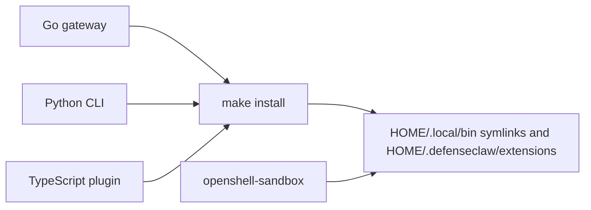

## Overview

A full developer install compiles the **Go gateway** (`./cmd/defenseclaw` → `defenseclaw-gateway`), installs the **Python CLI** from the repo root via `uv` into `.venv`, builds the **OpenClaw plugin** in `extensions/defenseclaw/` with `npm` and `tsc`, and optionally installs **openshell-sandbox** via `scripts/install-openshell-sandbox.sh` (Linux). `make install` ties the first three to `~/.local/bin` and `~/.defenseclaw/extensions/defenseclaw/`.

<Callout type="info">
  Shortcut: `./scripts/install-dev.sh` performs dependency checks, editable `pip install -e ".[tui]"`, dev Python deps, Go build, and copies the gateway to `~/.local/bin` (unless `--skip-install`). It does not build the TypeScript plugin—use `make plugin-install` for that.
</Callout>

## Component steps

### Python CLI (`pycli`)

- Requires `uv`. From repo root: `uv venv .venv --python 3.12 --clear` then `uv pip install -e . --python .venv/bin/python` (as in `Makefile` `pycli`).
- Package layout: setuptools discovers packages under `cli/` per `pyproject.toml`.
- Entry point: `defenseclaw` → `defenseclaw.main:main`.

### Go gateway

- Module version **Go 1.26.2** (`go.mod`).
- `make gateway` runs `go build -ldflags "-X main.version=$(Makefile)" -o defenseclaw-gateway ./cmd/defenseclaw`.
- Install: `make gateway-install` places `defenseclaw-gateway` in `~/.local/bin` with atomic replace.

### TypeScript plugin (`extensions/defenseclaw`)

- `package.json`: `npm run build` → `tsc` (ES2022, `dist/` output, `openclaw.plugin.json` manifest).
- `make plugin` copies `internal/configs/providers.json` into the plugin tree, runs `npm ci --include=dev`, then `npm run build`.
- `make plugin-install` copies `package.json`, `openclaw.plugin.json`, `dist/`, and selected `node_modules` (`js-yaml`, `argparse`) into `~/.defenseclaw/extensions/defenseclaw/` (and syncs `~/.openclaw/extensions/defenseclaw/` when that directory exists).

### openshell-sandbox

- Not produced by `go build`. Install **`openshell-sandbox`** with `scripts/install-openshell-sandbox.sh` (OCI layer download; defaults `OPENSHELL_Makefile` / `OPENSHELL_INSTALL_DIR` documented in the script).
- Curl installer flag `--sandbox` (Linux) chains this after the main install.
- Go code in `internal/sandbox/install.go` verifies the binary via `exec.LookPath` and `--version`.

## End-to-end graph

`make install` wires the gateway, venv CLI symlinks, and plugin copy targets; the sandbox binary is installed by **`scripts/install-openshell-sandbox.sh`** (or `install.sh --sandbox` on Linux) and should land on the same `PATH` as `defenseclaw` (typically `~/.local/bin`).

## Related

- [Make install](/docs-site/installation/make-install)
- [Prerequisites](/docs-site/installation/prerequisites)
- [Sandbox install](/docs-site/sandbox/install)

---

<!-- generated-from: Makefile, scripts/install-dev.sh, extensions/defenseclaw/package.json, extensions/defenseclaw/tsconfig.json, internal/sandbox/install.go, scripts/install-openshell-sandbox.sh -->
