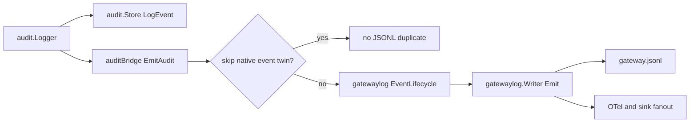

## Overview

The audit bridge in `internal/gateway/audit_bridge.go` is not a replay worker and it does not own external sink delivery. It is a small translator installed on `audit.Logger`: after an `audit.Event` is persisted, the bridge emits the matching `gatewaylog.Event` so `gateway.jsonl`, OTel fanout, and sink fanout see one correlated event stream.

<Callout type="info" title="External sinks use a different path">
  Splunk HEC, OTLP logs, and HTTP JSONL destinations are built from `audit_sinks[]` and delivered by `internal/audit/sinks`. The audit bridge only keeps the structured JSONL stream complete.
</Callout>

## Flow



## Mapping

The bridge maps audit actions onto the gatewaylog lifecycle vocabulary:

| Audit action shape | JSONL subsystem |
|---|---|
| `scan` | `scanner` |
| `watcher-*`, `watch-start`, `watch-stop` | `watcher` |
| `sidecar-*`, `gateway-ready` | `gateway` |
| `api-*` | `api` |
| `sink-*`, `splunk-*` | `sinks` |
| `otel-*`, `telemetry-*` | `telemetry` |
| `skill-*`, `mcp-*`, `install-*`, `block-*`, `allow-*`, `quarantine-*` | `enforcement` |
| anything else | `gateway` |

Transitions are intentionally narrow: `start`, `stop`, `ready`, `degraded`, `restored`, and the catch-all `completed`.

## Duplicate prevention

Some audit rows already have a native structured JSONL emission on the hot path. The bridge skips those twins so `gateway.jsonl` does not contain both a rich event and a lifecycle copy.

| Skipped audit action | Native JSONL source |
|---|---|
| `guardrail-verdict` | guardrail verdict emitter |
| `llm-judge-response` | judge emitter |
| `scan` | scanner result emitter |
| `alert` | alert lifecycle emitter |

Activity events are also skipped when the audit details already contain an `activity_id`, because `LogActivity` emits a native activity event.

## Exporting audit rows

For historical export, use the Go gateway CLI rather than a bridge replay command:

```bash
defenseclaw-gateway audit export --output audit-events.jsonl --include-activity
```

The export command reads `audit_events` from SQLite and writes schema-validated JSONL. It does not redeliver rows to sinks.

## Related

- [Audit store](/docs-site/observability/audit-store)
- [Sinks](/docs-site/observability/sinks)
- [Webhook dispatcher](/docs-site/observability/webhook-dispatcher)

---

<!-- generated-from: internal/gateway/audit_bridge.go -->
