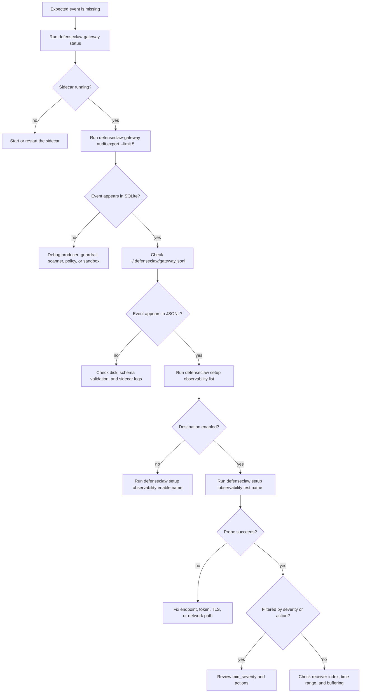

## Overview

When signals stop flowing, the diagnostic path is: audit store → gateway.jsonl → sink-specific probe. This page walks through the most common "where did my events go" scenarios.

## Fast triage

| Check | Command | If it fails |
|-------|---------|-------------|
| Sidecar health | `defenseclaw-gateway status` | Fix the daemon before debugging sinks. |
| Recent persisted events | `defenseclaw-gateway audit export --limit 5` | Debug guardrail/scanner/policy producers. |
| Configured sinks | `defenseclaw setup observability list` | Re-add or enable the missing sink. |
| Webhook config | `defenseclaw setup webhook list` | Re-add or enable the webhook. |
| Local JSONL output | `ls -la ~/.defenseclaw/gateway*.jsonl*` | Check permissions and sidecar startup logs. |

## Diagnostic decision tree



## 1. "I ran a test request but nothing appears anywhere"

First confirm that the audit database has recent rows:

```bash
sqlite3 ~/.defenseclaw/audit.db \
  "SELECT timestamp, action, severity FROM audit_events ORDER BY timestamp DESC LIMIT 10;"
```

If empty, the event never reached the store — the guardrail either didn't inspect (see [Guardrail troubleshooting](/docs-site/guardrail/troubleshooting)) or the sidecar is not running (`defenseclaw-gateway status`).

If non-empty but external sinks are quiet, the problem is downstream — skip to step 2.

## 2. "Audit has it, Splunk doesn't"

```bash
defenseclaw setup observability list
defenseclaw setup observability test splunk-main
```

The sink test probes the configured destination. Common outcomes:

- The destination is missing from `list` → re-run `defenseclaw setup observability add splunk-hec`.
- The probe returns `401` or `403` → token or index permissions are wrong.
- The probe succeeds → inspect Splunk index, sourcetype, and search time range.

## 3. "Webhooks fire inconsistently"

```bash
defenseclaw setup webhook list
defenseclaw setup webhook test slack-security --dry-run
defenseclaw setup webhook test slack-security --timeout 10
```

If `test` succeeds but real events don't arrive:

- Check `min_severity` — lower-severity events are skipped.
- Check `events` — the configured category allow-list may exclude the event.
- Check `cooldown_seconds` — duplicate target/action pairs are suppressed during the window.

## 4. "Events appear unredacted in my Splunk"

```bash
defenseclaw-gateway audit export --limit 5
```

The export path reads the persisted audit rows. If exported rows are redacted but Splunk is not:

- Confirm Splunk is ingesting the DefenseClaw HEC sink or `gateway.jsonl`, not a parallel debug log.
- Confirm `DEFENSECLAW_REVEAL_PII` is not set in the sidecar environment for operator-facing stderr logs.
- Inspect custom forwarding glue outside DefenseClaw that may be shipping raw application logs.

## 5. "The JSONL file is truncated"

```bash
ls -la ~/.defenseclaw/gateway*.jsonl*
```

- If `gateway.jsonl` is 0 bytes and rotated files exist, rotation just happened — normal.
- If `gateway.jsonl` is missing, the sidecar failed to initialize structured logging — check `gateway.log` and disk permissions.
- If the file exists but stops in the middle of a line, the writer crashed mid-flush — the next line is clean.
- Rotation uses the gatewaylog writer defaults: 50 MB, 5 backups, 30 days, compressed.

## 6. "OTel spans are missing"

```bash
defenseclaw config show --format json
```

- Check whether `otel.enabled` is true.
- Check traces, metrics, and logs endpoints under the `otel` block.
- Re-run `defenseclaw setup observability test otel` if the configured destination is named `otel`.

OTel exporter changes are process configuration. Restart the sidecar with your supervisor after editing.

## 7. "My policy change didn't take effect in the dashboards"

Dashboards read from the sink (Splunk/Datadog/etc.), which has its own buffering. After `policy reload`:

- Audit store updates immediately.
- gateway.jsonl updates immediately.
- Sink acknowledges within its own buffering window.
- Dashboard queries re-run on the dashboard's own cadence.

End-to-end latency is typically under 30 seconds. If you need faster, shorten the dashboard query interval.

## What to collect before escalation

| Evidence | Command | What it proves |
|----------|---------|----------------|
| Doctor snapshot | `defenseclaw doctor --json-output > doctor.json` | Sidecar, guardrail, scanner, credential, and destination health. |
| Redacted config | `defenseclaw config show --format json > config.redacted.json` | Active `otel`, `audit_sinks`, and `webhooks` blocks without secret values. |
| Destination list | `defenseclaw setup observability list --json > observability-destinations.json` | Names, kinds, targets, enabled state, and endpoints for every sink. |
| Webhook list | `defenseclaw setup webhook list --json > webhooks.json` | Notifier names, types, severity filters, event filters, and enabled state. |
| Recent audit events | `defenseclaw-gateway audit export --limit 1000 --output audit-events.jsonl` | Whether events reached SQLite before fanout. |
| Gateway JSONL tail | `tail -n 1000 ~/.defenseclaw/gateway.jsonl > gateway.tail.jsonl` | Sink failures, schema violations, lifecycle events, and verdict events. |
| Failing sink probe | `defenseclaw setup observability test splunk-main --timeout 10 > sink-test.txt` | Destination-specific reachability and auth result. |
| Failing webhook probe | `defenseclaw setup webhook test slack-security --dry-run > webhook-dry-run.txt` | Payload shape without delivering to the receiver. |

Collect the smallest useful bundle by combining:

```bash
defenseclaw doctor --json-output > doctor.json
defenseclaw config show --format json > config.redacted.json
defenseclaw-gateway audit export --limit 1000 --output audit-events.jsonl
tail -n 1000 ~/.defenseclaw/gateway.jsonl > gateway.tail.jsonl
```

Attach to a GitHub issue or your support channel.

## Related

- [Audit store](/docs-site/observability/audit-store)
- [Sinks](/docs-site/observability/sinks)
- [Webhook dispatcher](/docs-site/observability/webhook-dispatcher)
- [Guardrail troubleshooting](/docs-site/guardrail/troubleshooting)

---

<!-- generated-from: cli/defenseclaw/commands/cmd_audit.py, cli/defenseclaw/commands/cmd_doctor.py, cli/defenseclaw/commands/cmd_status.py, cli/defenseclaw/commands/cmd_config.py, cli/defenseclaw/commands/cmd_setup_observability.py, cli/defenseclaw/commands/cmd_setup_webhook.py, internal/cli/audit_export.go, internal/gateway/api.go, internal/gateway/proxy.go, internal/gateway/guardrail.go, internal/gateway/llm_judge.go, internal/gateway/notifications.go, internal/audit/sinks/sinks.go, internal/gatewaylog/writer.go, internal/config/config.go, internal/config/defaults.go -->
