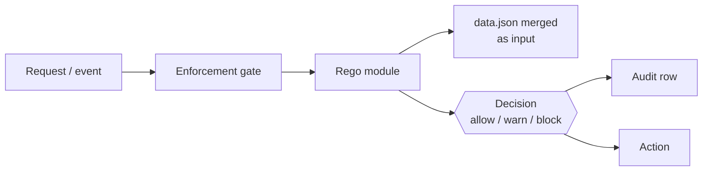

## Overview

DefenseClaw has three policy surfaces, each serving a different enforcement point:

| Surface | Lives in | Evaluates at | Example decision |
|---------|----------|--------------|-------------------|
| **Rego modules** (OPA) | `policies/rego/*.rego` | Admission, audit, firewall, guardrail hand-off | "Block installing a skill whose scanner flagged `severity: CRITICAL`" |
| **YAML rule packs** | `policies/guardrail/<profile>/rules/*.yaml` | Guardrail scanner path | "Fire a `SEC-AWS-KEY` finding on `AKIA[0-9A-Z]{16,}`" |
| **`data.json`** | `policies/rego/data.json` | Merged into every Rego eval | "Severity table, trust lists, action mappings" |

The Rego engine is **embedded** for runtime evaluation. The Python `defenseclaw policy test` command still shells out to the `opa` binary for unit tests, and live reload is exposed through `defenseclaw-gateway policy reload`.

## When to use which

- **Rego** — whenever the decision depends on *structured input* and you want something auditable, testable, and composable. Admission gates, audit severity routing, firewall egress rules, guardrail action mapping.
- **YAML rule packs** — whenever the decision is "does this text match this pattern." Content scanning in the guardrail.
- **`data.json`** — configuration *input* to Rego, not a policy by itself. Severity mappings, trust lists, org-specific thresholds.

A full enforcement path usually touches all three: a guardrail YAML rule pack fires → the verdict is handed to `guardrail.rego` → `guardrail.rego` consults `data.json` for the action map → it returns a decision that the gateway enforces.

## Section map

| Page | Purpose |
|------|---------|
| [Lifecycle](/docs-site/policy/lifecycle) | How policies load, reload, and version |
| [Actions matrix](/docs-site/policy/actions-matrix) | Severity × direction → action table |
| [Writing Rego](/docs-site/policy/writing-rego) | Authoring modules, testing, style |
| [data.json](/docs-site/policy/data-json) | Static input shape and overrides |
| [Scanner policies](/docs-site/policy/scanner-policies) | Rego that gates scanner findings |
| [Testing policies](/docs-site/policy/testing) | `opa test`, in-repo fixtures, CI |
| [Hot reload](/docs-site/policy/hot-reload) | Safely swapping policies without restart |
| [Examples](/docs-site/policy/examples) | Real-world recipe gallery |

## Related

- [Rule packs](/docs-site/guardrail/rule-packs)
- [Writing rules](/docs-site/guardrail/writing-rules)
- [policy CLI](/docs-site/cli/commands/policy)

---

<!-- generated-from: policies/rego/, internal/policy/engine.go, internal/gateway/guardrail.go -->
