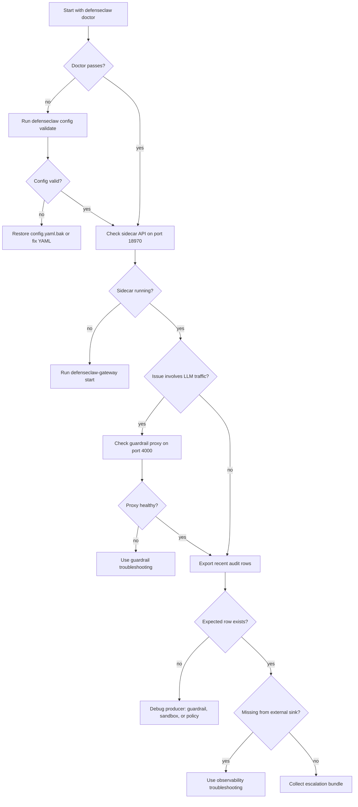

## Overview

Most problems belong to one subsystem and have a focused troubleshooting page:

- [Guardrail troubleshooting](/docs-site/guardrail/troubleshooting)
- [Observability troubleshooting](/docs-site/observability/troubleshooting)
- [Sandbox debugging](/docs-site/sandbox/debugging)

This page is for issues that span subsystems. If you know which system is failing, jump to that section first.

## First commands to run

````bash
defenseclaw doctor
defenseclaw config validate
defenseclaw config path
defenseclaw status
defenseclaw-gateway status
sqlite3 ~/.defenseclaw/audit.db \
  "SELECT timestamp, action, severity FROM audit_events ORDER BY timestamp DESC LIMIT 10;"
````

If those commands all look healthy and you still have a problem, the issue is likely at a subsystem boundary: sidecar configuration, audit persistence, sink delivery, or TUI filtering.

<Callout type="tip" title="Prefer reversible fixes first">
  During an incident, disable a destination or return guardrail mode to `observe` before deleting config. Most DefenseClaw repair commands preserve files and can be rolled back after the pressure is off.
</Callout>

## Diagnostic decision tree



## Emergency triage

| Symptom | Quick check | Safe first action | Verify |
|---------|-------------|-------------------|--------|
| Gateway is down | `defenseclaw-gateway status` | `defenseclaw-gateway start` | `defenseclaw doctor` |
| Sidecar health is stale after setup | `defenseclaw doctor` | `defenseclaw-gateway restart` | `defenseclaw doctor --json-output > doctor.json` |
| Config edit broke startup | `defenseclaw config validate` | restore `config.yaml.bak` | `defenseclaw-gateway restart` |
| Guardrail was never enabled | `defenseclaw config show --format json` | `defenseclaw init --enable-guardrail` or `defenseclaw setup guardrail` | `defenseclaw doctor` |
| Sink is failing or slow | `defenseclaw setup observability list` | `defenseclaw setup observability disable splunk-main` | `defenseclaw setup observability test splunk-main` after re-enable |
| Chat alerts are noisy | `defenseclaw setup webhook list` | `defenseclaw setup webhook disable secops-slack` | `defenseclaw setup webhook test secops-slack --dry-run` |
| Policy change is not taking effect | `defenseclaw-gateway policy validate` | `defenseclaw-gateway policy reload` | `defenseclaw-gateway policy evaluate --target-name probe --severity HIGH --findings 1` |
| MCP install is blocked | `defenseclaw mcp list --json` | scan first, then allow by exact name only | `defenseclaw mcp scan internal-tools --json` |

## Boundary issues

### Guardrail sees traffic but nothing in the audit store

- Confirm `audit_db` points at the database you are querying: `defenseclaw config show --format json`.
- The gateway process may have a stale audit DB handle after a crash: restart the sidecar with your supervisor.
- Disk full: `df -h ~/.defenseclaw/` — the sidecar stops writing when the partition is full.

### Audit store has the verdict but the TUI doesn't show it

- Restart the TUI so it re-reads local state.
- Check panel filters before assuming the row is missing.
- Export a small audit slice with `defenseclaw-gateway audit export --limit 20` and compare it with the panel.

### Policy reload returns success, but decisions don't change

- Confirm you edited the active policy directory, not a stale copy under another `DEFENSECLAW_HOME`.
- Re-run the relevant policy validation/test command from [Policy testing](/docs-site/policy/testing).
- Retest with content that should match the new rule; additive rules only change decisions for matching traffic.

### Sandbox runs but violations don't appear in Splunk

- First confirm the local audit database has the sandbox-related action.
- Then run `defenseclaw setup observability list` and `defenseclaw setup observability test splunk-main`.
- Check the sink `actions` and `min_severity` filters in `audit_sinks[]`.

## Safe remediation patterns

### Disable a noisy sink without deleting it

````bash
defenseclaw setup observability disable splunk-main
defenseclaw-gateway restart
````

Rollback:

````bash
defenseclaw setup observability enable splunk-main
defenseclaw-gateway restart
defenseclaw setup observability test splunk-main
````

### Disable a chat webhook during an alert storm

````bash
defenseclaw setup webhook disable secops-slack
defenseclaw-gateway restart
````

Rollback:

````bash
defenseclaw setup webhook enable secops-slack
defenseclaw-gateway restart
defenseclaw setup webhook test secops-slack --dry-run
````

### Validate before applying policy

````bash
defenseclaw-gateway policy validate
defenseclaw-gateway policy evaluate --target-name probe --severity HIGH --findings 1
defenseclaw-gateway policy reload
````

Use `policy reload` for OPA files under `policies/rego/`. Restart the gateway for `config.yaml`, `webhooks[]`, `audit_sinks[]`, and guardrail rule-pack YAML changes.

## Clock skew

Timestamps matter. If your sinks are rejecting events with "too old" errors:

````bash
timedatectl status        # Linux
sntp -sS time.apple.com   # macOS
````

Clock drift > 5 minutes triggers rejection from many SaaS sinks.

## Disk pressure

The gateway is disk-bound when `audit.db` or `gateway.jsonl` grow too large:

- `gateway.jsonl` uses lumberjack defaults from `internal/gatewaylog/writer.go`: 50 MB, 5 backups, 30 days, compressed.
- The audit DB is SQLite WAL-backed. Keep the data directory on a filesystem with enough free space and back it up like other local state.
- Use `defenseclaw-gateway audit export --limit 1000 --output audit-events.jsonl` before pruning or archiving externally.

## Memory pressure

- The webhook dispatcher caps concurrent deliveries at 20 and suppresses duplicate target/action pairs during the cooldown window.
- The gatewaylog writer writes JSONL synchronously, then runs fanout callbacks outside the writer lock.
- OTel buffers are owned by the OTel SDK/exporter configuration.

If the sidecar is using > 200 MB RSS steady-state, investigate — that's well above expected.

## What to collect before escalation

| Evidence | Command | Why it helps |
|----------|---------|--------------|
| Doctor snapshot | `defenseclaw doctor --json-output > doctor.json` | Captures sidecar, guardrail, scanner, credential, and destination health in one file. |
| Redacted resolved config | `defenseclaw config show --format json > config.redacted.json` | Shows active ports, modes, paths, sinks, and webhooks without revealing secret values. |
| Filesystem layout | `defenseclaw config path > config-path.txt` | Confirms which `~/.defenseclaw/` tree, audit DB, policy dir, and OpenClaw config were active. |
| Sidecar status | `defenseclaw-gateway status > gateway-status.txt` | Captures daemon state separately from the Python CLI status view. |
| Recent audit rows | `defenseclaw-gateway audit export --limit 1000 --output audit-events.jsonl` | Proves whether the event reached SQLite before sink or UI fanout. |
| Structured gateway tail | `tail -n 1000 ~/.defenseclaw/gateway.jsonl > gateway.tail.jsonl` | Shows recent lifecycle, verdict, judge, sink, and schema events from the sidecar. |

Review each file for deployment-specific hostnames, usernames, and target names before attaching it to an external issue.

Before opening a GitHub issue, run:

````bash
defenseclaw doctor --json-output > doctor.json
defenseclaw config show --format json > config.redacted.json
defenseclaw-gateway audit export --limit 1000 --output audit-events.jsonl
tail -n 1000 ~/.defenseclaw/gateway.jsonl > gateway.tail.jsonl
````

Attach the collected files after reviewing them for deployment-specific details.

## Related

- [doctor CLI](/docs-site/cli/commands/doctor)
- [Guardrail troubleshooting](/docs-site/guardrail/troubleshooting)
- [Observability troubleshooting](/docs-site/observability/troubleshooting)
- [Sandbox debugging](/docs-site/sandbox/debugging)

---

<!-- generated-from: cli/defenseclaw/commands/cmd_doctor.py, cli/defenseclaw/commands/cmd_status.py, cli/defenseclaw/commands/cmd_config.py, cli/defenseclaw/commands/cmd_setup_observability.py, cli/defenseclaw/commands/cmd_setup_webhook.py, cli/defenseclaw/commands/cmd_mcp.py, cli/defenseclaw/commands/cmd_init.py, internal/cli/audit_export.go, internal/cli/policy.go, internal/gateway/api.go, internal/gateway/proxy.go, internal/gateway/guardrail.go, internal/gateway/llm_judge.go, internal/gateway/notifications.go, internal/audit/sinks/sinks.go, internal/gatewaylog/writer.go, internal/config/config.go, internal/config/defaults.go -->
