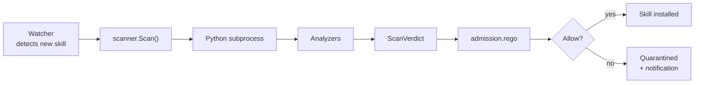

## Overview

The skill scanner inspects OpenClaw skill manifests before the agent loads them. It runs through the `skill_scanner` Python SDK (`cisco-skill-scanner` on PyPI) and produces a `ScanVerdict` that the watcher hands to `admission.rego`.

## What it scans

- `SKILL.md` body — prompt text, role instructions, preambles.
- Tool definitions — `tools/*.json` or inline tool blocks in the manifest.
- Embedded resources — referenced files, schemas.
- Signed manifests — signature verification if `trust.signed_by` is set.

## Analyzers

Five independent analyzers run in parallel:

| Analyzer | Findings prefix | Catches |
|----------|-----------------|---------|
| `injection` | `injection:*` | System-prompt override attempts, tool-injection instructions, persona-swap instructions |
| `secrets` | `secret:*` | API keys, tokens, credentials embedded in the manifest |
| `malicious_tools` | `tool:*` | Tool definitions that target dangerous endpoints (attacker.example, webhook.site), tools that exfiltrate by default |
| `obfuscation` | `obfuscation:*` | Base64-encoded payloads, ROT13/hex-encoded instructions, character-substitution bypass attempts |
| `trust_divide` | `trust:*` | Skills that claim system authority but are signed by a low-trust signer |

## Configuration

`~/.defenseclaw/config.yaml`:

```yaml
scanners:
  skill:
    enabled: true
    mode: local         # local | remote | both
    profile: balanced   # strict | balanced | permissive
    subprocess_isolation: true
    analyzers:
      injection: true
      secrets: true
      malicious_tools: true
      obfuscation: true
      trust_divide: true
    severity_threshold: MEDIUM   # report findings at or above
    max_file_bytes: 2097152       # 2 MB
```

## Subprocess isolation

`subprocess_isolation: true` runs the Python scanner in a subprocess per call. This shields the sidecar from any bugs in the scanner SDK, enforces a hard memory cap, and isolates scanner imports from the parent process. Disable only for benchmarks.

## CLI

```bash
defenseclaw skill scan ~/.openclaw/skills/excel_integration
defenseclaw skill scan --all
defenseclaw skill list --json
```

See [skill CLI](/docs-site/cli/commands/skill) for the full reference.

## Invocation flow



## Severity rubric

| Severity | Example finding |
|----------|-----------------|
| `CRITICAL` | Hardcoded production API key; tool targeting known exfil domain |
| `HIGH` | Persona-swap instruction; obfuscated payload with shell intent |
| `MEDIUM` | Ambiguous system-authority claim; non-standard tool endpoint |
| `LOW` | Unsigned manifest from an unknown signer |
| `INFO` | Cosmetic issue (missing description, etc.) |

## Related

- [Admission policy](/docs-site/policy/scanner-policies)
- [MCP scanner](/docs-site/scanners/mcp-scanner)
- [Watcher](/docs-site/watcher/index)
- [skill CLI](/docs-site/cli/commands/skill)

---

<!-- generated-from: internal/scanner/skill.go, cli/defenseclaw/commands/cmd_skill.py -->
