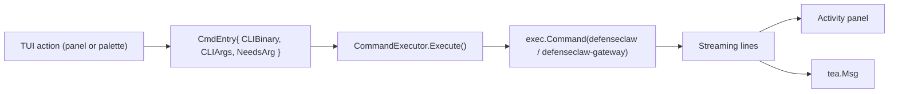

## Overview

The DefenseClaw TUI keeps state changes on the same command surface operators use in a shell. Palette entries, panel action menus, and setup forms resolve to argv-visible `defenseclaw` or `defenseclaw-gateway` subprocesses whenever they mutate DefenseClaw state. This is deliberate: a SOC operator can copy the command shape from Activity and reproduce it in CI or a terminal.

<Callout type="info">
  If a TUI action changes operator-owned state, it should route through a CLI command. The palette registry in `internal/tui/command.go` is the enumerable proof of that contract; `cli_parity_test.go` asserts every Python-backed registry entry uses a real Click command and real flags.
</Callout>

## The subprocess bridge

Source: `internal/tui/command.go` (`CommandExecutor`).



Key properties:

1. **Argv-visible** — every action becomes a literal `exec.Command(binary, args...)`. `ps auxfww` during a scan shows the same command line the operator would have typed.
2. **Line-streamed by default** — normal subprocess output is read line by line and shown in Activity.
3. **PTY-backed when interactive** — `ExecuteInteractive` uses `github.com/creack/pty` for prompt-heavy commands.
4. **Cancellable from Activity terminal mode** — when viewing command output in terminal mode, `Ctrl+C` sends SIGINT to the running subprocess; outside that mode, `Ctrl+C` is the global TUI quit key.
5. **Sibling-resolved binary** — `resolveSiblingBin("defenseclaw")` prefers a sibling of the running executable, falling back to `PATH`. A local install and a system package can coexist with fewer accidental cross-version calls.

## What this buys you

| Concern | Resolution |
|---------|------------|
| Audit trail | Mutating CLI commands emit the same audit or activity records they emit outside the TUI. Setup saves additionally call `defenseclaw audit log-activity --payload-file ...`. |
| CI parity | A registry entry maps to a concrete CLI argv, so CI can run the same command family directly. |
| Reproducibility | Bug reports can include the Activity command name and output; operators rarely have to guess what the TUI ran. |
| Safety | The TUI does not maintain a separate block/allow/quarantine implementation for skills, MCPs, plugins, or tools. |

## How actions resolve arguments

Palette commands are resolved by `MatchCommand`:

1. The typed prefix is matched against `TUIName`.
2. Anything after the matched name is split by `splitCommandTail`, preserving quotes.
3. The final argv is `CmdEntry.CLIArgs` plus the parsed tail.

Panel action menus resolve arguments differently: they read the selected row and dispatch a fixed CLI verb. For example, the Skills panel maps block to `defenseclaw skill block <selected-name>`, while the Tools panel preserves scoped tool names such as `write_file@filesystem`.

The resolver is covered by `command_resolve_test.go`; command registry shape is covered by `command_test.go`.

## Auditing TUI-originated actions

Three complementary operator trails exist:

| Layer | What it captures |
|-------|------------------|
| Activity panel | In-memory command history, streamed stdout/stderr, exit code, and duration for commands run during the current TUI session. |
| SQLite audit DB | Scanner, enforcement, alert, and activity events emitted by the underlying CLI or sidecar code paths. |
| `gateway.jsonl` | Structured gateway events, including activity mutations rendered by the Activity panel's second tab. |

To confirm a suspected TUI action after the fact:

```bash
# Export recent persisted audit evidence
defenseclaw-gateway audit export --include-activity --limit 200 --output recent-audit.jsonl

# Inspect recent structured gateway events
tail -n 200 ~/.defenseclaw/gateway.jsonl
```

The Activity panel is the live view for the current TUI session. `audit export` and `gateway.jsonl` are the durable evidence sources after the session ends.

## Deviations (intentional)

A handful of TUI behaviors are not 1:1 with the CLI. They are cosmetic, not functional:

- **Live refresh** (5s / 30s intervals) is TUI-only; the CLI gives point-in-time command output.
- **Filter bars** are local TUI views over already-loaded rows; they do not mutate policy or write audit rows.
- **Fuzzy search** in the palette has no CLI equivalent; it's a discovery aid.

None of these alter state or emit events on their own.

## Parity tests

Parity is not a documentation promise — it's tested in CI:

- `cli_parity_test.go` — every Python-backed `CmdEntry` must point to a real Click command and pass real flags, using the manifest from `scripts/audit_parity.py`.
- `command_test.go` — asserts there are no duplicate `TUIName` values; operators never see two palette entries for the same action.
- `command_resolve_test.go` — asserts argument resolution for every `NeedsArg=true` entry.

## Related

- [Command palette](/docs-site/tui/command-palette)
- [Panels](/docs-site/tui/panels)
- [CLI overview](/docs-site/cli/index)
- [Audit store](/docs-site/observability/audit-store)

---

<!-- generated-from: internal/tui/command.go, internal/tui/app.go, internal/tui/activity.go, internal/tui/gateway_parse.go, internal/tui/cli_parity_test.go, internal/tui/command_test.go, internal/tui/command_resolve_test.go, scripts/audit_parity.py -->
