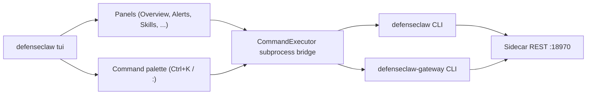

## Overview

`defenseclaw tui` launches a full-screen terminal interface built on [charm.sh Bubbletea v2](https://github.com/charmbracelet/bubbletea). It is an operator console over the same CLIs documented in this section: actions are executed as `defenseclaw` or `defenseclaw-gateway` subprocesses, while panels read from the local audit store, gateway health endpoint, `gateway.jsonl`, and generated CLI inventories.



<Callout type="info">
  The TUI is read-and-act, not read-only. Every write operation (block, allow, quarantine, policy edit, scan) runs as a subprocess so it is auditable, cancellable with Ctrl+C, and reproducible from a shell.
</Callout>

## Launch

```bash
defenseclaw tui
```

The Python command resolves the `defenseclaw-gateway` binary and execs its `tui` subcommand. Inside the TUI, subprocess execution uses `resolveSiblingBin`, which prefers a sibling of the running executable over `PATH` lookup. That means a local install and a system package are less likely to cross wires.

## First five minutes

| Goal | Action |
|------|--------|
| Confirm the daemon is reachable | Start on Overview; if it says the gateway is offline, open the palette with `:` and run `start`. |
| Re-run diagnostics | On Overview, use the doctor quick action or open the palette and run `doctor`. |
| Inspect urgent events | Press `2` for Alerts, then use `1`-`5` to narrow severity. |
| Review changed assets | Press `3`, `4`, `5`, or `6` for Skills, MCPs, Plugins, or Inventory. |
| Apply an enforcement decision | Select a row and use the panel action menu; the TUI calls the matching CLI command. |
| Check command output | Press the Activity panel through tab navigation or the palette to inspect recent subprocess output. |
| Export evidence | Press `9` for Audit, filter if needed, then use the panel export action. |

## The 12 panels

| # | Panel | Shortcut | Purpose |
|---|-------|----------|---------|
| 1 | Overview | `1` | Sidecar health, mode, key missing-credential summary, audit DB stats |
| 2 | Alerts | `2` | Active audit alerts plus scan roll-ups, filterable by severity and text |
| 3 | Skills | `3` | Installed OpenClaw skills, trust status, per-skill scan actions |
| 4 | MCPs | `4` | Registered MCP servers, scan/allow/block/set/unset actions |
| 5 | Plugins | `5` | DefenseClaw plugins (guardrail, CodeGuard, etc.), install/disable |
| 6 | Inventory | `6` | Cross-cutting asset index (skills + MCPs + plugins + tools) |
| 7 | Policy | `7` | OPA/Rego bundles + guardrail rule packs, hot reload, YAML viewer |
| 8 | Logs | `8` | Tail of `~/.defenseclaw/gateway.log` with scroll + filter |
| 9 | Audit | `9` | Queryable audit store with filter bar, detail view, JSON export |
| 10 | Activity | — | Recent TUI subprocesses and gateway activity mutations |
| — | Tools | `T` | Per-tool inventory (declared by MCP servers); separate from Tools CLI |
| 0 | Setup | `0` | Wizard panel running the same flows as `defenseclaw setup …` |

Panel numbering (1–9, 0) is intentionally stable across releases so muscle memory survives upgrades. See `internal/tui/app.go` for the ordering contract.

## Global shortcuts

| Key | Action |
|-----|--------|
| `Ctrl+C` | Quit (the only hard quit) |
| `?` | Open the help overlay |
| `:` / `Ctrl+K` | Open the command palette |
| `/` | Start an in-panel filter (where supported) |
| `Tab` / `Shift+Tab` | Cycle panels forward / backward |
| `1`–`9`, `0`, `T` | Jump to a panel directly |
| `esc` | Close any overlay / form / filter |

`q` is deliberately **not** a global quit — it's reserved for panel-local actions like "close overlay" or "quarantine". This was a deliberate change after operators kept killing the TUI by pressing `q` inside a YAML viewer.

## What the Overview panel shows

- Sidecar state (`gateway`, `watcher`, `api`, `guardrail`, `telemetry`, `sinks`, `sandbox`).
- Audit store counts for enforcement, scans, and active alerts.
- Doctor cache summary from the most recent `defenseclaw doctor --json-output` run.
- Missing required API keys surfaced from the cached doctor result.
- Silent-bypass count from recent `gateway.jsonl` egress events.
- A tip footer that points at the palette and the help overlay.

The panel refreshes every 5 seconds; heavier queries (audit store stats, doctor cache) refresh every 30 seconds. Both cadences are defined in `app.go` as `refreshInterval` / `slowRefreshInterval`.

## Related

- [Panels](/docs-site/tui/panels)
- [Keybindings](/docs-site/tui/keybindings)
- [Command palette](/docs-site/tui/command-palette)
- [CLI parity](/docs-site/tui/cli-parity)

---

<!-- generated-from: internal/tui/app.go, internal/tui/palette.go, internal/tui/command.go, internal/tui/overview.go, internal/tui/doctor_cache.go, internal/tui/activity.go -->
