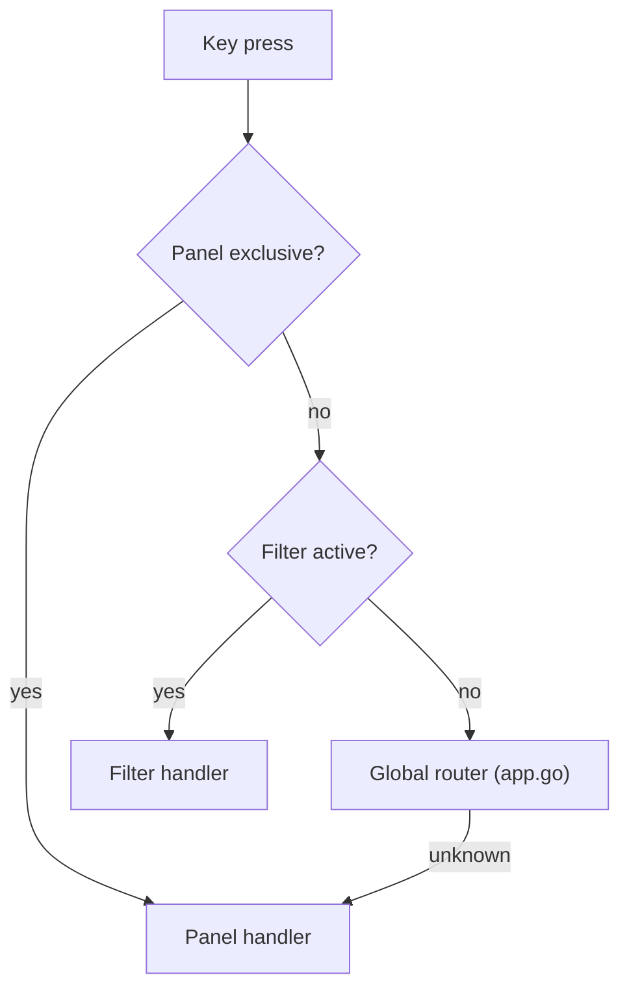

## Overview

Keybinding dispatch in the TUI is layered: an `exclusive` overlay (form, detail modal, policy YAML viewer) always wins, then a filter mode, then the global router in `app.go`, then panel-local handlers. Understanding the layer model is the fastest way to reason about which key is swallowed where.

## Global keys (always active)

| Key | Action | Notes |
|-----|--------|-------|
| `Ctrl+C` | Quit the TUI | Activity terminal mode uses it to interrupt the running subprocess |
| `?` | Open the help overlay | |
| `:` / `Ctrl+K` | Open the command palette | Focuses the palette input |
| `/` | Start in-panel filter | Supported in Alerts, Skills, MCPs, Audit |
| `Tab` / `Shift+Tab` | Cycle panels | In Policy, Tab is panel-local for tab-navigation within the YAML viewer |
| `1`–`9` | Jump to panel | Overridden per-panel when `panelOwnsDigitShortcut(key)` returns true |
| `0` | Jump to Setup | |
| `T` | Jump to Tools | Uppercase; mnemonic for the panel |
| `q` | Panel-local action | **Not** a global quit — see note below |

<Callout type="warning" title="q is not global quit">
  Historically the TUI bound `q` to quit. That meant typing `q` inside a YAML viewer silently killed the TUI. The key is now delegated to the active panel or overlay, where it can close local views or select local menu actions. Use `Ctrl+C` to quit.
</Callout>

## Filter mode

Activated by `/` in Alerts, Skills, MCPs, and Audit. Logs has its own search and filter-chip handling inside the Logs panel. While the shared filter input is focused:

| Key | Action |
|-----|--------|
| `esc` | Abort filter, restore view |
| `enter` | Apply filter, keep it visible |
| `backspace` | Delete last character |
| printable | Append to filter string |

The shared filter is simple text matching, not a query language. Type the word, severity, target, action, or identifier you want to narrow on.

| Panel | What the filter searches |
|-------|--------------------------|
| Alerts | Rendered alert action, target, severity, details, and scan roll-up text |
| Skills | Skill name, status, severity, verdict, and action text |
| MCPs | MCP name, URL, transport, status, severity, and verdict text |
| Audit | Audit action, target, severity, and details text |

## Exclusive / overlay mode

When any of these are active the panel fully owns keyboard input:

| Panel | Exclusive condition |
|-------|---------------------|
| Policy | YAML / Rego viewer is open (`m.policy.IsOverlayActive()`) |
| Skills | Detail modal open |
| MCPs | Detail modal OR `mcpSetForm` active |
| Plugins | Detail modal open |
| Tools | Detail modal open |
| Alerts | Detail modal open |
| Audit | Detail modal open |
| Inventory | Detail modal open |
| Setup | Wizard / form / editor active |

In exclusive mode the global router is bypassed — you can type `q` or `1` freely.

## Panel-specific keys

See [Panels](/docs-site/tui/panels) for every per-panel key.

The short cheatsheet:

| Panel | Key | Action |
|-------|-----|--------|
| Alerts | `1`–`5` | Severity filter (owned locally) |
| Alerts | `enter` | Open detail |
| Alerts | `space` | Select current alert and move down |
| Alerts | `x` | Acknowledge selected alerts |
| Alerts | `c` / `C` | Clear filtered alerts / clear all alerts |
| Alerts | `y` | Copy selected alert details |
| Skills | `s` | Scan now |
| Skills | `b` / `a` | Block / allow selected skill |
| Skills | `o` | Open contextual action menu |
| MCPs | `b` / `a` | Block / allow selected server |
| MCPs | `o` | Open contextual action menu |
| MCPs | `n` / `+` | Open MCP set form |
| Plugins | `s` | Scan selected plugin |
| Plugins | `o` | Open contextual action menu |
| Inventory | `1`–`4` | Scope filter (skills/mcps/plugins/tools) |
| Policy | `enter` | Open viewer overlay |
| Policy | `e` | Edit in `$EDITOR` |
| Policy | `r` | Reload policies |
| Policy | `t` | Run policy tests |
| Policy | `n` | New policy form |
| Logs | `g` / `G` | Top / bottom |
| Logs | `f` | Cycle log preset filters |
| Logs | `a` / `t` / `s` | Cycle verdict action/type/severity chips |
| Logs | `space` | Pause / resume auto-scroll |
| Audit | `/` | Text filter |
| Audit | `e` | Export filtered view |
| Activity | `1` / `2` | Commands / gateway activity mutations |
| Activity | `enter` | Open selected command output or mutation diff |
| Activity | `!` | Rerun the last palette command when it resolves |
| Setup | `enter` | Run wizard step |
| Setup | `esc` | Back |

## Command palette keys

When the palette is open:

| Key | Action |
|-----|--------|
| printable | Append to fuzzy search |
| `↑` / `↓` | Move match selection |
| `tab` | Complete the highlighted command name into the input |
| `enter` | Execute selected command |
| `esc` | Close palette |
| `backspace` | Delete last character |

## Related

- [Panels](/docs-site/tui/panels)
- [Command palette](/docs-site/tui/command-palette)
- [CLI parity](/docs-site/tui/cli-parity)

---

<!-- generated-from: internal/tui/app.go, internal/tui/palette.go, internal/tui/filter.go, internal/tui/command.go, internal/tui/logs.go, internal/tui/activity.go, internal/tui/audit.go -->
