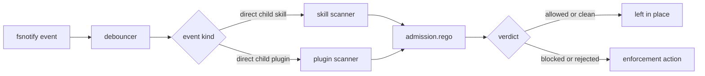

## Overview

The watcher is DefenseClaw's filesystem event loop for installed skills and plugins. It subscribes to configured skill and plugin directories, debounces new direct-child directories, runs the admission pipeline, and optionally starts the periodic rescan loop.

MCP servers are different: they are not watched through fsnotify. The rescan loop enumerates configured MCP servers from OpenClaw config and snapshots their server entry.

## Trees watched

- Skill directories from `cfg.skill_dirs()`.
- The configured plugin directory.

Create and rename events are debounced with `watch.debounce_ms`. The default is 500 ms, and non-positive config values fall back to the same 500 ms runtime default.

## Pipeline



## Section map

| Page | Purpose |
|------|---------|
| [Admission gate](/docs-site/watcher/admission-gate) | How pre-scan lists, scanners, and Rego decide admission |
| [Drift detection](/docs-site/watcher/drift-detection) | Snapshot diffs catch silent changes |
| [Periodic rescan](/docs-site/watcher/rescan) | Scheduled rescans for skills, plugins, and MCP entries |
| [Enforcement](/docs-site/watcher/enforcement) | Quarantine, block, disable, and restore behavior |

## Configuration

```yaml
watch:
  debounce_ms: 200
  rescan_enabled: true
  rescan_interval_min: 60
  allow_list_bypass_scan: true
gateway:
  watcher:
    skill:
      enabled: true
      take_action: true
    plugin:
      enabled: true
      take_action: false
    mcp:
      take_action: false
```

`take_action` controls whether rejected post-scan decisions apply side effects such as block, disable, or quarantine. Without it, the watcher still records scan and admission results.

## Related

- [Scanners](/docs-site/scanners/index)
- [Admission policy](/docs-site/policy/scanner-policies)
- [Firewall](/docs-site/firewall/index)

---

<!-- generated-from: internal/watcher/watcher.go, internal/watcher/rescan.go, internal/watcher/policy_files_watch.go, internal/config/defaults.go -->
