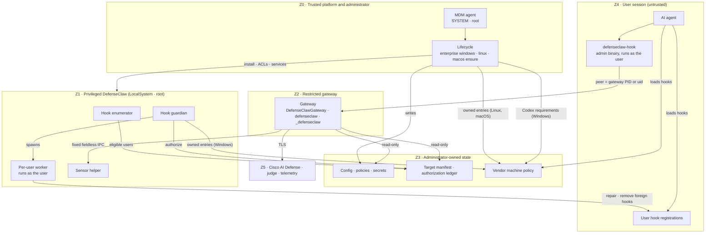

# Enterprise threat model (Windows, Linux, macOS)

This is the cross-platform threat model for DefenseClaw's `managed_enterprise`
deployment mode. It explains which DefenseClaw component runs in which
privilege zone on each operating system, how every boundary between zones is
protected, and which risks remain. The per-platform models carry the detailed
threat rows:

- [Windows](WINDOWS-ENTERPRISE-THREAT-MODEL.md) — rows `W-01`…
- [Linux](LINUX-ENTERPRISE-THREAT-MODEL.md) — rows `L-01`…
- [macOS](MACOS-ENTERPRISE-THREAT-MODEL.md) — rows `M-01`…

The design comes from `internal/managed/profile.go`,
`internal/managed/standalone_layout.go`, and `internal/config/enterprise.go`.
Each row names the code and tests that implement it.

## Scope

In scope:

- the `managed_enterprise` services, lifecycle commands, protected state,
  per-user hook enrollment and repair, vendor machine policy, and the hook
  runtime on Windows, Linux and macOS;
- both enterprise profiles (below);
- a standard local user, an AI agent running as that user, a prompt that
  steers that agent, another local user, and a compromised gateway process.

Out of scope, as in every platform model:

- a fully elevated administrator, root, LocalSystem, the MDM authority, a
  malicious signer, or a kernel compromise;
- physical access and offline disk modification without full-disk
  encryption;
- prevention of every local resource-exhaustion attack (availability is
  covered as a residual).

## Profiles

`managed_enterprise` runs in one of two profiles. The profile is set by
`enterprise.profile` in the administrator-owned config and pinned by
`DEFENSECLAW_ENTERPRISE_PROFILE` in the gateway, guardian, enumerator and
sensor-helper service environments. The pin and
the config must agree or the service refuses to start
(`managed.ResolveEnterpriseProfile`). The profile cannot change during a hot
reload (`internal/gateway/config_manager.go`, `enterprise_profile_change`).

| | `secure_client` | `standalone` |
| --- | --- | --- |
| Who installs it | Cisco Secure Client, as a module (Windows, macOS) | Any MDM, a package manager, or an administrator shell (Windows, Linux, macOS) |
| Default when unset | Windows, macOS | Linux (Linux rejects `secure_client`) |
| Decisions | Cisco AI Defense only, authenticated with the Secure Client Cloud Management identity; local detectors off | Local policy engine (rule packs, policy, CodeGuard, judge when keyed), plus Cisco AI Defense when an administrator stores an API key in a protected credential |
| When AI Defense is unreachable | Governed by the Secure Client posture | The local verdict stands |
| Windows services | Gateway, CMID broker, sensor helper, guardian, enumerator (five) | Gateway, sensor helper, guardian, enumerator (four; no broker) |
| Linux units | — | Gateway with activated API and hook sockets, guardian, enumerator, sensor helper, config-apply path unit, daily verify timer |
| macOS daemons | Gateway, guardian, enumerator, all as root (`com.cisco.secureclient.defenseclaw.*`) | Gateway as the hidden `_defenseclaw` user; guardian, enumerator and sensor helper as root (`com.cisco.defenseclaw.*`) |
| Roots | `…\Cisco\Cisco Secure Client\DefenseClaw`, `/opt/cisco/secureclient/defenseclaw` | Windows `C:\Program Files\Cisco\DefenseClaw` + `C:\ProgramData\Cisco\DefenseClaw`; Linux `/opt/defenseclaw`, `/etc/defenseclaw`, `/var/lib/defenseclaw`; macOS `/opt/cisco/defenseclaw` + `/Library/Logs/Cisco/DefenseClaw` |
| Secure Client GUI IPC, `env_config.json`, managed telemetry sink | On | Off |
| Lifecycle engine | Windows PowerShell 5.1 (Windows), `packaging/macos/install.sh` (macOS) | PowerShell 7 (Windows), Go (`internal/enterpriseunix`, Linux and macOS) |

The `secure_client` profile is in production. Nothing in the standalone work
changes it: every standalone behavior is gated on the resolved profile, and a
release gate byte-compares the Secure Client profile's rendered config,
service definitions, ACL plan, vendor policy bytes and status output before
each release. The profiles cannot coexist on one host: they share
service names, and each lifecycle refuses to install over the other
(`profile_conflict`).

The rest of this document describes the standalone profile unless a row says
otherwise. The Secure Client profile's controls are described in the Windows
model and in the Secure Client packaging documentation.

## Trust zones

Every DefenseClaw component belongs to exactly one zone. An arrow that
crosses a zone boundary is an attack surface and is listed in
[Boundaries](#boundaries).

| Zone | Windows | Linux | macOS | Protected by |
| --- | --- | --- | --- | --- |
| Z0 Trusted platform and administrator | SCM, LSA, Administrators, the MDM agent running as SYSTEM (for example the Intune Management Extension), Setup `/ensure` or `defenseclaw.exe enterprise windows` (the installed enterprise CLI) | PID 1 (systemd), root, the package manager, `defenseclaw-gateway enterprise linux` | launchd, root, the MDM agent, the package's postinstall, `defenseclaw-gateway enterprise macos` | Trusted by assumption. Artifacts are verified before use: Authenticode or a hash-pinned payload manifest on Windows; package signatures and published checksums on Linux and macOS |
| Z1 Privileged DefenseClaw services | Hook guardian and enumerator (LocalSystem, explicit privilege list); sensor helper (LocalSystem, `SeChangeNotifyPrivilege` only) | Guardian (root, bounded capabilities); enumerator (root, read-only homes); sensor helper (root, acquisition capabilities) | Guardian, enumerator, sensor helper (root) | Users get query-only SCM access; units and plists are root-owned; user homes are written only through a per-user worker running as that user (Linux, macOS) or an impersonated token (Windows) |
| Z2 Restricted gateway | `NT SERVICE\DefenseClawGateway`, restricted service SID | `defenseclaw` system user, empty capability set, systemd sandbox | `_defenseclaw` hidden user | Config, policy, secrets directory and authorization ledger are read-only to it; it writes only its runtime state and logs |
| Z3 Administrator-owned state | Program Files binaries; ProgramData config, policies, secrets, target manifest, ledger; vendor machine policy | `/opt/defenseclaw`, `/etc/defenseclaw`, `/var/lib/defenseclaw-hook-guardian`, `/etc/{codex,claude-code,cursor,github-copilot,opencode}` | `/opt/cisco/defenseclaw`, `/Library/Application Support/{ClaudeCode,Cursor,opencode}`, `/etc/{codex,github-copilot}` | Only administrators write. Users may read policy and the public machine-policy summary, never secrets or other users' tokens |
| Z4 User session (untrusted) | The AI agent and `defenseclaw-hook.exe` (an administrator-owned binary running as the user); per-user registrations | The AI agent and `/opt/defenseclaw/bin/defenseclaw-hook` | The AI agent and `/opt/cisco/defenseclaw/bin/defenseclaw-hook` | The hook sends nothing until the listener is the exact gateway; the foreign-hook guard; guardian repair |
| Z5 External | Cisco AI Defense, LLM judge, telemetry, the MDM cloud, vendor server-managed policy | same | same | TLS, outbound from the gateway only |

OpenCode's managed config directories (`/etc/opencode`,
`/Library/Application Support/opencode`, `%ProgramData%\opencode`) are used
only when the managed OpenCode plugin is installed at
`<install root>/share/opencode/defenseclaw.js`. This release does not ship
that plugin, so OpenCode is a per-user connector on every OS
(`internal/enterprisepolicy/opencode.go`).

## Boundaries

Each row is one arrow that crosses a zone boundary: what could go wrong, the
mechanism that protects it, and where the evidence lives.

| # | Crossing | Threat | Mechanism | Evidence |
| --- | --- | --- | --- | --- |
| B1 | Z0 → Z1/Z3: lifecycle installs services and state | A user-writable payload, config or engine is executed or installed with administrator rights | Windows: the standalone CLI resolves PowerShell 7 only from its HKLM registration, requires a Microsoft Authenticode signature and an administrator-owned path, scrubs .NET and PowerShell loader variables, and verifies a hash-pinned installer before launching it. Linux and macOS: paths come only from `managed.StandaloneLayoutFor`; every mutating action is a locked transaction with snapshot and rollback | `internal/cli/windows_enterprise_pwsh.go`, `internal/cli/windows_enterprise_profile.go`, `internal/enterpriseunix/lifecycle.go`, `internal/enterpriseunix/lock.go` |
| B2 | Z4 → Z0: a user runs `install.sh`, `install.ps1`, `defenseclaw upgrade` or a per-user gateway on a managed host | A per-user install takes the shared port or state directory and blocks or shadows managed hooks | Each per-user entry point refuses on a managed host: `scripts/install.ps1` when the marker key `HKLM\SOFTWARE\Cisco\DefenseClaw\Enterprise` exists; `scripts/install.sh` when the Linux or macOS runtime descriptor exists; `defenseclaw upgrade` and `defenseclaw rollback` when either is present; and the per-user gateway when the administrator-owned marker key or a trusted standalone deployment record (or the running standalone gateway service) confirms a deployment (Windows, `winpath.InspectEnterpriseDeployment`; a planted record or folder counts as neither) or the runtime descriptor exists (Linux, macOS). These refusals prevent accidental conflicts; they are skipped when the caller's environment already carries the managed deployment pin, so B7 remains the control against a hostile listener. On Windows the lifecycle also sets `HKLM\SOFTWARE\Policies\Cisco\DefenseClaw\DisableSelfUpdate` (W-53). The lifecycle does not detect, migrate or remove a per-user install that already exists; `enterprise.coexistence.per_user_install` is accepted and validated but has no effect in this release | `internal/cli/managed_host_guard.go`, `scripts/install.sh`, `scripts/install.ps1`, `cli/defenseclaw/upgrade_shim.py`, `internal/cli/windows_enterprise_registration.go`, `internal/config/enterprise.go` |
| B3 | Z4 → Z1: a user controls a service | Stop, disable, mask, reconfigure, delete or replace a service or its binary | Windows service DACLs grant users query only; units, plists and binaries are root- or Administrators-owned; `Restart=always` with `StartLimitIntervalSec=0`, launchd `KeepAlive`, SCM recovery repeated indefinitely | `packaging/systemd/*.service`, `packaging/launchd-standalone/*.plist`, Windows rows W-01, W-20, W-21 |
| B4 | Z4 → Z3: a user edits administrator state | Config, policy, secrets, manifest, ledger, descriptor or machine policy is changed | Administrator-only write on every file and ancestor; the loader rejects untrusted config and policy inputs (`validateManagedStandalonePolicyInputs`); secrets are readable only by root and the gateway (root-only on Linux with systemd 247 or later, which passes them through `LoadCredential=`) or, on Windows, carry an exact SYSTEM, Administrators and gateway-read DACL; the descriptor is parsed strictly from a trusted path | `internal/config/enterprise.go`, `internal/managed/credentials_unix.go`, `internal/managed/credentials_windows.go`, `internal/managed/runtime_descriptor.go` |
| B5 | Z2 → Z3: a compromised gateway edits policy or authorization | The gateway widens its own policy or forges readiness | Gateway identity is read-only on config, policy and the ledger (`ReadOnlyPaths=`, Windows restricted SID); the ledger is written only by the guardian | `packaging/systemd/defenseclaw-gateway.service`, Windows row W-05 |
| B6 | Z2 → Z5: the gateway calls Cisco AI Defense | The API key leaks to a user or into logs | The key is read only from a protected credential (systemd `LoadCredential=` under `/run/credentials/`, else a root-owned single-link file; Windows exact SYSTEM/Administrators/gateway-read DACL); `api_key_env` is cleared; inline `cisco_ai_defense.api_key` is rejected in standalone; values are never printed by `enterprise secret` | `internal/gateway/standalone_inspection.go`, `internal/managed/credentials*.go`, `internal/enterpriseunix/secrets.go` |
| B7 | Z4 → Z2: the hook calls the gateway | A user process binds the gateway endpoint during a restart and returns a forged allow | The hook writes no byte until the peer is proven: Windows compares the connected peer PID with the SCM gateway PID; the Windows Amp plugin and the per-user OpenCode plugin, which cannot, first make the listener prove it can derive the user's credential (an HMAC over a fresh nonce, served at `/api/v1/hook-listener-proof`), so an impostor that answers the proof receives only the credential's SHA-256 and the nonce and fails the call closed. The proof is a separate GET, and nothing binds the hook POST that follows to it: a listener that replaces the gateway between the proof and the POST receives that request's credential and payload, and its verdict is accepted. That needs the gateway to release the port (an administrator or upgrade restart) in that interval and the POST to open a new connection instead of reusing the proven pooled one (R7). Linux and macOS use only the hook socket and require its `SO_PEERCRED` / `LOCAL_PEERCRED` uid to be root or the gateway uid from the root-owned descriptor. Hooks, in-agent plugins (which ask `defenseclaw-hook` or post over the socket), the OmniGent bridge and the Codex notify bridge have no loopback TCP fallback: a descriptor without `hook_socket` fails closed (`enterprise_managed_hook_socket_missing`), and the guardian refuses to render a per-user hook without the socket. On Linux, PID 1 holds both sockets across gateway restarts. The agents' own telemetry exporters are R7 | `internal/gateway/connector/hookexec/managed_standalone_transport.go`, `internal/peercred/`, `internal/systemd/activation.go`, `internal/cli/hook_trusted_state_unix.go`, `internal/cli/enterprise_hooks_standalone_unix.go`, `internal/gateway/user_scoped_listener_proof.go`; the socket unit `packaging/systemd/defenseclaw-gateway-hook.socket` |
| B8 | Z4 → Z2: the gateway authorizes the hook caller | An unenrolled user or another connector's credential uses a hook route, or one user's credential posts events attributed to another user | Hook socket: the gateway reads the caller's kernel uid and checks the guardian's root-owned ledger (per-user connectors require enrollment; machine-policy connectors, OpenCode included while its managed plugin is in force, inspect every user unless `enrollment.unenrolled_users: deny`; `enrollment.root` governs uid 0). TCP (the remaining consumers such as Codex, Claude Code, OpenHands and OmniGent telemetry, and Windows hooks): the standalone guardian gives each protected user credentials bound to their uid or SID, derived from a per-machine key the users never see. The gateway accepts them only while the ledger protects that user, attributes the request to the bound identity, and refuses (403) identity headers that name anyone else. Connector-wide credentials, which every user of a connector used to share, no longer authenticate in the standalone profile. On Windows a SID that is not in protected enrollment state fails closed for every connector (W-28); `unenrolled_users`, `root`, `uid_min`, `uid_max`, `home_roots` and `agent_prefixes` apply only on Linux and macOS, `exempt_users` keeps a user's machine-policy rows, and `include_groups` / `exclude_groups` apply from session tokens (Windows residual 16). A telemetry exporter that hands its credential to a process holding the port is R7; the Secure Client profile is R12 | `internal/gateway/managed_hook_peer.go`, `internal/gateway/api_uds_unix.go`, `internal/gateway/user_scoped_credentials.go`, `internal/gateway/connector/user_scoped_token.go`, `internal/enterprisehooks/enumerator_windows.go`, `internal/enterprisehooks/enrollment_groups_windows.go` |
| B9 | Z1 → Z4: the guardian repairs a user's hooks | Root or LocalSystem follows a user-planted link, races a check, or writes outside the home | Windows: every user mutation runs under the exact target token (W-06), including the removal of DefenseClaw's registrations from a revoked user, which waits for that user's next session. Linux and macOS standalone: the root guardian never touches a home in-process; a per-user `apply-target` worker runs with the target's uid, gid and supplementary groups in its own session (Linux: parent-death signal, non-dumpable), with rlimits and a timeout. Homes under a world-writable ancestor are refused | `internal/cli/enterprise_hooks_worker_unix.go`, `internal/enterprisehooks/standalone_unix.go`, `internal/enterprisehooks/home_unix.go`, `internal/cli/enterprise_hooks_standalone_policy_windows.go` |
| B10 | Z1 → Z3: the enumerator publishes the manifest | An ineligible identity is enrolled, operator state is overwritten, or a directory outage revokes everyone | Directory-backed accounts resolve through NSS (`getent`) on Linux and Directory Services on macOS; only a definitive not-found counts as absence, and a row is revoked after three consecutive misses (`UnixRevokeAfterMisses`); uid or home-inode changes are treated as a new identity, and a reused uid does not inherit a deleted user's rows; existing `enabled` / `deferred` / version state is preserved, and a published manifest that fails to load is kept and the cycle fails. Candidates must fall inside the interactive uid range (Linux: `UID_MIN` from `/etc/login.defs`, 1000 when unset, up to `UID_MAX` for local accounts only; macOS: 501 and up; `enrollment.uid_min` and `uid_max` override both bounds) and have a login shell, unless they are listed in `enrollment.include_users`; uid 0 and `nobody` are never targets. An installed agent that cannot be enrolled is written to `unprotected-agents.json` beside the manifest, and status and verify report it | `internal/unixidentity/`, `internal/enterprisehooks/enumerator_unix.go`, `internal/enterprisehooks/unprotected_agents.go`, Windows row W-42 |
| B11 | Z0/Z1 → Z3: DefenseClaw writes vendor machine policy | An administrator's own hooks or settings are overwritten or deleted | Linux and macOS: the lifecycle is the only writer. It writes only DefenseClaw's own entries (a `90-defenseclaw.json` drop-in, marked regions in Codex `requirements.toml`, one plugin entry in OpenCode's managed config), records ownership and preimages that follow later administrator edits, reports conflicts, and never re-marshals an administrator document. `ownership` is `merge`, `verify_only` or `off` per connector. Windows: the lifecycle writes Codex `requirements.toml` at install, upgrade and repair (`enterprise windows codex-requirements reconcile`); the guardian writes the Claude Code drop-in, Cursor `hooks.json`, the Copilot `policy.d` drop-in and OpenCode's managed config and plugin, repairs all five, and records ownership and preimages for uninstall. It parses and re-marshals Codex `requirements.toml`, so administrator comments and key order are not kept, and it does not read `ownership`, `managed_hooks_only` or `higher_precedence_sources` when it writes Codex, Claude Code or Cursor policy | `internal/enterprisepolicy/`, `internal/enterpriseunix/machinepolicy.go`, `internal/enterprisepolicy/windows_owned.go`, `internal/enterprisepolicy/opencode.go`, `internal/gateway/connector/codex_machine_requirements.go` |
| B12 | Z4 → Z4: a user or project hook rewrites a tool call after DefenseClaw inspected it | Inspection bypass through ordinary file writes | Linux and macOS: Codex and Claude Code run with their vendor locks (`allow_managed_hooks_only`, `allowManagedHooksOnly`) under the default `managed_hooks_only: enforce`, and Codex requirements always pin `[features] hooks = true`; with `preserve` the foreign-hook guard covers them instead. Windows: Codex requirements always carry `allow_managed_hooks_only = true` and `features.hooks = true`, and an administrator value of `false` fails the transaction. The Windows Claude Code drop-in sets `allowManagedHooksOnly` under the default `managed_hooks_only: enforce`, as on Linux and macOS, and with `preserve` the foreign-hook guard covers Claude Code instead. Connectors without a lock (Cursor, Copilot, Devin, OpenCode, Amp, and Hermes on Linux and macOS): the guardian removes foreign entries from user-level config (backed up and audited; in a Hermes `config.yaml` only the `hooks` mapping is rewritten), and `defenseclaw-hook` fails closed while an unapproved foreign hook is present in user or project files, naming the file and the allowlist (`enterprise.machine_policy.connectors.<connector>.allowed_hooks`). The OpenCode and Amp plugins ask `defenseclaw-hook` for the same decision at load and before each tool call, and the standalone `hermes-hook.sh` asks before each Hermes tool call and at `on_session_start` (R24 lists the Hermes gaps). Only the registrations DefenseClaw renders for the administrator-owned hook binary, and the installed DefenseClaw plugin, count as owned. Agents keep hooks they loaded at session start, so a session (and the agent process running it) that started with an unapproved hook present stays denied until the agent restarts, for at most 7 days; the gateway keeps that state per verified uid or SID. When the guardian removes an unapproved hook it records the removal in its protected authorization directory, and the gateway denies that account's agent processes of that connector that started before the removal, for at most 7 days, which covers an agent whose session-start event arrives only with its first prompt (Hermes). Stop and session-end events of a denied session get the agent's neutral allow and are recorded, because a block there keeps the agent running instead of stopping it. The guardian also cleans the user config locations the agent's environment redirects to, as recorded by the hook and, on Windows, as named by the user's persistent environment | `internal/enterprisepolicy/guard.go`, `internal/enterprisepolicy/guard_hermes.go`, `internal/gateway/connector/hermes_foreign_guard.go`, `internal/enterprisepolicy/guard_session.go`, `internal/enterprisepolicy/guard_removals.go`, `internal/gateway/foreign_hook_session.go`, `internal/enterprisepolicy/guard_env.go`, `internal/cli/enterprise_hooks_foreign_env_windows.go`, `internal/enterprisepolicy/publicpolicy.go`, `internal/cli/hook_foreign_guard.go`, `internal/enterprisepolicy/codex.go`, `internal/enterprisepolicy/claude.go`, `internal/gateway/connector/codex_machine_requirements.go` |
| B13 | Z1 → Z2: the sensor helper answers the gateway | A compromised gateway uses the privileged helper to read arbitrary host data | Fixed, fieldless request protocol: no caller-selected path, pid, filter, glob or command; standalone helpers use their own runtime directory and manifest-derived homes | `cmd/defenseclaw-sensor-helper/`, `packaging/systemd/defenseclaw-sensor-helper.service` |
| B14 | Z0 → Z3: an MDM or administrator also manages the vendor policy | Two writers flap, or a higher-precedence source shadows DefenseClaw's hooks | Linux and macOS: `ownership: verify_only` for a file an MDM templates. Higher-precedence Claude Code sources (macOS managed preferences) and the macOS Codex preference `com.openai.codex` `requirements_toml_base64` are detected; they are accepted when they carry DefenseClaw's hooks (the block from `enterprise policy export`) or, for Claude Code 2.1.242 or later, set `managedSourcesBehavior: merge`. Otherwise `higher_precedence_sources: fail` (default) records a conflict and reports the connector as not covered, and `warn` only reports it. Windows: the guardian refuses to publish the Claude Code drop-in while `HKLM\SOFTWARE\Policies\ClaudeCode\Settings` is non-empty, and `higher_precedence_sources` is not read. Server-managed settings cannot be seen locally on any OS (R9) | `internal/enterprisepolicy/claude_sources_*.go`, `internal/enterprisepolicy/codex.go`, `internal/enterprisepolicy/export.go`, `internal/enterprisehooks/managed_policy_windows.go` |

## Invariants

These hold on every platform in the standalone profile.

1. `managed_enterprise` and the profile are both configuration and authority.
   A user environment variable or user config cannot select, downgrade or
   change either.
2. The gateway never runs as root or LocalSystem.
3. Paths come from the fixed layout, never from the caller's environment.
4. No privileged process mutates a user home with its own credentials. On
   Windows the write happens under the target's token; on Linux and macOS it
   happens in a worker running as the target.
5. A hook sends no request byte to a listener whose identity it has not
   verified with the kernel or SCM. An in-agent plugin that cannot do either
   (Amp, and OpenCode on the per-user route, on Windows) sends only a
   credential digest and a nonce until the listener proves it can derive the
   user's credential. Third-party telemetry exporters cannot verify the
   listener (R7).
6. The authorization ledger, not a service-writable status file, decides
   enrollment and readiness.
7. A directory lookup error never revokes a user; only a definitive
   not-found does.
8. DefenseClaw edits only the machine-policy entries it owns, and uninstall
   removes only those entries or restores their recorded preimages. On
   Windows, Codex `requirements.toml` is re-marshalled when DefenseClaw writes
   it (B11).
9. A secret value is never logged, printed, or placed on a command line.
10. `Running` is not readiness. Partial coverage is reported as incomplete.

## Residual risks

| # | Residual | Where | Why it remains | Mitigation outside DefenseClaw |
| --- | --- | --- | --- | --- |
| R1 | Per-user connectors are advisory against a deliberate local user. DefenseClaw's registration or plugin lives in the user's default config: the user can edit or delete it until the next guardian pass, and can start the agent with another config root or a vendor mode that skips user configuration (`XDG_CONFIG_HOME`, `HOME`, `OPENCODE_CONFIG_DIR`, a non-default Hermes profile or `HERMES_HOME`, a `HERMES_MANAGED_DIR` whose `config.yaml` replaces every Hermes hook list with one that leaves out DefenseClaw's entry, `devin --config <file>`, Hermes `--safe-mode`), so the agent never loads the registration, never calls `defenseclaw-hook`, and nothing fails closed. This applies to Amp (`XDG_CONFIG_HOME`, `HOME`), Devin (`XDG_CONFIG_HOME`, `--config` with a copy that has no hooks), Antigravity (`HOME`), Hermes (`--safe-mode`, `HERMES_HOME`) and OpenHands (`HOME`). Such a session leaves no DefenseClaw audit rows, and `status` and `verify` keep reporting the user's target ready, because the registration in the default location is intact. On Linux and macOS a user can also leave a path the guardian refuses in their own home (a link, or a file where the agent's config folder belongs), so the registration is not repaired until the path is fixed; `status` and `verify` report that target only as the warning `guardian_target_user_path`, which does not fail `verify` or MDM detection. The guardian repairs only the default location and cannot see a per-process environment or command line, so these sessions are never repaired and the bypass is not bounded by the repair interval. Hermes `--ignore-user-config` on its own keeps DefenseClaw's hooks. `DEFENSECLAW_*` overrides (fail mode, gateway address, token, home) do not remove the hooks for Amp or Hermes. The guardian also checks the user's hook scripts against the digests in the user's own `hook_contract_lock.json`, so a user who edits both is not detected. The machine-policy connectors (Claude Code, Codex, Copilot, and OpenCode on its managed plugin) are not affected by the same variables | Per-user connectors on every OS (Devin, Antigravity, Hermes, Amp, OpenHands, OmniGent, and OpenCode while it is on the per-user route) | The files belong to the user by design, and the guardian cannot see a per-process environment | Prefer machine-policy connectors for enforcement; a vendor machine policy for these agents, or application control over how users launch them (their environment and flags), for example allowing the agent binary to run only from an administrator-owned launcher that resets these variables and refuses these flags |
| R2 | Claude Code `--bare` and `CLAUDE_CODE_SIMPLE=1` skip managed `SessionStart` and `UserPromptSubmit` hooks; managed `PreToolUse` still runs. `disableAllHooks` in user or project settings or through `--settings` does not disable managed hooks | Claude Code, every OS | Vendor behavior ([vendor machine policy](https://cisco-ai-defense.github.io/defenseclaw/docs/enterprise/machine-policy/)) | Treat prompt inspection as advisory; tool-level inspection is the enforcement point |
| R3 | Amp has no machine plugin path, and plugin handler order is undefined; execute mode can start a turn before plugins load. The guardian writes the managed plugin under the user's default Amp config directory (`~/.config/amp/plugins/defenseclaw.ts`), so an Amp session that uses a different config directory does not load it: with `XDG_CONFIG_HOME` or `HOME` pointing elsewhere a tool call runs with no DefenseClaw inspection or audit row (R1), while `status` and `verify` keep reporting the user's Amp target ready | Amp, every OS | Vendor design | Per-user plugin with guardian repair and the foreign-plugin guard; treat Amp coverage as best effort; application control over how users launch Amp (R1) |
| R4 | OpenCode does not document the order in which plugins run. The run-after ordering described in [vendor machine policy](https://cisco-ai-defense.github.io/defenseclaw/docs/enterprise/machine-policy/) applies to the managed plugin at `<install root>/share/opencode/defenseclaw.js`, which the payload ships and OpenCode's managed config names; on the per-user fallback route the order is undefined. Pure mode (`--pure`, `OPENCODE_PURE=1`) and `OPENCODE_TEST_MANAGED_CONFIG_DIR` start a session without any DefenseClaw plugin, the managed one included | OpenCode, every OS | Vendor design | Re-check per client release; the foreign-plugin guard stays on for OpenCode; application control over how users launch OpenCode |
| R5 | Hermes blocks a `pre_tool_call` only on a valid block response (and, from 0.21, on exit code 2); any other hook failure (a crash, a kill, another exit code) only warns, so a hook cannot fail closed upstream. In the Hermes contracts DefenseClaw pins (0.19 to 0.21), a hook timeout also lets the call run (from 0.21, unless the hook entry sets `fail_closed`, which DefenseClaw's entries, with a 30 s timeout, do not set); some Hermes builds block the call when a stalled `pre_tool_call` hook reaches its timeout, but that is not a documented contract. A killed hook lets the call run (R18) | Hermes | Vendor design | Treat Hermes coverage as advisory; application control and EDR process protection for the hook process (R18) |
| R6 | Copilot command hooks that time out fail open, even policy hooks | GitHub Copilot CLI | Vendor behavior | Keep hook latency bounded; monitor timeouts |
| R7 | A user can deny availability by holding the gateway port or the hook socket name while the gateway is down, and a user who holds the TCP port receives whatever a client that does not verify the listener sends. Hooks and the Codex notify bridge verify it on every connection (hook socket peer uid, or the SCM PID on Windows), so the holder receives no hook credential or tool payload and no verdict it returns is trusted (B7); on Linux and macOS hooks and in-agent plugins use only the hook socket, which the gateway serves independently of the TCP port. The Windows Amp and per-user OpenCode plugins verify it with the listener proof, a separate request before each hook POST: a holder present at the proof gets nothing, but a holder that takes the port between the proof and the POST (after the gateway releases it in an administrator or upgrade restart, and only when the POST opens a new connection) receives that request's per-user credential and tool payload, and the plugin accepts its verdict. The native OTLP exporters of Codex, Claude Code, OpenHands and OmniGent cannot: the holder receives their telemetry, which can include prompt text, and the sending user's per-user telemetry credential, and can replay that credential after the gateway is back to post telemetry attributed to that user for that connector. The credentials do not rotate, so a captured one works until that user leaves enrollment; it never authenticates hook, inspect or management routes, or another connector. The port can be held during every gateway restart on macOS (the gateway binds it itself) and Windows, and on Linux only after an administrator stops the socket unit | Every OS | The exporters are third-party code that sends a static bearer to a loopback address; port squatting cannot be prevented without the service manager holding the port continuously, which launchd cannot do for a cgo-free binary; the plugins' listener proof is not yet bound to the request that carries the credential (a request-bound proof, an HMAC over the nonce and the body with a signed verdict, would close that window) | Socket activation (Linux); alert on any process other than the gateway listening on `127.0.0.1:18970`; treat per-user telemetry attribution as advisory after a gateway restart. Removing a user from enrollment revokes their credentials; re-enrolling the user restores the same ones |
| R8 | Hash-pinned (unsigned) payloads do not satisfy application-control policies that require a publisher signature | Windows WDAC and AppLocker, macOS Gatekeeper | Signing is optional until a release channel provides it | Authenticode or Developer ID signing, or customer re-signing with pinned signers: on Windows `--trust-mode authenticode` with `--allowed-signer`, Setup `ALLOWEDSIGNERS=`, the MDM wrapper's `-TrustMode Authenticode -AllowedSigners`, or `enterprise.trust.mode: authenticode` with `enterprise.trust.allowed_signers` in the config (which also refuses the hash-pinned route and any run over a hash-pinned deployment; `hash_pinned` or an unset mode is the minimum and does not refuse a signed payload); on macOS the MDM script's `--trust-mode signed --allowed-team-id`. Linux and macOS do not read `enterprise.trust` |
| R9 | A higher-precedence vendor source (Codex cloud or macOS MDM requirements, Claude server-managed settings) can override local machine policy and is not always visible locally | Codex, Claude Code | Vendor precedence | `defenseclaw-gateway enterprise policy verify --live --user <user> --connector <codex or claudecode> --agent-binary <absolute path>` with the real client (on this code the policy commands read the config named by `DEFENSECLAW_CONFIG`, so point it at the managed config); coordinate with whoever owns the cloud policy |
| R10 | A compromised privileged DefenseClaw service (guardian, enumerator, sensor helper) holds root or LocalSystem authority | Every OS | Those services need the privilege | Collapses into the trusted-administrator assumption; keep binaries administrator-owned |
| R11 | An administrator or a user with unrestricted sudo can remove DefenseClaw | Every OS | Out of scope by definition | Restrict administrator membership; audit lifecycle events |
| R12 | In the Secure Client profile hook and telemetry credentials are connector-scoped: every user of a connector holds the same one, and the gateway attributes the request from the caller's identity headers, so one user can post hook, inspection and telemetry events attributed to another user of the same connector. Per-user credentials bound to the uid or SID (B8) exist only in the standalone profile | Secure Client profile, Windows and macOS | The Secure Client lifecycle and its credential custody are pinned to the shipped release and were not changed with the standalone profile | Treat per-user attribution in Secure Client telemetry as advisory; binding Secure Client credentials to the SID is a tracked follow-up |
| R13 | A foreign hook that removes itself (or that the user removes) before DefenseClaw's session-start check reads the files can remain loaded without a recorded block; a guardian removal holds only the agent processes DefenseClaw can name; a hook added after the session start, or a session still running 7 days after its block was recorded, is held only by the per-call check, which denies while the hook's file is present; when OS process lookup fails, only the session ID carries the block, and the next session start (a restart, resume, clear or compact) resets it | Connectors covered by the foreign-hook guard, every OS | The agent reads its hooks before any hook runs, and only a hook present then is known to be loaded; session records are bounded in time; the gateway cannot infer a process identity if the OS does not return its ancestry | The gateway stores session snapshots under its protected data directory, keyed by verified uid or SID, and denies calls when the record cannot be read or written; vendor locks (`managed_hooks_only: enforce`) for Claude Code and Codex; deliver needed hooks through machine policy |
| R14 | The guardian cleans an environment-redirected user config location only after a DefenseClaw hook has run with that environment and recorded it; on Windows it also cleans the locations the user's persistent environment (`HKEY_USERS\<SID>\Environment`) names, but only while the user's registry hive is loaded (otherwise the skip is logged), and a variable set only for one shell or process still needs a hook run; a relative `OPENCODE_CONFIG` and `OPENCODE_CONFIG_CONTENT` are never cleaned | Connectors covered by the foreign-hook guard, every OS | The guardian has no user session environment and never loads a user's hive | The hook-time check still denies while a foreign hook is present there |
| R15 | An unapproved client, a client below the hook-contract floor, an old or copied agent binary, or a self-built or modified client (Codex is open source) does not call DefenseClaw's hooks or honor machine policy (`/etc/codex/requirements.toml`, `allowManagedHooksOnly`, the managed-settings drop-in), so its tool calls are not inspected. On Linux and macOS, Claude Code releases that do not read `managed-settings.d` ignore both DefenseClaw drop-ins, the hooks and the version floor: 1.0.128, 2.0.0 and 2.0.77, installed by a standard user under their home with `npm install --prefix`, run tool calls with no DefenseClaw hook and no audit row, and `status` and `verify` do not report them. Those releases read only `managed-settings.json`, which the ownership model leaves to the administrator ([#920](https://github.com/cisco-ai-defense/defenseclaw/issues/920)). GitHub Copilot CLI below its 1.0.18 floor behaves the same way: 1.0.15, installed under a home with `npm install --prefix` and run with `--no-auto-update`, does not load `/etc/github-copilot/policy.d`, and its tool calls run with no audit row. Per-user connectors below their contract minimum can skip DefenseClaw's registration too, the same class as [#920](https://github.com/cisco-ai-defense/defenseclaw/issues/920): OpenHands 1.11.0, below the 1.12.0 minimum and started by a standard user with `uvx --from openhands==1.11.0 openhands`, does not load `~/.openhands/hooks.json`, so its tool calls run with no DefenseClaw decision and no audit row. Nothing refuses it: `uvx` runs it from the uv cache, where discovery does not look (R19), so it is neither enrolled nor reported, and `status` and `verify`, which check only the enrolled OpenHands and its default hook file, keep reporting the user's target ready | Every OS | DefenseClaw cannot make a client honor a hook contract it does not implement; the floors are in `cli/defenseclaw/inventory/hook_contracts.json` | Application control (WDAC or AppLocker, fapolicyd, Santa) that allows only approved clients at or above the floors (Windows row W-27, Linux L-25, macOS M-17); it is the only control for Claude Code releases without `managed-settings.d` support and for per-user connectors below their contract minimum (such as OpenHands before 1.12.0), including copies a package runner such as `uvx` starts from its cache. For Claude Code the standalone profile also sets `requiredMinimumVersion` to the lowest verified contract (`enterprise.machine_policy.connectors.claudecode.version_floor`), but that floor stops no build: Claude Code reads the setting only from 2.1.163, and every build below the 2.1.154 floor is older. 2.1.153 starts with the floor in DefenseClaw's drop-in and in `managed-settings.json`; under a 2.1.300 floor, 2.1.154 to 2.1.162 start while 2.1.163 and later refuse, so a value of 2.1.163 or later stops only the builds from 2.1.163 that are below it ([#920](https://github.com/cisco-ai-defense/defenseclaw/issues/920)). No other connector has a vendor setting that stops an older client. The floor has further limits: Claude Code checks it when a session starts, so running sessions continue; an administrator value wins, even one below the floor; Claude Code ignores a value that is not a version, so one that merges after DefenseClaw's drop-in leaves no floor, and so does an administrator file at the drop-in's name that does not set the key (DefenseClaw never edits it); and while a higher-precedence source (HKLM `Settings`, macOS managed preferences, or server-managed settings, which DefenseClaw cannot see) is in force without the key, the builds the floor targets never read the managed settings files. `enterprise policy verify` fails when a value, file or source it can see leaves no floor, and reports a value below the floor |
| R16 | Retired (the number is kept for references). The Windows Claude Code drop-in now sets `allowManagedHooksOnly` under the default `managed_hooks_only: enforce`, so user and project Claude Code hooks no longer run next to DefenseClaw's managed hooks on Windows (B12) | Windows, Claude Code | None | Keep `enforce` for `claudecode`; `preserve` removes the lock and turns the foreign-hook guard on instead, as on Linux and macOS |
| R17 | On Windows the guardian changes a user's files only while that user has an active (connected) session: a signed-out or disconnected user is repaired, and a revoked user's DefenseClaw registrations are removed, when their session is active again. An uninstall that is not run as LocalSystem, or that finds users signed out, leaves their registrations; they are inert because enrollment is revoked and the hook binary is removed | Windows, per-user connectors | The guardian writes only under the user's own session token (Windows residual 3) | Monitor guardian status for users that stay pending; uninstall as LocalSystem while users are signed in |
| R18 | `defenseclaw-hook` (and the per-user hook scripts such as `openhands-hook.sh`) runs as the user, who can terminate, suspend or starve it until the agent's hook timeout fires. Agents that block only on an explicit deny or exit code then run the call, and because the hook never reached the gateway there is no DefenseClaw decision or audit row for the call before it runs; hooks that still run afterwards can record it after the fact (Hermes' `post_tool_call` and model hooks can reach the gateway while no `pre_tool_call` row does). When the user kills or stops their own hook processes (`defenseclaw-hook`, `openhands-hook.sh`, `hermes-hook.sh`), Claude Code and Codex treat a killed hook (no exit code 2) and a stopped one (after the 30 s timeout) as non-blocking and run the tool call; OpenHands runs the call for a killed hook (`Exit Code: -9`) and can run it for one that stalls until its 60 s timeout, leaving its own confirmation prompt, which the user answers, as the only check; Devin runs it for a killed hook; Hermes runs it for a killed `pre_tool_call` hook (R5). GitHub Copilot CLI stays closed unless every one of its hooks is stopped: its permission-request hook still denies after a failed or timed-out `preToolUse` hook, but when both time out the call runs (R6). OpenCode, Amp and Antigravity stay closed: the plugins block the call, or wait until the stopped hook is killed and then block it. "Fail-closed" in the connector capability matrix means the hook blocks when it cannot reach the gateway; it does not cover a hook process the user ends | Every OS (Windows residual 22, Linux residual 12 and L-32, macOS residual 8 and M-22) | The hook is a user process by design, and the agent decides what a hook that dies or times out means | Application control and EDR process protection for the hook process (users must not be able to signal it); a vendor setting that treats a failed or timed-out hook as a deny would close it for that agent; keep hook latency bounded and monitor hook failures and tool calls that reach the audit without a pre-tool decision |
| R19 | Agent discovery covers the usual per-user install locations, the Node version managers (nvm, fnm, Volta, asdf, mise; nvm-windows, fnm, Volta and pnpm on Windows), pnpm and yarn global directories, the user's npm prefix, the machine prefixes and `agent_prefixes`. An agent CLI installed or copied anywhere else in a home is neither enrolled nor reported, so a per-user connector run from there has no DefenseClaw hooks | Every OS | Discovery reads known layouts and never runs user binaries as root | Install shared agents under `agent_prefixes` (Linux and macOS); application control over where users run agents from |
| R20 | Where standard users can create a private user and mount namespace (Linux), an agent started inside one can be given its own view of the machine policy, the runtime descriptor and the hook socket directory. `enterprise linux verify` warns (`unprivileged_user_namespaces`), which it does on stock Ubuntu 24.04 and RHEL 9. Both remedies also restrict the agents' own command sandboxes, which use bubblewrap and need user namespaces: `user.max_user_namespaces=0` stops Codex's and Claude Code's sandboxes from starting, and under the AppArmor restriction a sandbox runs only where a profile allows user namespaces. On stock Ubuntu 24.04 (`kernel.apparmor_restrict_unprivileged_userns=1`) Codex's bundled bubblewrap already fails, so Codex shell calls fail until the user runs without its sandbox | Linux (L-26) | A kernel setting DefenseClaw cannot change from user space, and the same setting governs the agents' sandboxes | `user.max_user_namespaces=0`, or `kernel.apparmor_restrict_unprivileged_unconfined=1` with `kernel.apparmor_restrict_unprivileged_userns=1`, chosen against the sandbox trade-off ([Linux deployment: User namespaces](https://cisco-ai-defense.github.io/defenseclaw/docs/enterprise/linux/#user-namespaces)) |
| R21 | Administrator-triggered windows: a running gateway can hot-reload an in-place config edit just before the lifecycle rejects and reverts it (`config_rejected`), and on Linux an upgrade that changes a socket unit releases the gateway's listener while the socket restarts | Linux and macOS | Both follow an administrator action | Change the config and upgrade through the lifecycle; monitor `config_rejected` |
| R22 | Kiro. On Linux and macOS the guardian enrolls Kiro per user: the global `~/.kiro/hooks/defenseclaw.json` (read by Kiro IDE 1.0.182 and later and by `kiro-cli --v3`) and the CLI 2.x `defenseclaw` agent. Neither kiro-cli engine vetoes prompts: kiro-cli 2.24.1 with `--v3` sends a prompt DefenseClaw blocked to the model with the block reason attached (the audit log still records the block), and the 2.x engine blocks tool calls only. That is advisory like every per-user connector (R1): another agent (`--agent`, `/agent swap`), a relocated `KIRO_HOME` or hooks from Kiro's cloud configuration sync run without DefenseClaw's hook. On Windows the guardian does not enroll Kiro (`kiro-cli.exe` records its version nowhere discovery can read), so Kiro is covered only when it runs through the ACP guard (`enterprise acp enroll`, then the user-side `acp setup --managed`); an editor entry that launches the agent directly is not controlled. The Kiro IDE is R29 | Kiro, every OS | Vendor hooks are user-scoped; Windows discovery runs nothing | Keep kiro-cli at 2.24.1 or later; turn off configuration sync in the Kiro console; deploy the managed ACP setup; control editor configuration with endpoint policy |
| R23 | Cursor applies the enterprise `hooks.json` only on Cursor plans that support enterprise hooks | Cursor, every OS | Vendor licensing | Confirm on a real client with the organization's Cursor plan |
| R24 | Antigravity, OpenHands and OmniGent have neither a vendor lock nor the foreign-hook guard, and neither has Hermes on Windows, so hooks a user or project adds for them run next to DefenseClaw's. On Linux and macOS the guard covers the Hermes shell hooks in `config.yaml` and in the managed-scope `config.yaml` that `HERMES_MANAGED_DIR` names, which Hermes merges over it (DefenseClaw's per-user `hermes-hook.sh` asks `defenseclaw-hook` before each tool call and at `on_session_start`), but Hermes has no lock and no hook ordering, so three gaps remain there: a Hermes process keeps the hooks it loaded at start or re-read when a plugin reload re-registers `config.yaml` hooks (entries already in the user's Hermes allowlist register without a new prompt), so an unapproved entry the user removes after Hermes loaded it and before the next `on_session_start` event or tool call keeps running in that process unseen (one the guardian removes is held by its removal record, B12); Hermes Python plugins (under `HERMES_HOME/plugins`, project plugins, installed plugin packages) run inside Hermes and are not inspected; and a session that never loads DefenseClaw's hook (R1) is not checked | Antigravity, OpenHands and OmniGent on every OS; Hermes on Windows; the Hermes gaps above on Linux and macOS | No vendor lock; the guard covers only connectors with a documented rewrite surface, and Hermes loads its hooks and plugins into its own process | Treat their coverage as advisory; application control |
| R25 | Agents a user has only as a desktop app or editor extension (Claude Desktop's Code tab, the Claude Code or Codex VS Code extension, the Codex app, the Antigravity IDE) are not enrolled: enrollment finds an agent only through its CLI install. On Windows an unenrolled user's machine-policy hook calls (Claude Code, Codex, Cursor, Copilot) are refused; on Linux and macOS they are inspected under the default contract (`unenrolled_users: inspect`) or refused (`deny`), and the app version is not reported; per-user connectors (Antigravity, Devin) get no hooks and no `unprotected-agents.json` record. App versions have no verified hook contract policy ([#912](https://github.com/cisco-ai-defense/defenseclaw/issues/912)) | Every OS (Windows row W-57, Linux L-27, macOS M-18) | App and extension discovery and their version sources are not implemented or live-verified | Install the agent's CLI for users of its app or extension; `unenrolled_users: deny`; application control over which apps users run |
| R26 | GitHub Copilot in VS Code is partly covered. With `ownership: merge` the standalone Copilot machine policy enables VS Code's `ChatHooks` and `ChatEditorPreferCopilotHarness` policies (HKLM on Windows, `/etc/vscode/policy.json` on Linux; deployed through MDM on macOS), so new editor chats open on the SDK harness, which reads Copilot `policy.d`. A chat moved back to the default Local harness is governed only by a hook bound with `--hook-surface vscode-local`, which DefenseClaw does not place per user yet; per-user Copilot CLI hook files are misread by Local, and in Local an `allow` auto-approves the call, so DefenseClaw prints nothing on allow. None of this is live-verified in VS Code ([#913](https://github.com/cisco-ai-defense/defenseclaw/issues/913)) | Copilot in VS Code, every OS (W-58, L-28, M-19) | The per-user Local hook file, the plugin route and the Local harness lock are not implemented | Keep the two VS Code policies enabled; use the Copilot CLI for governed work |
| R27 | Agent sessions inside a WSL 2 distribution are outside Windows machine policy: a Claude Desktop WSL session reads the distribution's `/etc/claude-code`, the Codex app's agent can run in WSL, and the Codex VS Code extension's `chatgpt.runCodexInWindowsSubsystemForLinux` runs Codex there. The Windows user can open their own distribution as root, and Windows endpoint sensors do not see processes in the WSL VM ([#914](https://github.com/cisco-ai-defense/defenseclaw/issues/914)) | Windows (W-59); a Linux standalone install inside the distribution (L-29) | Partly covered: the standalone guardian keeps Claude Desktop WSL sessions off (`disableWslSessions`, merged only into existing machine policy unless `claude_desktop_key: create`), resets the Codex extension's WSL setting, reports `wslInheritsWindowsSettings` and the Codex app, and the Linux lifecycle refuses to install inside WSL. Open: CLIs inside the distribution, Remote - WSL windows, the Codex app's setting, the window before the next repair, and whether REG_SZ `true` forces Desktop's gate | `platform: disable` (`AllowWSL=0`) where agents must be governed; see [Agent sessions in WSL](../docs-site/content/docs/enterprise/windows.mdx) |
| R28 | Devin Desktop is partly covered. A Desktop-only user is reported in `unprotected-agents.json` on macOS and Windows, but not enrolled, and Linux has no Desktop probe. The foreign-hook guard scans installed Devin plugin hooks, and `enterprise policy show` reports Devin Desktop ACP registry entries that start uncovered agents or override Devin Local's config. Devin Local under `devin acp` is not live-verified, and its bundled harness updates from the server past the exact contract pins. One Devin Local process serves every Desktop tab, so a foreign-hook session block covers all tabs until Devin Desktop restarts. Builds from 3.0.12 up to (not including) 3.9.19 still run Cascade, which DefenseClaw does not cover ([#915](https://github.com/cisco-ai-defense/defenseclaw/issues/915)) | Devin Desktop, every OS (W-60, L-30, M-20) | Desktop enrollment, a Linux probe, a reviewed contract range and the Cascade route are not implemented | Keep Devin Desktop at 3.9.19 or later; application control over which apps users run |
| R29 | The Kiro IDE is discovered on Linux and macOS from its `product.json` (never run): a user with only the IDE is enrolled, and an IDE before 1.0.182, which reads only workspace hooks, is reported as `kiro_ide_below_global_hooks_floor`. That the IDE enforces the global `~/.kiro/hooks` file the guardian writes (R22) is not live-verified, IDE 0.x legacy hooks cannot block, and where the Agent Hooks panel stores a disabled hook is unknown. The Windows guardian does not enroll Kiro, and Kiro does not document which shell runs hook commands on Windows: DefenseClaw's command returns a block as exit 2 through `cmd.exe` or a direct launch, but a `powershell -Command` launcher reports it as 1 and Kiro proceeds ([#916](https://github.com/cisco-ai-defense/defenseclaw/issues/916)) | Kiro IDE, every OS; Windows hook shell (W-61, L-31, M-21) | The IDE live checks and Windows enrollment are not done; Kiro's Windows hook shell is undocumented | Keep Kiro IDE at 1.0.182 or later; use the ACP guard on Windows and for editors that start Kiro over ACP |
| R30 | OpenHands loads a project's `.openhands/hooks.json` instead of the user-level `~/.openhands/hooks.json`, not next to it: it looks in the working directory's `.openhands/hooks.json` first, then in `~/.openhands/hooks.json`, and uses only the first file it finds. In a project that carries its own file, even one with a single unrelated hook, none of DefenseClaw's OpenHands hooks run, so tool calls there are neither inspected nor logged, and no DefenseClaw message is shown. OpenHands then reports `Loaded: ... 1 hook` instead of DefenseClaw's six. A repository the user clones can carry the file, so no deliberate action is needed. This is wider than R24, which covers extra hooks next to DefenseClaw's. The OpenHands hook contract lists `<workspace>/.openhands/hooks.json`, but the guardian writes only the user-level file and neither restores nor removes a project file; the foreign-hook guard does not cover OpenHands, and `enterprise policy verify --user` does not look for the project file, so status and verify do not report it | OpenHands, Linux and macOS (L-33, M-23) | Vendor precedence: the project file replaces the user file, and OpenHands has no machine-level hook location | Treat OpenHands coverage as advisory; keep `.openhands/hooks.json` out of the repositories developers use (for example with a repository rule or a server-side push check) and search existing checkouts for it; application control. A vendor precedence change or machine-level OpenHands hooks would close it |
| R31 | Each verified standalone account has its own request budget on the hook socket and its per-user TCP credential (60 requests a second, a burst of 120, 32 in flight; OTLP export has a separate budget). Requests past it get HTTP 429 `enterprise_managed_rate_limited`, which a hook treats as a gateway failure. Under `hook_fail_mode: open` an account that floods its own budget therefore makes its own hooks allow until the budget refills; under the default `closed` the same flood only denies that account's own calls | Standalone profile, per-user connectors with `hook_fail_mode: open` (Linux and macOS hook socket, and per-user credentials on every OS) | The budget keeps one account from delaying every other account's hooks; the fail mode is the administrator's choice | Keep `hook_fail_mode: closed` (the default) for per-user connectors; the machine-policy connectors (Claude Code, Codex) and standalone Devin always fail closed |
| R32 | Desktop apps and editor extensions are enrolled from static discovery. A hook call names its surface from the agent engine's executable path and the vendor's surface variable; both are the user's to change, so with `enrollment.unverified_versions: refuse` a user can make an app or extension call look like a CLI call or leave it unclassified (an unclassified call is not refused on its surface). The surface variables are not documented vendor interfaces. The user controls the extension and app folders in their home, so they can claim any engine version with a known contract, as with a CLI (R1). Extension folders relocated with `--extensions-dir` (and, on Linux and macOS, `VSCODE_EXTENSIONS`), JetBrains plugins, and layouts vendors do not document are not found by discovery; a surface installed between cycles is found on the next cycle. On Windows only Claude Code and Codex apps and extensions are discovered, the profile is read only while its user is signed in, and the Codex app's engine version has no static source, so a Codex app-only user is reported, not enrolled | Standalone profile, every OS | Hook payloads carry no surface identity, and vendors document few app layouts | Application control over which agent apps and editor extensions users may install; `unverified_versions: refuse` |

R2–R6 and R9 describe vendor behavior summarized in
[vendor machine policy](https://cisco-ai-defense.github.io/defenseclaw/docs/enterprise/machine-policy/).
Re-check them for each client release you deploy.
