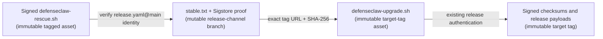

# Authenticated release channel and rescue bootstrap

DefenseClaw keeps every versioned release immutable. A published tag is never
edited to repair an installer or upgrade resolver. Starting with `0.8.8`, each
release instead includes a small, checksummed `defenseclaw-rescue.sh` asset
that discovers the current resolver through an authenticated stable channel.

The result is a mutable pointer to immutable code:



This separation lets a later release repair orchestration for older
installations without replacing anything attached to an existing tag. The
channel changes; the referenced resolver and all installable payloads do not.

## Channel contract

The release workflow publishes four files on the dedicated
`release-channel` branch:

- `stable.txt`
- `stable.txt.sig`
- `stable.txt.pem`
- `stable.txt.bundle`

`stable.txt` is fixed-order ASCII with exactly these fields:

| Field | Binding |
| --- | --- |
| `schema` | `defenseclaw-release-channel-v1` |
| `channel` | `stable` |
| `repository` | `cisco-ai-defense/defenseclaw` |
| `target_version` | Canonical `X.Y.Z` |
| `target_tag` | Exactly equal to `target_version` |
| `target_ref` | Exactly `refs/tags/<target_version>` |
| `target_commit` | Lowercase 40-character commit ID |
| `resolver_name` | Exactly `defenseclaw-upgrade.sh` |
| `resolver_url` | Derived exactly from repository, tag, and resolver name |
| `resolver_sha256` | Digest copied from the immutable release's signed `checksums.txt` |

The document is not shell code and is never sourced or evaluated. Its
fixed-order line format lets the rescue bootstrap parse it without depending
on a working DefenseClaw Python environment, `python3`, or `jq`.

## Publication order

The release workflow advances the channel only after all of the following are
true:

1. The exact tested release candidate has been published under its version
   tag.
2. GitHub reports that release as immutable and every remote asset digest
   matches the sealed candidate.
3. The channel candidate is generated from that candidate's
   `checksums.txt`.
4. Cosign signs the channel with the keyless identity
   `https://github.com/cisco-ai-defense/defenseclaw/.github/workflows/release.yaml@refs/heads/main`.
5. The workflow verifies its own signature and the existing channel's
   signature.
6. The existing channel is either identical (an idempotent rerun) or points
   to an older version. Same-version rebinding and version rollback are
   rejected.
7. The `release-channel` branch is updated with a non-forced, fast-forward Git
   commit, and the workflow reads back and verifies the published bytes.

If channel publication fails after the immutable release was created, the
release remains valid but the stable pointer stays on the previous version.
Rerunning the release workflow reconciles the already-published exact
candidate and can safely retry the channel advance.

Repository rules should protect `release-channel` from deletion, force pushes,
and ordinary contributor writes. The release workflow's protected `release`
environment is the intended publisher. Git history provides an audit trail,
while the Sigstore proof prevents an unsigned branch edit from redirecting
clients.

## Rescue behavior

Run `defenseclaw-rescue.sh` only after obtaining it from an authenticated
`0.8.8` or later release (or another trusted distribution of those exact
bytes). A `releases/latest/download` URL is only a locator; authenticate the
bootstrap through that release's signed `checksums.txt` before its first use.
Do not stream a raw branch or release response directly into a shell.

The rescue bootstrap:

1. Downloads `stable.txt` and its Sigstore bundle over HTTPS.
2. Uses an existing Cosign, or downloads a platform-specific Cosign `2.6.3`
   binary and verifies its hard-coded SHA-256.
3. Verifies the bundle's transparency-log inclusion proof and requires the
   exact `release.yaml@main` Fulcio identity and GitHub Actions OIDC issuer.
4. Validates every channel field and reconstructs the canonical bytes so
   duplicate, reordered, redirected, or extra fields fail closed.
5. Downloads only the exact version-tagged resolver URL derived from the
   authenticated channel.
6. Verifies the resolver SHA-256, completeness marker, and Bash syntax.
7. Supplies the authenticated channel version as the resolver's target and
   passes the operator's recovery arguments.

The bootstrap rejects an operator-supplied `--version` and
`--allow-unverified`; neither command-line nor ambient legacy overrides may
replace the signed stable target or bypass its authentication.

For the two field-recovery cases:

```bash
# Repair an incomplete migration cursor with the current resolver.
bash defenseclaw-rescue.sh --yes

# Preserve a proven-corrupt audit SQLite tuple and activate a fresh store.
bash defenseclaw-rescue.sh --yes --recover-corrupt-audit
```

The bootstrap itself never stops services or changes installed state. All
preflight checks, backup, recovery custody, bridge selection, rollback, and
post-install health checks remain owned by the authenticated target resolver.

## Trust and failure boundaries

- A mutable channel is not permission to mutate tagged artifacts. Resolver
  bytes are fetched from an exact version tag and must match the signed
  channel digest.
- TLS is transport protection, not artifact authentication. The Sigstore
  workflow identity authenticates the channel; SHA-256 then binds the tagged
  resolver.
- An unsigned channel edit, arbitrary URL, changed resolver name, tag/ref
  mismatch, same-version digest change, or rollback publication is rejected.
- A repository administrator could replay an older, previously valid signed
  channel by bypassing branch rules. That is a freshness/availability risk,
  not authority to execute modified bytes: the resolver is still an immutable
  signed release asset, and normal upgrade policy refuses downgrades.
- Windows continues to use native Setup and its signed release contract. This
  initial rescue bootstrap is for supported macOS and Linux upgrade paths.
