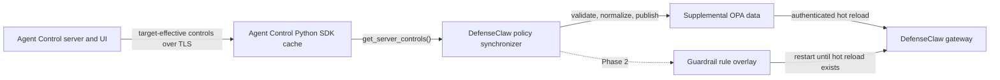
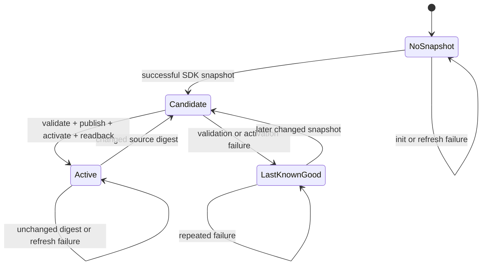

# Agent Control Policy Synchronization for DefenseClaw

**Status:** Proposed

**Target repository:** `defenseclaw`

**Companion specification:** *DefenseClaw External Evaluators — Technical
Specification* (`agent-control`)

**DefenseClaw source baseline:** `8d2919df6` (`origin/main`, July 8, 2026)

**Last updated:** July 8, 2026

## 1. Executive summary

DefenseClaw needs a DefenseClaw-owned translation layer between the Agent
Control Python SDK and DefenseClaw's native policy systems. Agent Control is
the authoring, targeting, and distribution plane. DefenseClaw remains the
validation, activation, and runtime enforcement plane.

The integration has two independent projection lanes:

1. `defenseclaw.opa_policy` becomes a strictly validated supplemental OPA
   data document consumed by stable, reviewed DefenseClaw Rego. This is the
   first implementation phase because the OPA engine already supports atomic
   in-memory reload through the authenticated `/policy/reload` endpoint.
2. `defenseclaw.rule_pack` becomes a native guardrail rule file. This is a
   later phase because the current rule-pack runtime has one base directory
   per connector, permissive loading, and a process-lifetime cache. It must
   gain additive overlay and strict validation support before remotely
   managed rules can be enabled safely.

The integration does **not** send prompts, completions, tool calls, or other
runtime events to Agent Control. It consumes the target-effective control
snapshot cached by the Agent Control SDK, translates matching configurations,
publishes deterministic local artifacts, and requests local activation.

The security boundary is:

> Agent Control may distribute versioned structured configuration.
> DefenseClaw defines the accepted values, validates the complete candidate,
> translates it into native data, activates it locally, verifies the active
> version, and retains last-known-good policy on failure.

Arbitrary Rego, file paths, commands, URLs, and executable policy are outside
the remote contract.

## 2. Decision

Add an optional persistent Python synchronization process to DefenseClaw.
The process owns the Agent Control SDK session because the SDK cache is
process-local Python state.



The synchronizer is not a second policy engine. It has no event-time API and
does not interpret prompts or tool calls. It only projects control-plane data
into DefenseClaw-owned representations.

## 3. Relationship to the Agent Control companion specification

### 3.1 Repository ownership

| Concern | Agent Control owns | DefenseClaw owns |
|---|---|---|
| Authoring | Evaluator registration, typed models, JSON Schema, both UI forms | Documentation of supported semantics |
| Distribution | Agent/policy/target binding and effective-control rendering | Stable installation identity and SDK session |
| Wire contract | Exact evaluator names and versioned configuration envelopes | Authoritative provider values and resource limits |
| Runtime | SDK cache and refresh lifecycle | Extraction, native validation, publication, activation, rollback |
| Enforcement | None for these distribution controls | OPA and guardrail runtime decisions |
| Observability | Control authoring/binding and SDK retrieval | Projection, activation, LKG, and local enforcement state |

### 3.2 Required clarification to the companion specification

The companion document currently describes a shared DefenseClaw client,
transport, authentication, and response mapping for evaluator execution. That
would put DefenseClaw behind an event-time provider call and conflicts with
this design. For this integration, the two evaluator classes are typed
**policy-distribution controls**, not remote runtime evaluators.

The Agent Control implementation must therefore use the following behavior:

- Keep the public names exactly `defenseclaw.opa_policy` and
  `defenseclaw.rule_pack`.
- Keep the typed config models, entry-point discovery, and UI work described
  by the companion specification.
- Do not add a DefenseClaw HTTP client or call a DefenseClaw endpoint from
  `evaluate()`.
- If either evaluator is invoked accidentally, return a deterministic neutral
  result:

  ```python
  EvaluatorResult(
      matched=False,
      confidence=1.0,
      message="DefenseClaw policy-distribution control; not an event evaluator",
      metadata={"mode": "policy_distribution", "schema_version": 1},
      error=None,
  )
  ```

- Use `execution: "sdk"`, selector path `"*"`, action `observe`, and a
  dedicated synchronization agent. The synchronizer reads the cached control
  definitions; it does not ask the SDK evaluator engine to execute them.

This clarification resolves the companion specification's open transport,
authentication, timeout, retry, and `EvaluatorResult` questions: there is no
DefenseClaw provider request in evaluator execution. DefenseClaw-to-Agent
Control authentication is handled by the SDK session described below.

### 3.3 Authoritative provider values

The following values are final for schema version 1 and should be mirrored by
the Agent Control backend models and both UIs:

| Field | Allowed values or constraint |
|---|---|
| Rule severity | `LOW`, `MEDIUM`, `HIGH`, `CRITICAL` |
| OPA `block_at` / `alert_at` | `LOW`, `MEDIUM`, `HIGH`, `CRITICAL` |
| OPA `domain` | Exactly `guardrail` |
| `cisco_trust_level` | `full`, `advisory`, `none` |
| Empty `tags` | Allowed |
| Pattern language | Go `regexp` syntax, which has RE2 semantics |
| Pattern flags | No separate flags field; supported inline Go/RE2 flags are allowed |
| Pattern length | At most 2,048 Unicode code points |
| Rule count | At most 1,000 rules in the effective candidate |
| Confidence | Finite number in inclusive range `0.0` through `1.0` |
| Threshold order | `rank(alert_at) <= rank(block_at)` |

`NONE` exists inside DefenseClaw's native severity rank but is intentionally
excluded from remotely authored v1 values. Disabling remote policy is done by
disabling or unbinding the Agent Control control, not by lowering a rule to
`NONE`.

## 4. Current DefenseClaw constraints

This design is based on the following behavior on the source baseline:

- `internal/policy/engine.go` loads `data.json`, permissively merges
  `data-sandbox.json`, compiles all Rego modules, and swaps the OPA store only
  after a successful reload.
- `internal/gateway/api.go` exposes token-authenticated
  `POST /policy/reload`. A failed reload leaves the previous in-memory store
  intact.
- `internal/watcher/policy_files_watch.go` audits policy file changes but does
  not activate them.
- `policies/rego/guardrail.rego` reads numeric block/alert thresholds and
  Cisco trust from `data.guardrail`. Live HILT input takes precedence over
  policy data and must remain local.
- `internal/guardrail/rulepack.go` loads one full rule-pack directory and
  silently skips or falls back when files are missing or malformed.
- `internal/guardrail/rulepack_cache.go` treats loaded packs as immutable for
  the process lifetime.
- `internal/gateway/rules.go` uses Go regular expressions, rejects patterns
  longer than 2,048 characters, and replaces categories by category name.
- `guardrail.rule_pack_dir` and per-connector overrides select a single base
  pack. There is no independent managed overlay list.
- DefenseClaw supports Python 3.10+, while Agent Control SDK 8.2.x requires
  Python 3.12+.

These constraints make OPA a safe first phase and rule-pack projection a
separate compatibility change.

## 5. Goals and non-goals

### 5.1 Goals

- Author the supported DefenseClaw configuration in Agent Control UIs.
- Resolve direct, policy-derived, and target-bound controls for one stable
  DefenseClaw installation identity.
- Keep Agent Control off all runtime enforcement paths.
- Preserve the local DefenseClaw baseline and local-only safety settings.
- Apply OPA policy-data changes without restarting the gateway.
- Retain last-known-good policy through network, schema, disk, activation,
  and process failures.
- Treat a successful empty control snapshot differently from no snapshot.
- Make native artifacts bounded, deterministic, auditable, and reversible.
- Support user-mode and managed Linux/macOS installations.
- Keep the integration optional and disabled by default.

### 5.2 Non-goals

- Evaluating DefenseClaw events through Agent Control.
- Accepting or generating arbitrary Rego.
- Allowing Agent Control to change HILT, guardrail mode, hook fail mode,
  scanner strategy, credentials, paths, or service permissions.
- Replacing operator-owned `data.json`, Rego, suppressions, judge prompts,
  sensitive-tool settings, or base rule packs.
- Projecting admission, firewall, sandbox, audit, or skill-action policy in v1.
- Adding rule-pack hot reload in the OPA phase.
- Supporting Windows managed service installation in v1.

## 6. Identity, targeting, and authentication

### 6.1 Dedicated Agent Control agent

Use one dedicated SDK agent name:

```text
defenseclaw-policy-sync
```

It must not be reused by an application instrumented with Agent Control
decorators. This separation prevents distribution controls from being mixed
with ordinary application guardrails.

### 6.2 Stable target identity

Use this target pair:

```text
target_type = defenseclaw.installation
target_id   = <persisted UUID or provisioned immutable ID>
```

The setup command creates the UUID once or accepts an externally provisioned
value. It is persisted with mode `0600`, is never derived only from hostname,
and is not regenerated during normal startup or upgrade. Resetting identity
is an explicit operator action.

The target values are limited to 255 characters to match Agent Control's
target contract.

### 6.3 Credentials

- Read `AGENT_CONTROL_URL`, `AGENT_CONTROL_API_KEY`, and the optional standard
  API-key-header environment variable through the SDK.
- Use a regular runtime credential, never an Agent Control administrator
  credential.
- Require certificate verification for non-loopback URLs.
- Never copy an Agent Control credential into `config.yaml`, generated policy,
  state, metrics, or logs.
- Use the existing DefenseClaw gateway token only for loopback policy
  activation and readback.

## 7. Cached-control extraction contract

### 7.1 Required control envelope

A matching control has one leaf condition and this envelope:

```json
{
  "control": {
    "enabled": true,
    "execution": "sdk",
    "scope": {},
    "condition": {
      "selector": {"path": "*"},
      "evaluator": {
        "name": "defenseclaw.opa_policy",
        "config": {}
      }
    },
    "action": {"decision": "observe"}
  }
}
```

The same envelope applies to `defenseclaw.rule_pack`.

Extraction rules are exact:

- Ignore unrelated evaluator names.
- Validate every control using an exact DefenseClaw evaluator name.
- Reject composite condition trees for v1.
- Reject a matching control with the wrong execution, selector, scope, action,
  envelope, or config shape.
- Reject the complete candidate for the affected lane when any matching
  control is invalid. Never partially publish the remaining matching controls.
- Process the OPA and rule-pack lanes independently. One lane may retain LKG
  while the other successfully advances.
- Deep-copy matching configuration before normalization. The list returned by
  `get_server_controls()` is borrowed SDK cache state and must never be
  modified.

### 7.2 OPA multiplicity

Schema version 1 permits one semantic OPA configuration per effective
snapshot. Multiple normalized byte-equivalent controls are de-duplicated.
Two different effective OPA configurations are a conflict and reject the OPA
candidate.

### 7.3 Rule-pack multiplicity

Multiple rule-pack controls may contribute rules. The synchronizer builds one
candidate by rule ID:

- Identical normalized duplicate rules are de-duplicated.
- A duplicate ID with different content rejects the entire rule-pack
  candidate.
- Output rules are sorted by ID so Agent Control result order cannot change
  the artifact digest.

### 7.4 Determinism and digest semantics

Each lane maintains three related identities:

- **Source digest:** SHA-256 of the canonical, normalized matching evaluator
  configs after semantic de-duplication. Wrapper IDs, control names, list
  order, descriptions, and timestamps are excluded.
- **Projection key:** SHA-256 of the source digest plus local projection
  settings that affect output, including precedence, translator schema
  version, and the enabled lane. This is the no-op/coalescing key.
- **Artifact digest:** SHA-256 of the exact canonical native JSON or YAML bytes
  published to DefenseClaw.

Control IDs and names remain available for audit correlation but cannot make
semantically identical policy reload. A change to local precedence must
change the projection key and regenerate the artifact even when Agent Control
returns the same source controls.

## 8. OPA policy-data projection (phase 1)

### 8.1 Agent Control source schema

```json
{
  "schema_version": 1,
  "policy": {
    "domain": "guardrail",
    "block_at": "HIGH",
    "alert_at": "MEDIUM",
    "cisco_trust_level": "full"
  }
}
```

Validation is strict:

| JSON path | Requirement |
|---|---|
| `schema_version` | Required integer exactly `1` |
| `policy` | Required object |
| `policy.domain` | Required string exactly `guardrail` |
| `policy.block_at` | Required v1 severity |
| `policy.alert_at` | Required v1 severity |
| `policy.cisco_trust_level` | Required v1 trust value |
| Unknown properties | Rejected at every object level |
| Canonical serialized size | At most 64 KiB per matching control |

Severity rank is `LOW=1`, `MEDIUM=2`, `HIGH=3`, `CRITICAL=4`. Alert rank
must be less than or equal to block rank. Lower thresholds are stricter
because they activate at more severities.

### 8.2 Local precedence

DefenseClaw local configuration selects the merge mode:

```yaml
agent_control:
  opa:
    precedence: stricter  # stricter | remote
```

`stricter` is the default:

- Effective block threshold is the lower numeric rank of local and remote.
- Effective alert threshold is the lower numeric rank of local and remote.
- Trust strictness is `full > advisory > none`; the stricter value wins.

`remote` uses the present remote values. The local value remains the fallback
when the remote overlay is disabled or absent. The merge mode is local-only
and is never accepted from Agent Control.

The following remain local authority in all modes:

- guardrail `observe` versus `action` mode;
- HILT enabled state and minimum severity;
- hook fail mode;
- severity ranking;
- scanner mode and detection strategy;
- local Rego and base policy data.

### 8.3 Native supplemental artifact

The synchronizer converts severity labels to native ranks and writes canonical
JSON. A present remote policy produces:

```json
{
  "agent_control": {
    "schema_version": 1,
    "enabled": true,
    "precedence": "stricter",
    "source_digest": "sha256:...",
    "guardrail": {
      "block_threshold": 3,
      "alert_threshold": 2,
      "cisco_trust_level": "full"
    }
  }
}
```

A successful snapshot with no matching OPA control produces the canonical
disabled artifact:

```json
{
  "agent_control": {
    "schema_version": 1,
    "enabled": false,
    "precedence": "stricter"
  }
}
```

The disabled document explicitly returns evaluation to the local baseline.
It is different from an unavailable/unknown snapshot, which does not change
the active artifact.

Canonical JSON uses UTF-8, sorted object keys, compact separators, a trailing
newline, and no timestamp. Digests are SHA-256 over exact canonical bytes.

### 8.4 Strict OPA loading

Add a dedicated loader for `data-agent-control.json` in
`internal/policy/engine.go`:

- Missing file behaves as a disabled v1 overlay.
- The only top-level property is `agent_control`.
- Unknown properties, wrong types, invalid ranks, invalid threshold ordering,
  unsupported versions, and oversize files return an error.
- The `agent_control` key is reserved to this loader. Base or sandbox data
  must not override the validated value.
- Validation happens before the new OPA store is published.
- Invalid supplemental data causes `Reload()` to fail and preserves the
  previous store.

The existing permissive `data-sandbox.json` behavior is unchanged for its
current keys. It must not be reused for Agent Control data.

### 8.5 Stable Rego changes

Add reviewed helper rules and update `guardrail.rego` to read effective
values instead of directly reading the three local fields:

```text
effective block threshold
effective alert threshold
effective Cisco trust level
```

The helpers read the validated `data.agent_control` object and apply the
locally selected precedence. When the overlay is missing or disabled, outputs
must be byte-for-byte behaviorally equivalent to the current local values.

No Agent Control string is parsed or evaluated as Rego. Existing unsafe
builtin restrictions remain in force.

### 8.6 Publication layout

Use a DefenseClaw-owned managed directory:

```text
<data_dir>/agent-control/
├── lock
├── state.json
├── opa/
│   └── versions/
│       └── <artifact-digest>/data-agent-control.json
└── rule-pack/
    ├── versions/
    └── current/rules/                  # phase 2
```

The active OPA file is a concrete file at:

```text
<policy_dir>/rego/data-agent-control.json
```

Publication protocol:

1. Validate and normalize the complete lane candidate in memory.
2. Write the immutable version artifact with mode `0600`.
3. `fsync` the artifact and containing version directory.
4. Write a temporary file in `<policy_dir>/rego` using `O_EXCL` and no
   symlink following.
5. `fsync` and atomically rename the temporary file to
   `data-agent-control.json`.
6. `fsync` the Rego directory.
7. Mark the digest as published, not active.

Using a concrete activation file avoids trusting a mutable symlink during OPA
reload. Version artifacts provide rollback and forensic reconstruction.

### 8.7 Candidate validation

Before publication, DefenseClaw must validate the exact generated file using
the same Go loader and Rego compiler used by the gateway. Add a Go-facing
validation command or internal CLI route that:

- loads the base policy plus candidate supplemental data;
- compiles all Rego modules;
- evaluates a small deterministic guardrail smoke corpus;
- returns the normalized artifact digest and source digest;
- performs no writes and no activation.

Python schema validation is an early usability check. Go validation is the
authoritative native boundary.

### 8.8 Activation, readback, and rollback

Activation uses the existing authenticated loopback request:

```text
POST /policy/reload
```

Extend policy status additively so activation can be verified rather than
inferred:

- `POST /policy/reload` success includes OPA generation and the active Agent
  Control artifact digest.
- Add token-authenticated `GET /policy/status` returning the same readback.
- The engine calculates the digest from the exact bytes it successfully
  loaded and swaps digest/generation metadata with the OPA store.
- Existing reload response fields remain for compatibility.

Successful activation requires the readback digest to equal the published
digest. On reload error, timeout, process exit, or digest mismatch:

1. Atomically restore the previous LKG bytes to the active file.
2. Request reload again.
3. Verify the previous digest through status readback.
4. Report rollback success or a critical disk/runtime divergence.
5. Never mark the failed candidate active.

The synchronizer must not restart the gateway for an OPA-only update.

## 9. Guardrail rule-pack projection (phase 2)

### 9.1 Source schema

```json
{
  "schema_version": 1,
  "rule_pack": {
    "version": 1,
    "category": "agent-control",
    "rules": [
      {
        "id": "AC-CMD-RM-RF",
        "pattern": "(?i)rm\\s+-rf",
        "title": "Recursive deletion",
        "severity": "HIGH",
        "confidence": 0.99,
        "tags": ["filesystem"]
      }
    ]
  }
}
```

### 9.2 Rule validation

In addition to the provider values in section 3.3:

| Constraint | Limit |
|---|---:|
| Canonical combined candidate | 1 MiB |
| Effective rules | 1 through 1,000 |
| Rule ID | 1 through 128 characters |
| Rule title | 1 through 256 characters |
| Pattern | 1 through 2,048 code points |
| Tags per rule | 0 through 32 |
| Tag length | 1 through 128 characters |

IDs and tags are trimmed but patterns and titles are not silently rewritten.
IDs must be unique after normalization. Confidence must be finite; `NaN` and
infinities are rejected even if a parser accepts them.

Patterns are compiled with Go `regexp` under the existing compile time bound.
Python or browser regex acceptance is not authoritative.

The generated native file is exactly:

```text
<managed rule overlay>/rules/agent-control.yaml
```

It has `version: 1`, fixed category `agent-control`, and deterministically
sorted rules. The synchronizer does not generate judge, suppression,
sensitive-tool, or local-pattern files.

### 9.3 Required additive overlay support

Do not point the existing `guardrail.rule_pack_dir` at the managed Agent
Control directory. Doing so would replace the operator's selected profile and
could discard local suppressions, judge prompts, and other rules.

Add a rules-only overlay field:

```yaml
guardrail:
  rule_pack_dir: ~/.defenseclaw/policies/guardrail/default
  rule_pack_overlay_dirs:
    - ~/.defenseclaw/agent-control/rule-pack/current
```

Required semantics:

- Load the existing base pack exactly as today.
- Overlay directories may contain only `rules/*.yaml` in phase 2.
- Apply global overlay directories after each connector's effective base
  pack, so the centrally targeted installation policy covers every enabled
  connector.
- Preserve per-connector base `rule_pack_dir` selection.
- Merge overlays in configured order; later categories replace earlier
  categories.
- Reserve category `agent-control` for this integration and reject it from
  other managed overlay entries.
- Missing, malformed, or invalid managed overlays are fatal during native
  validation and activation. They must never silently fall back.
- Existing operator base-pack permissive behavior remains unchanged for
  backward compatibility.

Add a strict shared Go validator for managed rule files. Runtime loading and
the pre-publication validator must share the same rule normalization,
severity, regex, confidence, and duplicate-ID implementation.

### 9.4 Rule-pack publication and activation

The synchronizer retains immutable versions and atomically replaces only:

```text
<data_dir>/agent-control/rule-pack/current/rules/agent-control.yaml
```

An empty successful snapshot removes the managed category by publishing an
empty/absent managed overlay state; it never edits the base pack.

Because `RulePackCache` is process-lifetime and category state is installed at
startup, phase 2 activation requires a gateway restart. Automatic activation
uses authenticated `POST /policy/restart`: daemon mode arranges the normal
restart helper, while managed mode exits with an intentional restart result so
systemd or launchd relaunches the gateway. Manual/user-mode publication reports
`pending_restart` and provides the exact operator command.

After restart, a health/status surface must report the active rule artifact
digest. A failed restart or digest mismatch restores the prior overlay and
restarts again. Phase 2 is not complete until this transaction and its
multi-connector behavior are tested.

## 10. Synchronization lifecycle

### 10.1 SDK startup

The synchronizer calls:

```python
agent_control.init(
    agent_name="defenseclaw-policy-sync",
    target_type="defenseclaw.installation",
    target_id=target_id,
    policy_refresh_interval_seconds=refresh_seconds,
)
```

Agent Control SDK 8.2.x starts its refresh loop even when the first
registration does not produce a snapshot. A refresh alone may continue to
fail if the agent was never registered. Until the first successful snapshot,
the synchronizer must retry the complete `shutdown()` plus `init()` sequence
with capped exponential backoff and jitter.

After first success, the SDK owns network refresh and fail-stale cache
behavior. The synchronizer polls `get_server_controls()` locally and avoids a
second network loop.

### 10.2 Snapshot semantics

| SDK/cache observation | Synchronizer behavior |
|---|---|
| `None` before first success | Preserve LKG; do not publish a disabled artifact |
| Successful `[]` | Publish disabled/empty managed candidates and preserve local baselines |
| Successful non-empty list | Extract, validate, and process both lanes |
| Failed refresh preserving old list | No policy change; report stale/refresh failure when metadata is available |
| Invalid matching control | Reject that lane and preserve its LKG |
| Only unrelated controls | Equivalent to a successful empty DefenseClaw candidate |
| Repeated identical digest | No write, reload, restart, or duplicate audit event |

The SDK currently returns the previous cached list when manual or background
refresh fails, so list equality alone cannot prove freshness. Production
freshness reporting requires an additive SDK snapshot metadata API with at
least:

```text
generation
last_attempt_at
last_success_at
last_error
controls
```

Functional preview can proceed without this API because LKG behavior remains
safe, but status must say freshness is `unknown`; it must not claim that the
snapshot is current.

### 10.3 Lane state machine



Published and active are separate states. A candidate is active only after
runtime readback confirms its digest.

## 11. Configuration and CLI

### 11.1 Configuration

Add a typed configuration block:

```yaml
agent_control:
  enabled: false
  agent_name: defenseclaw-policy-sync
  target_type: defenseclaw.installation
  target_id: ""
  refresh_seconds: 60
  cache_poll_seconds: 2
  init_retry_max_seconds: 300
  managed_dir: ""  # default: <data_dir>/agent-control

  opa:
    enabled: true
    precedence: stricter  # stricter | remote
    activation: reload    # reload | manual

  rule_pack:
    enabled: false        # phase 2 feature gate
    activation: restart   # restart | manual
    max_rules: 1000
```

Validation rejects:

- an enabled integration without a stable target ID;
- partial target pairs;
- invalid or unreasonably small intervals;
- unsupported precedence or activation values;
- OPA reload activation without a policy directory and gateway token;
- rule-pack enablement when the overlay capability is unavailable;
- managed paths outside the DefenseClaw data root in managed mode;
- credential values under the `agent_control` block.

### 11.2 CLI surface

```text
defenseclaw agent-control setup
defenseclaw agent-control sync --once
defenseclaw agent-control sync --watch
defenseclaw agent-control status
defenseclaw agent-control validate <path>
```

`setup`:

- checks Python and optional dependency compatibility;
- creates or imports the stable target ID;
- creates managed directories and the active supplemental file;
- adds the fixed rule overlay path only when phase 2 is enabled;
- validates Agent Control connectivity and authentication;
- prints the exact agent/target identifiers for binding;
- optionally installs the platform service.

`sync --once`:

- obtains one successful snapshot within a bounded timeout;
- processes changed candidates and exits;
- returns nonzero when no snapshot is obtained or requested activation fails;
- never clears LKG on `None`.

`sync --watch`:

- holds the single-writer lock;
- maintains one SDK session;
- polls the local SDK cache;
- coalesces unchanged snapshots;
- shuts down the SDK cleanly on termination.

`status` reports configuration, SDK compatibility, redacted connection
identity, hashed target identity, snapshot freshness, lane states, digests,
last activation, pending restart, and the last safe error. It never prints
raw policy by default.

`validate` performs strict schema and native validation without publication
or activation.

## 12. Packaging and platform behavior

- DefenseClaw core remains Python 3.10+.
- Add optional extra `defenseclaw[agent-control]` with
  `agent-control-sdk>=8.2,<9` for Python 3.12+.
- Import the Agent Control SDK lazily inside the integration command/process;
  importing the core DefenseClaw CLI on Python 3.10/3.11 must not require the
  optional package.
- On Python 3.10 and 3.11, Agent Control commands return a clear unsupported
  version message; all other DefenseClaw commands remain available.
- Add a systemd service and a launchd plist for persistent synchronization.
- Run the synchronizer as the DefenseClaw service account with access only to
  its managed directory, the one supplemental policy file, state/lock files,
  and loopback activation.
- Gateway startup must not depend on Agent Control or the synchronizer. The
  gateway starts with LKG or local policy when either is unavailable.
- Installer and uninstaller changes must preserve operator policy and remove
  only files bearing the DefenseClaw Agent Control ownership marker.

## 13. Filesystem and concurrency safety

- Permit one synchronizer writer per installation using an advisory lock with
  process identity and stale-lock recovery.
- Managed directories use `0700`; files use `0600` unless the existing
  service ownership model requires a stricter group-readable mode.
- Never accept an output path, filename, service name, or command from a
  control payload.
- Use fixed filenames and open temporary files with `O_EXCL` and no-follow
  semantics.
- Reject unexpected owners, hard links, symlinks, or path traversal at every
  managed write boundary.
- Keep temporary and destination files on the same filesystem for atomic
  rename.
- `fsync` file and directory metadata before reporting publication.
- Retain a bounded number of immutable versions, always including active and
  rollback LKG versions.
- Reconstruct state from validated artifacts and runtime readback after a
  crash; do not trust `state.json` alone.

## 14. Security requirements

### 14.1 Remote input boundary

- Reject unknown schema versions and properties.
- Enforce all count, size, string, enum, duplicate, and regex bounds before
  expensive work.
- Never log full regex patterns or raw control payloads by default.
- Never import Python modules, execute commands, fetch URLs, or resolve paths
  named by remote config.
- Never generate Rego from a control.

### 14.2 Availability posture

Synchronization is fail-stale: failures preserve LKG. Event-time fail-open or
fail-closed behavior remains the existing local DefenseClaw setting and is
not changed by this integration.

Successful empty snapshots are not failures. They intentionally remove only
the Agent Control-managed overlay and restore local baseline behavior.

### 14.3 Least privilege and privacy

- Use non-admin Agent Control credentials.
- Keep gateway activation loopback-bound and token-authenticated.
- Hash the target ID in persisted status and telemetry.
- Redact authorization headers, API keys, raw target IDs, full policies, and
  regex content from exceptions and logs.
- Do not put control ID, rule ID, digest, URL, or error text in metric labels.

## 15. Observability and persistent state

Persist state atomically as a diagnostic index, not as policy authority:

```json
{
  "schema_version": 1,
  "status": "active",
  "sdk_version": "8.2.0",
  "agent_name": "defenseclaw-policy-sync",
  "target_type": "defenseclaw.installation",
  "target_id_hash": "sha256:...",
  "snapshot_state": "nonempty",
  "snapshot_freshness": "known",
  "source_digest": "sha256:...",
  "opa_published_digest": "sha256:...",
  "opa_active_digest": "sha256:...",
  "rule_pack_published_digest": null,
  "rule_pack_active_digest": null,
  "matching_controls": 1,
  "ignored_controls": 3,
  "last_observed_at": "2026-07-08T15:00:00Z",
  "last_activated_at": "2026-07-08T15:00:01Z",
  "last_error": null
}
```

Register audit actions for synchronization, publication, activation, and
rollback. Emit lifecycle events for init, snapshot, candidate rejection,
publish, activate, rollback, staleness, and shutdown.

Recommended low-cardinality metrics:

```text
defenseclaw.agent_control.sync.attempts
defenseclaw.agent_control.sync.failures
defenseclaw.agent_control.controls
defenseclaw.agent_control.candidate.rejections
defenseclaw.agent_control.activation.attempts
defenseclaw.agent_control.activation.failures
defenseclaw.agent_control.snapshot.age_seconds
defenseclaw.agent_control.active_info
```

Metric labels are limited to lane, schema version, result class, and
activation type.

## 16. DefenseClaw change map

Paths are proposed locations and may be adjusted to repository conventions
during implementation without changing the contracts in this document.

| Path | Change |
|---|---|
| `pyproject.toml` | Add the Python 3.12+ optional Agent Control extra |
| `cli/defenseclaw/config.py` | Add typed integration config, merge, save, and validation |
| `cli/defenseclaw/main.py` | Register the `agent-control` command group |
| `cli/defenseclaw/commands/cmd_agent_control.py` | Implement setup, sync, status, and validate UX |
| `cli/defenseclaw/agent_control/` | SDK lifecycle, extractor, models, canonicalization, state, publisher, activation |
| `internal/policy/engine.go` | Strict supplemental loader and atomic digest/generation metadata |
| `internal/policy/types.go` | Internal status types if needed; do not change public evaluation shapes |
| `policies/rego/agent_control_guardrail.rego` | Stable precedence helpers |
| `policies/rego/guardrail.rego` | Consume effective threshold/trust helpers |
| `internal/gateway/api.go` | Add authenticated policy status/readback and additive reload response fields |
| `internal/audit/actions.go` | Register sync/publish/activate/rollback actions |
| `internal/config/config.go` | Phase 2 overlay directories and Go config validation |
| `internal/guardrail/rulepack.go` | Phase 2 strict managed-overlay loading |
| `internal/guardrail/rulepack_cache.go` | Phase 2 activation/restart status behavior |
| `internal/gateway/rules.go` | Shared strict rule validation and deterministic overlay merge |
| `packaging/systemd/defenseclaw-agent-control.service` | Managed Linux synchronizer |
| `packaging/launchd/com.defenseclaw.agent-control.plist` | Managed macOS synchronizer |
| `docs/API.md` | Policy status and reload readback contract |
| `docs/CONFIG_FILES.md` | Integration and overlay configuration |
| `docs/CLI.md` | Agent Control commands |
| `docs/GUARDRAIL_RULE_PACKS.md` | Base versus managed overlay behavior |
| `docs/ENV-VARS.md` | Agent Control SDK environment variables and redaction rules |

## 17. Implementation sequence

### Phase 0: Cross-repository contract alignment

- Apply section 3.2 to the Agent Control evaluator specification.
- Finalize the two typed schemas using section 3.3.
- Publish/discover both no-op evaluator types in the Agent Control server.
- Verify target-bound control creation and exact cached envelope preservation.
- Pin compatibility to Agent Control SDK 8.2.x.

### Phase 1A: DefenseClaw OPA foundation

- Add strict supplemental loading and disabled defaults.
- Add stable Rego precedence helpers and regression tests.
- Add policy digest/generation status and authenticated readback.
- Preserve all behavior when the integration is disabled.

### Phase 1B: OPA synchronizer

- Add config, optional dependency, identity provisioning, and CLI.
- Implement SDK initialization/recovery and cached snapshot extraction.
- Add canonicalization, digests, version storage, atomic publication, reload,
  readback, and rollback.
- Add systemd/launchd packaging, audit, metrics, and status.

### Phase 2: Rule-pack overlay

- Add rules-only overlay config and strict shared Go validation.
- Apply the global managed overlay to every connector's effective base pack.
- Add deterministic rule projection and versioned publication.
- Add restart/readback/rollback and multi-connector tests.
- Remove the phase 2 feature gate only after transactional activation passes.

Additional OPA domains require separate versioned contracts and precedence
rules. They must not be added through a generic arbitrary JSON patch.

## 18. Test plan

### 18.1 Python unit tests

Cover:

- config validation and Python version gating;
- `None`, empty, unrelated, valid, invalid, and conflicting snapshots;
- deep-copy isolation from SDK cache objects;
- full-init retry before first success;
- equivalent OPA de-duplication and conflicting OPA rejection;
- rule aggregation, duplicate IDs, bounds, and deterministic ordering;
- canonical JSON/YAML and stable digests;
- no-op on unchanged digest;
- lock, atomic write, file mode, crash point, and state reconstruction;
- redaction of secrets, raw target identity, and policy content.

### 18.2 Go and Rego tests

Cover:

- strict valid/invalid/missing supplemental data;
- reserved `agent_control` key behavior;
- malformed new data preserving the old OPA store;
- disabled overlay parity with current guardrail results;
- complete `stricter` and `remote` threshold/trust matrices;
- HILT remaining input/config-owned;
- unchanged public OPA query/output shapes;
- reload generation and exact digest readback;
- existing reload authentication;
- phase 2 native regex, severity, count, size, and duplicate validation;
- base plus overlay merge for global and per-connector packs;
- process restart reporting the expected rule digest.

### 18.3 Integration tests

- Fake SDK snapshot through native artifact and OPA reload.
- Agent Control unavailable at boot, followed by successful full init retry.
- Different target IDs receiving different effective policy.
- Direct, policy-derived, and target-bound de-duplication.
- Successful empty snapshot restoring local baseline.
- Invalid new candidate leaving disk and runtime on LKG.
- Gateway unavailable during activation leaving candidate published but not
  active, followed by rollback.
- Digest mismatch detection.
- Repeated unchanged snapshots producing no write or reload.
- Rule-pack phase 2 preserving suppressions, judge prompts, and connector base
  selection.

### 18.4 End-to-end scenario

1. Start Agent Control and DefenseClaw locally.
2. Register `defenseclaw-policy-sync` for a stable installation target.
3. Bind a valid `defenseclaw.opa_policy` control.
4. Start the synchronizer and verify the cached control is projected.
5. Verify the supplemental file and published digest.
6. Verify hot reload without a gateway process restart.
7. Send guardrail inputs around both thresholds and verify local merge mode.
8. Disable/unbind the control and verify local policy is restored.
9. Supply an invalid candidate and verify LKG remains active.
10. Stop Agent Control and verify DefenseClaw enforcement continues.

### 18.5 Expected verification commands

Exact focused targets should be added with the implementation. The minimum
repository checks are expected to include:

```bash
uv run pytest cli/tests/test_agent_control_*.py -q
go test ./internal/policy ./internal/gateway ./internal/guardrail ./internal/config
opa test policies/rego
go test ./...
uv run pytest cli/tests -q
ruff check cli
```

Packaging tests must also render and validate both service definitions on
their target platforms. The final implementation PR must record the exact
commands and observed results.

## 19. Compatibility and breaking changes

- With `agent_control.enabled: false` or no supplemental file, current
  DefenseClaw behavior must remain unchanged.
- Adding `GET /policy/status` and fields to reload responses is additive.
- Reserving `data.agent_control` is a new policy-data namespace; custom local
  policies using that key must migrate before enabling the integration.
- Phase 2 adds `guardrail.rule_pack_overlay_dirs` without changing existing
  `rule_pack_dir` selection.
- Remote schema version 1 is closed. Version 2 requires explicit migration and
  dual-version compatibility rather than widening v1 silently.
- Renaming either evaluator is a breaking cross-repository control contract.
- Agent Control SDK major version 9 is rejected or feature-gated until its
  target and cache behavior is revalidated.

## 20. Acceptance criteria

OPA phase 1 is complete when:

1. DefenseClaw consumes target-effective controls only through the SDK cache.
2. Agent Control is absent from event-time enforcement paths.
3. Both evaluator types are global, typed, discoverable, and neutral if
   executed.
4. Provider enums, threshold ordering, regex semantics, and resource limits
   match this document.
5. `None`, empty, unrelated, invalid, and failed-refresh states have the
   documented distinct behavior.
6. Only strictly validated supplemental data reaches OPA.
7. Stable DefenseClaw Rego applies local precedence and preserves HILT/local
   authority.
8. Publication is deterministic, atomic, single-writer, and versioned.
9. Hot reload readback proves the active digest without a gateway restart.
10. Activation failure restores and verifies LKG.
11. Credentials and raw policy do not leak through files, logs, metrics, or
    status.
12. Existing behavior is unchanged while the integration is disabled.
13. Unit, Go, Rego, integration, end-to-end, security, and compatibility tests
    pass with recorded results.

Rule-pack phase 2 is complete only when:

1. The Agent Control rules are additive to every connector's local base pack.
2. Managed rules use strict shared native validation.
3. Local suppressions, judge prompts, sensitive tools, local patterns, and
   base rule categories remain intact.
4. Restart activation, readback, rollback, and pending-restart states are
   transactional and tested.

## 21. External readiness requirements

The implementation can begin with the attached Agent Control schema/UI work,
but production readiness depends on two additive contracts:

1. Agent Control should expose SDK snapshot generation and refresh metadata so
   DefenseClaw can report freshness without inferring it from an unchanged
   borrowed list. Preview status may explicitly report `unknown` until then.
2. DefenseClaw must add authenticated active policy/rule digest readback before
   claiming transactional activation. A reload or restart success alone is
   not sufficient proof.

Neither requirement changes the wire schemas or two-lane architecture.

## 22. References

Agent Control:

- [Documentation](https://docs.agentcontrol.dev/)
- [Controls overview](https://docs.agentcontrol.dev/concepts/overview)
- [Python SDK source, v8.2.0](https://github.com/agentcontrol/agent-control/blob/v8.2.0/sdks/python/src/agent_control/__init__.py)
- Companion specification: *DefenseClaw External Evaluators — Technical
  Specification*

DefenseClaw source:

- [`internal/policy/engine.go`](../../internal/policy/engine.go)
- [`internal/gateway/api.go`](../../internal/gateway/api.go)
- [`internal/watcher/policy_files_watch.go`](../../internal/watcher/policy_files_watch.go)
- [`policies/rego/guardrail.rego`](../../policies/rego/guardrail.rego)
- [`policies/rego/data.json`](../../policies/rego/data.json)
- [`internal/guardrail/rulepack.go`](../../internal/guardrail/rulepack.go)
- [`internal/guardrail/rulepack_cache.go`](../../internal/guardrail/rulepack_cache.go)
- [`internal/gateway/rules.go`](../../internal/gateway/rules.go)
- [`docs/GUARDRAIL_RULE_PACKS.md`](../GUARDRAIL_RULE_PACKS.md)

## Appendix A: Complete OPA distribution control

```json
{
  "id": 42,
  "name": "defenseclaw-guardrail-thresholds",
  "control": {
    "description": "Apply DefenseClaw guardrail thresholds",
    "enabled": true,
    "execution": "sdk",
    "scope": {},
    "condition": {
      "selector": {"path": "*"},
      "evaluator": {
        "name": "defenseclaw.opa_policy",
        "config": {
          "schema_version": 1,
          "policy": {
            "domain": "guardrail",
            "block_at": "HIGH",
            "alert_at": "MEDIUM",
            "cisco_trust_level": "full"
          }
        }
      }
    },
    "action": {"decision": "observe"},
    "tags": ["defenseclaw", "policy-distribution"]
  }
}
```

## Appendix B: Complete rule-pack distribution control

```json
{
  "id": 43,
  "name": "defenseclaw-managed-rules",
  "control": {
    "description": "Apply centrally managed DefenseClaw detection rules",
    "enabled": true,
    "execution": "sdk",
    "scope": {},
    "condition": {
      "selector": {"path": "*"},
      "evaluator": {
        "name": "defenseclaw.rule_pack",
        "config": {
          "schema_version": 1,
          "rule_pack": {
            "version": 1,
            "category": "agent-control",
            "rules": [
              {
                "id": "AC-CMD-RM-RF",
                "pattern": "(?i)rm\\s+-rf",
                "title": "Recursive deletion",
                "severity": "HIGH",
                "confidence": 0.99,
                "tags": ["filesystem"]
              }
            ]
          }
        }
      }
    },
    "action": {"decision": "observe"},
    "tags": ["defenseclaw", "policy-distribution"]
  }
}
```
