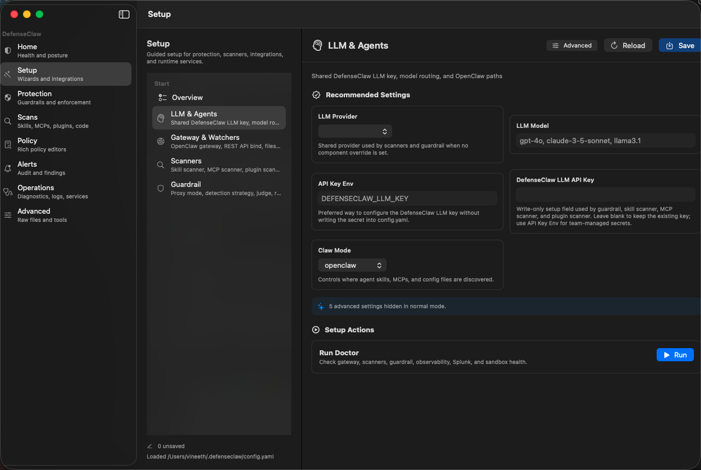
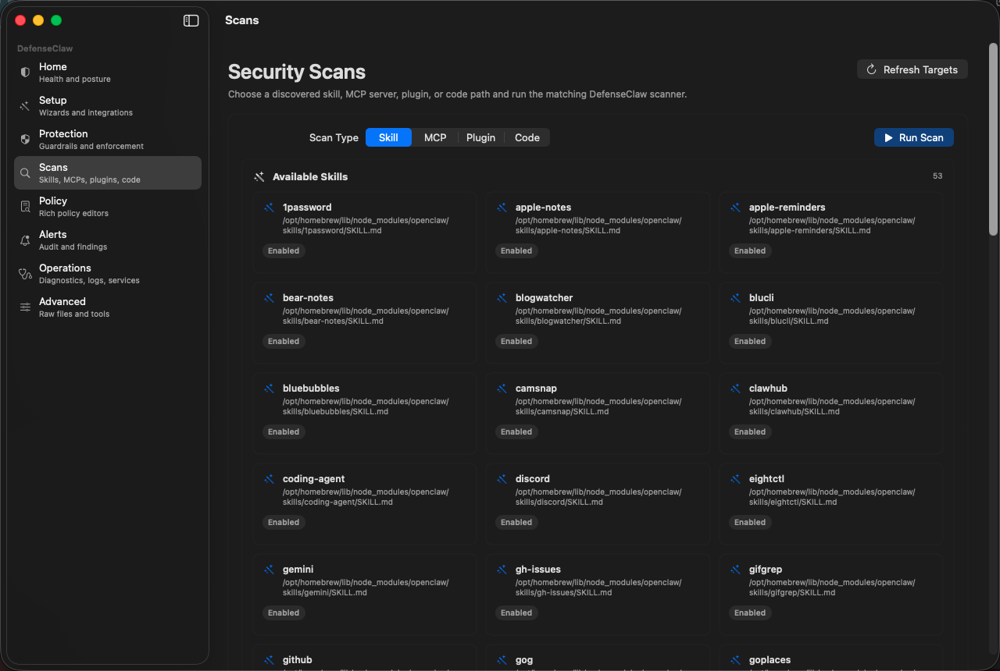
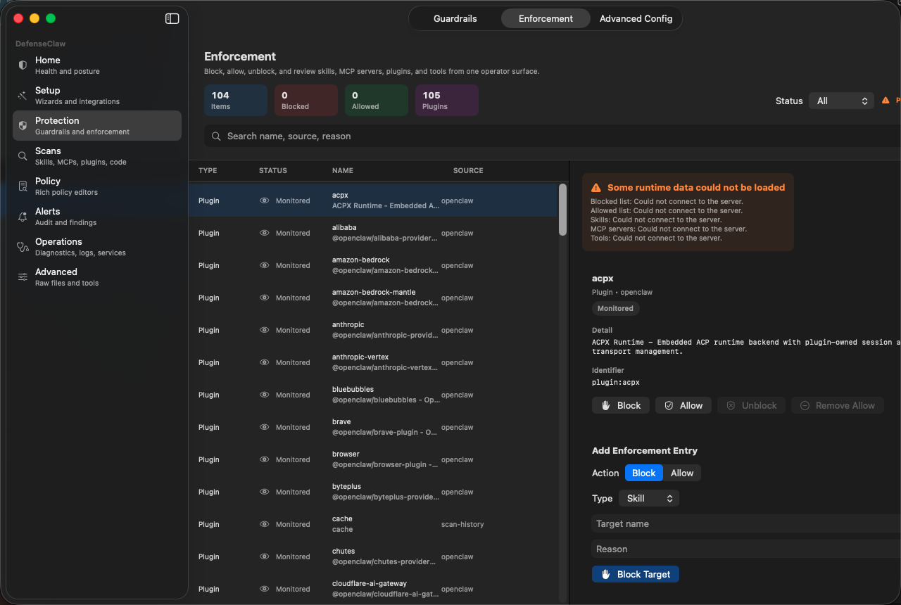
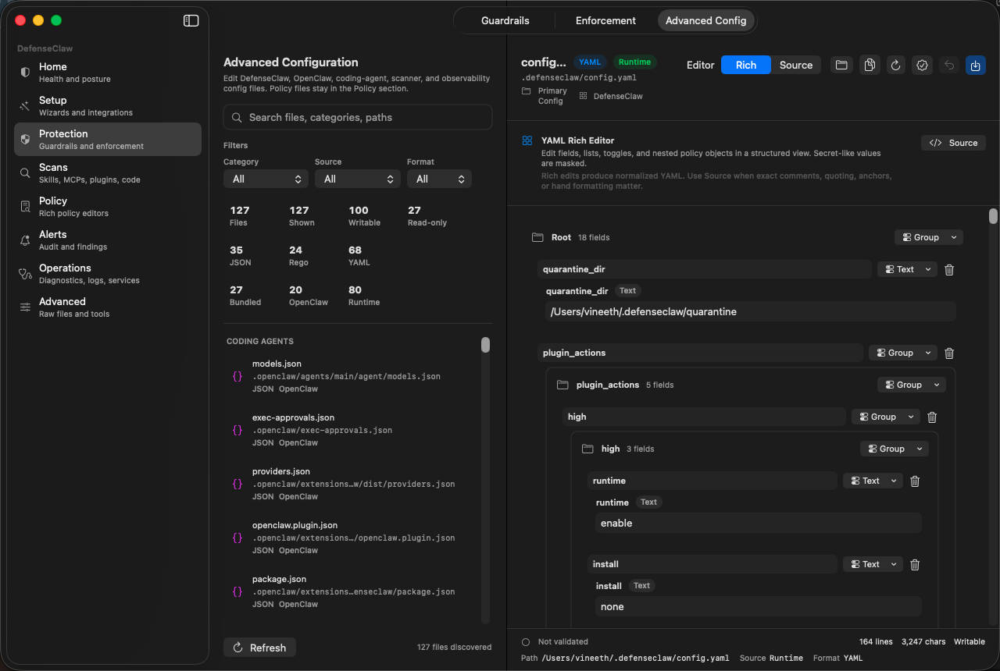

# DefenseClaw macOS App Screen Review

## Latest PR QA Screenshots

The current PR includes local app-window screenshots captured after the latest
native macOS app fixes:

| Screen | Screenshot | What it verifies |
| --- | --- | --- |
| Setup: LLM & Agents |  | The recommended setup flow exposes `API Key Env` and a visible write-only DefenseClaw LLM API key field. |
| Scans |  | The scans page lists discovered skills and provides target tabs for skills, MCP servers, plugins, and code. |
| Protection: Enforcement |  | Enforcement loads plugin inventory even when sidecar-only runtime lists are partially unavailable. |
| Protection: Advanced Config |  | Advanced Config stays inside Protection and opens the config workspace, not the Policy tab. |

Validation run for this pass:

- `swift build --package-path apps/shared`
- `swift build --package-path apps/appkit-app`
- `./script/build_and_run.sh --verify`
- `./script/build_and_run.sh --qa setup llm`
- `./script/build_and_run.sh --qa scan`
- `./script/build_and_run.sh --qa protection`
- `defenseclaw-gateway status`

`swift test --package-path apps/shared` and
`swift test --package-path apps/appkit-app` were attempted, but this local Swift
toolchain cannot import `XCTest`, so the test runner exits before executing the
test cases.

This review covers the current native macOS app screens captured by
`script/smoke_macos_app.sh` on 2026-04-27. It assumes the product direction is
that users download the macOS app and complete every human-facing DefenseClaw
operation from the app: install, setup, secrets, scanning, policy editing,
guardrail tuning, observability, alerts, logs, diagnostics, and repair.

## Executive Assessment

The app is much better than the early Tauri prototype: it is native, it starts a
sidecar, it shows real health, it has setup grouping, and it now has a rich
YAML/JSON/Rego editing path. The remaining issue is product design, not only
visual polish.

The current UI still exposes backend artifacts too early:

- raw config and policy files are prominent
- many screens are thin wrappers around fields
- empty states often say nothing about what the user should do next
- alerts, scans, enforcement, tools, and diagnostics are not yet connected into
  a clear operator workflow
- Setup and Settings overlap instead of forming one coherent setup-to-day-2 path

The target experience should be:

1. Most users start with guided outcomes.
2. Operators see domain screens that explain impact and state.
3. Advanced users can open rich or raw file editors for every YAML, JSON, and
   Rego artifact.
4. Every mutation shows validation, restart impact, and backend confirmation.

## Priority Fixes

| Priority | Area | Why it matters |
| --- | --- | --- |
| P0 | Secrets in config editors | Secret-like fields must never appear as ordinary text fields. They need masking, Keychain-backed storage, and clear secret-reference flows. |
| P0 | Empty and zero states | The app must distinguish "not configured", "not scanned yet", "backend unavailable", "endpoint empty", and "healthy empty". |
| P0 | Policy editor UX | Users need domain-specific editors for suppressions, regex rules, guardrail judge prompts, firewall rules, sandbox policies, admission decisions, and Rego rules. Generic YAML is only the fallback. |
| P1 | Setup as real workflows | Setup should guide users through outcomes, not show a field grid plus a Run button. |
| P1 | Alerts to action | Alerts need selection, detail, related policy/logs, suppress/block actions, and export. |
| P1 | Scans and enforcement data | Scan and enforcement screens need source selection, inventory readiness, actions, and useful empty states. |
| P2 | Native macOS polish | Reduce giant empty canvases, use native source-list patterns, avoid floating form islands, tighten tab/toolbar ownership, and make all primary actions keyboard/menu reachable. |

## Cross-Screen UX Principles

### Use Three Configuration Layers

Do not show every setting by default.

1. **Guided Setup:** first launch, connect coding agents, add secrets, enable
   guardrail, configure scanners, configure observability, configure webhooks.
2. **Domain Settings:** Guardrail, Gateway, Scanners, Observability,
   Enforcement, Secrets. These are curated, validated, and grouped by user goal.
3. **Advanced Files:** complete YAML/JSON/Rego workspace with rich editor and
   source editor for every managed file.

### Make Empty States Actionable

Every empty state should answer:

- Is the backend connected?
- Is the feature disabled?
- Is the scanner/inventory not run yet?
- Is this genuinely empty?
- What button should the user press next?

Examples:

- Enforcement: "No enforcement inventory loaded" should offer "Load inventory",
  "Run scan", and "Add allow/block entry".
- Scans: disabled Run button should explain which input is missing and offer a
  folder picker.
- Alerts: if rows exist, select the first row by default.

### Prefer Domain Editors Over Raw Files

Raw files remain necessary, but common policy/config editing should use rich
views:

- suppressions table
- regex rule builder
- guardrail judge prompt editor
- firewall allowlist/denylist editor
- sandbox/OpenShell policy form
- admission action matrix
- Rego package/import/rule block editor
- JSON settings form for OpenClaw/coding-agent files

Saving can still serialize back to YAML/JSON/Rego in the backend, but the user
should not have to know the file layout for normal tasks.

### Treat Backend Operations As Tasks

"Guided Workflow" should become a real task experience:

- input form
- validation
- dry run when possible
- progress
- structured result
- exact files/services changed
- restart required state
- link to logs

Raw CLI output should be hidden behind "Show raw output".

## Screen-by-Screen Review

### Home

Current strengths:

- Real sidecar status is visible.
- Health, posture, alerts, skills, tools, and enforcement are present.
- Operator workflow shortcuts are a good direction.

Problems:

- Home is still a status board, not a prioritized action center.
- "Policy Not loaded" is visible but not explained or repairable from the card.
- "Active Alerts 50" is scary, but recent alerts are repetitive and mostly
  low-information hook events.
- Metric cards look clickable but do not clearly explain where they route.

Improvements:

- Add an "Action Required" rail at the top: policy not loaded, missing secrets,
  unscanned inventory, observability endpoint missing.
- Group repeated alerts by action/target/severity instead of listing duplicates.
- Make every metric card clickable and show the next action on hover/help.
- Add a protection timeline: setup complete, guardrail enabled, scanners
  ready, policies loaded, last scan, last alert.

### Setup

Current strengths:

- Recommended vs Advanced is the right model.
- Setup categories cover LLM, gateway, scanners, guardrail, observability,
  webhooks, enforcement, and sandbox.
- Normal mode hides many low-value settings.

Problems:

- The setup group list consumes too much space and has an empty lower half.
- Most sections are still field grids with one Run button.
- "Run Doctor" in LLM setup is not a meaningful LLM onboarding action.
- Save/Reload/Run semantics are unclear: users cannot tell whether a field is
  saved, applied live, or only used for a task run.
- The app sidebar appears visually dim in several setup screenshots, making the
  app feel disabled.

Improvements:

- Turn Setup into a vertical checklist:
  - Install or repair backend
  - Add DefenseClaw LLM key
  - Connect coding agents
  - Enable guardrail
  - Configure scanners
  - Configure observability
  - Configure notifications
  - Verify with Doctor
- Each checklist item should show status: complete, missing secret, needs test,
  failed, skipped.
- Each setup group should have a clear primary action:
  - "Validate LLM key"
  - "Connect OpenClaw"
  - "Run scanner probe"
  - "Enable observe mode"
  - "Send test event"
  - "Send test webhook"
- Replace raw task output with parsed result cards, keeping "Show raw output" as
  an advanced disclosure.

### Settings Overview

Current strengths:

- It correctly says most users should not start in raw YAML.
- Role-based grouping is helpful.

Problems:

- It has too much whitespace and weak hierarchy.
- Some actions route away instead of performing the task or explaining state.
- The top tab bar duplicates the main sidebar mentally.

Improvements:

- Make Settings Overview a control center with stateful cards:
  - Backend and gateway
  - Guardrail protection
  - Scanners
  - Policies
  - Observability
  - Secrets
- Add status chips to every card.
- Keep "Config Files" as "Advanced Files" and visually separate it from normal
  settings.

### Config Files

Current strengths:

- It discovers a broad set of YAML, JSON, and Rego files.
- Rich and Source editor modes are the right direction.
- Filter/search/source/category support is useful.

Problems:

- Secret-like fields are presented as ordinary config fields.
- The file stats block is too prominent and visually noisy.
- Generic recursive editors are necessary but not yet friendly for large config
  files.
- Users may accidentally normalize comments/formatting when saving rich YAML.

Improvements:

- Mask and route secret fields to a Secrets surface.
- Rename this tab to "Advanced Files".
- Move stats into a compact toolbar or footer.
- Add domain templates for primary config files, then use the recursive editor
  only for unknown structures.
- Add a pre-save diff showing normalized output before writing YAML/JSON.
- Show restart impact after saving.

### Gateway

Current strengths:

- Shows sidecar and OpenClaw gateway running state.
- Has restart controls.

Problems:

- The form floats in the middle of a huge empty canvas.
- Host is blank in the screenshot even though defaults exist elsewhere.
- Restart actions are low-context and potentially dangerous.

Improvements:

- Use a service-control layout:
  - Current state
  - Bind addresses and ports
  - Coding-agent connection status
  - Restart required banner
  - Restart sidecar and restart gateway actions with confirmation
- Explain local vs remote gateway mode.
- Validate port conflicts before save.

### Guardrails

Current strengths:

- Live mode and scanner mode exist.
- Observe vs Action explanation is present.

Problems:

- The screen is too sparse and centered.
- It does not connect guardrail mode to policies, suppressions, judge prompts, or
  test evaluation.
- Users cannot quickly test a prompt/tool-call decision.

Improvements:

- Add a decision card for Observe vs Action mode.
- Add a "Test request" evaluator directly on the Guardrails screen.
- Show active rule pack, suppressions count, regex rules count, and judge status.
- Link to policy editors with context preserved.

### Enforcement

Current strengths:

- The intended data model is visible: items, blocked, allowed, status, details.

Problems:

- Empty state still feels like failure.
- The add action appears detached at the bottom of the detail pane.
- Enforcement is partly in Settings and partly an app-level screen.

Improvements:

- Make Enforcement a primary operational screen, not a settings tab.
- If inventory is empty, show:
  - "Run scan"
  - "Load explicit allow/block entries"
  - "Add manual entry"
- Show inventory and explicit rules together, with source labels.
- Add actions: allow, block, unblock, quarantine, restore, suppress.

### Scanners

Current strengths:

- Scanner binary paths are configurable.
- Setup has a richer scanner screen.

Problems:

- Settings Scanners is too thin compared with Setup Scanners.
- It does not show binary existence, version, policy, last scan, or coverage.

Improvements:

- Merge scanner setup and scanner settings into one scanner control surface.
- Show per-scanner readiness:
  - binary found
  - version
  - policy profile
  - analyzers enabled
  - last probe result
- Add "Install or repair scanner" and "Run probe scan".

### Diagnostics

Current strengths:

- Health, uptime, subsystem states, Doctor, logs, and file paths are present.
- This is much better than the earlier broken state.

Problems:

- "Raw Status Snapshot" shows unknown values and is confusing.
- Subsystems say "No subsystem detail reported" even when healthy.
- Doctor is buried below health cards.

Improvements:

- Put failures and warnings first.
- Parse Doctor into structured checks with remediation buttons.
- Hide raw snapshots behind Advanced.
- Add one-click repair actions: reinstall helper, restart sidecar, regenerate
  config, restore bundled policies, export diagnostics bundle.

### Scans

Current strengths:

- Has scan type, path input, and findings area.

Problems:

- Run Scan is disabled without explaining why.
- There is no file/folder picker.
- Findings area is giant and empty.
- It does not show scanner readiness.

Improvements:

- Add source pickers:
  - Choose skill folder
  - Choose MCP config/server
  - Choose repository
- Show scanner readiness before the form.
- Add recent targets and default detected targets.
- Stream scan progress and display findings grouped by severity and target.

### Policy

Current strengths:

- All policy files and guardrail rule packs are discoverable.
- Rich editor mode is now present for YAML/JSON/Rego.
- Runtime vs bundled and writable vs read-only metadata are visible.

Problems:

- The left stats and filters still dominate the policy workspace.
- A bundled read-only firewall file is selected by default, so users immediately
  hit a read-only advanced file.
- The generic rich editor is still too technical for common policy authoring.
- Policy evaluation controls are cramped and not tied to the selected policy
  domain.

Improvements:

- Default to a domain selector, not a file list:
  - Admission
  - Guardrail suppressions
  - Guardrail regex rules
  - Judge prompts
  - Firewall
  - Sandbox
  - Rego
- Use specialized rich editors per domain.
- Offer "Copy bundled policy to runtime" whenever a bundled file is selected.
- Move file counts into a compact toolbar.
- Make evaluation a right inspector or bottom result pane, with presets from
  selected inventory/alert.

### Alerts

Current strengths:

- Alerts are loading and visible now.
- Severity, time, action, and target columns exist.

Problems:

- No alert is selected by default.
- Repeated hook events crowd out meaningful security findings.
- Detail pane is empty even though rows exist.
- There are no triage actions.

Improvements:

- Auto-select the first alert.
- Group repeated events and add "show raw events".
- Detail pane should show:
  - summary
  - severity and verdict
  - actor/action/target
  - redacted payload
  - related logs
  - related policy
  - enforcement actions
- Add buttons: allow, block, suppress, open policy, open logs, export evidence.

### Tools

Current strengths:

- Tool inventory is visible.

Problems:

- The screen exposes internal tool names instead of user workflows.
- Every row has the same "Inspect" action with no visible result.
- It is unclear why a normal DefenseClaw user should care about `update_plan`,
  `read`, `write`, or `apply_patch`.

Improvements:

- Rename to "Runtime Catalog" or move behind Advanced.
- Group tools by agent/provider/source/risk.
- Show policy status and enforcement action per tool.
- Use human task labels when possible.
- Add a detail inspector with schema, permissions, recent use, and policy.

### Logs

Current strengths:

- Logs are visible in-app.
- Filters, export, and source category exist.

Problems:

- DEBUG is selected by default and is too noisy for normal users.
- There is no pause/live state.
- No row detail or correlation to alerts/tasks.

Improvements:

- Default to WARN/ERROR or "Important".
- Add source tabs: app, sidecar, gateway, guardrail, tasks.
- Add live/pause, copy row, open log file, and export filtered logs.
- Link rows to alert/request/task ids where available.

## Setup Subscreen Notes

### LLM and Agents

- The provider picker is empty in screenshots and should never appear blank.
- Add provider cards for OpenAI-compatible, Anthropic-compatible, Ollama/local,
  Cisco AI Defense, and custom endpoint if supported.
- Secret entry belongs here, but should save to Keychain or managed `.env`, not
  raw config.
- Add "Validate key" and "Test model" actions.

### Gateway and Watchers

- Recommended settings are sensible.
- Watcher toggles need plain-language descriptions: "Automatically scan changed
  skills", "Automatically act on changed skills".
- Advanced host/port/watchdog values should stay hidden for most users.

### Scanners

- Good coverage of skill/MCP/plugin/codeguard concepts.
- Add installed/missing status for each scanner binary.
- Add per-scanner probe actions and last result.

### Guardrail

- Good normal-mode grouping.
- Needs a first-class "test protection" flow and clear warning before Action
  mode.

### Enforcement Actions

- Too sparse.
- Replace booleans with an action matrix:
  - skill, MCP, plugin, tool
  - on info/medium/high/critical
  - observe, block, quarantine, allow

### Sandbox

- Clearly say execution is Linux-only on macOS.
- On macOS, frame this as "configure policy for Linux agents" rather than a
  runnable local feature.

### Observability

- The Splunk and OTel fields are useful.
- Split by destination: Splunk Observability Cloud, Splunk HEC, OTel Collector,
  Datadog-compatible, local stack.
- Add "Send test event" and "View received event" results.

### Webhooks

- The cards are useful.
- Disable Run until the URL/secret reference is valid.
- Add "Send test notification" as the primary action.
- Mask or route tokens to Secrets.

## Answers To Current Product Questions

### Do we need to show all settings?

No. Launch with recommended defaults and expose advanced settings by progressive
disclosure. Every setting should still be reachable, but most should be reached
through search or Advanced Files, not shown in the first-run path.

### What is a guided workflow?

A guided workflow is useful only if it replaces terminal knowledge. A good
workflow asks for human inputs, validates them, runs backend tasks, shows
structured success/failure, and explains what changed. A card that only displays
`defenseclaw doctor` plus raw output is not enough for frontend users.

### Why is everything zero or empty?

Usually because the screen is showing backend inventory counts before the
relevant discovery/scan/load step has happened. The UI must distinguish:

- no data yet
- feature disabled
- scanner not configured
- backend offline
- genuinely zero findings

Zero is acceptable only when the app can say why it is zero.

### Should YAML/JSON/Rego remain visible?

Yes, but only as an advanced/source fallback. Normal policy and config editing
should use domain-specific rich views that serialize to YAML/JSON/Rego behind
the scenes. The app should still preserve a source editor for exact formatting,
comments, and expert edits.

## Implementation Order

### Phase 1: Make Current Screens Trustworthy

- Mask secret-like fields in rich config editors.
- Auto-select the first alert.
- Explain disabled Run buttons.
- Replace misleading zero/empty states with actionable states.
- Move file stats into compact toolbars.

### Phase 2: Convert Setup Into Outcome-Based Wizards

- Add first-launch checklist.
- Add provider/key validation.
- Add scanner readiness and probe flows.
- Add observability/webhook test flows.
- Replace raw task output with parsed results.

### Phase 3: Build Domain Policy Editors

- Suppressions table.
- Regex rule builder.
- Judge prompt editor.
- Firewall allowlist/denylist editor.
- Sandbox policy editor.
- Rego package/import/rule editor.
- Copy bundled policy to runtime.

### Phase 4: Connect Operations

- Alert detail to enforcement/policy/logs.
- Scan results to alerts and enforcement.
- Policy evaluation using selected alert/inventory context.
- Diagnostics repair actions.

### Phase 5: Native macOS Polish

- Normalize split-view widths and empty space.
- Use native sidebars and inspectors consistently.
- Add keyboard shortcuts and commands for primary actions.
- Add contextual menus for rows.
- Add focused toolbars per scene instead of scattered buttons.

## Release-Gating Acceptance Tests

- A fresh user can install and repair the backend without terminal use.
- A user can add required secrets without exposing raw values.
- A user can configure LLM, coding agents, scanners, guardrail, Splunk/OTel, and
  webhooks from Setup.
- A user can run a skill/MCP/code scan and see findings.
- A user can open an alert, understand it, and take an enforcement/policy action.
- A user can edit suppressions, regex rules, guardrail judge prompts, firewall
  rules, sandbox policies, JSON config, and Rego through rich editors.
- A power user can switch to source editing for every YAML/JSON/Rego file.
- Diagnostics can run Doctor, parse results, and offer repair actions.
- Every save shows validation and restart impact.
