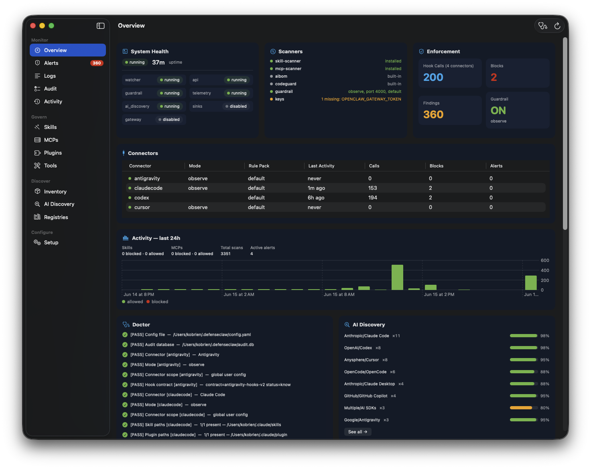

<!--
Copyright 2026 Cisco Systems, Inc. and its affiliates

Licensed under the Apache License, Version 2.0 (the "License");
you may not use this file except in compliance with the License.
You may obtain a copy of the License at

    http://www.apache.org/licenses/LICENSE-2.0

Unless required by applicable law or agreed to in writing, software
distributed under the License is distributed on an "AS IS" BASIS,
WITHOUT WARRANTIES OR CONDITIONS OF ANY KIND, either express or implied.
See the License for the specific language governing permissions and
limitations under the License.

SPDX-License-Identifier: Apache-2.0
-->

# DefenseClaw for macOS

Native SwiftUI companion app for [Cisco DefenseClaw](https://github.com/cisco-ai-defense/defenseclaw). The app provides a menu-bar status view, native dashboards and setup flows, and a unified runtime installer.



## Release package

Every DefenseClaw release builds two Apple Silicon artifacts:

- `DefenseClawMac-<version>-macos-arm64[-unverified].dmg` — the recommended unified installer. Mount it, drag `DefenseClawMac.app` to `/Applications`, launch it, then select **Install DefenseClaw Runtime** on first run.
- `DefenseClawMac-<version>-macos-arm64[-unverified].zip` — the smaller app-only artifact. Only the verified form without `-unverified` is eligible for in-app self-update; it does not replace or reinstall the independently updating runtime.

The app inside the DMG contains an embedded `Contents/Resources/RuntimePayload` with the matching release's:

- `defenseclaw-gateway` macOS arm64 binary;
- Python CLI wheel;
- dependency overrides; and
- SHA-256 payload manifest.

On first run, the app installs that payload into the user's normal DefenseClaw locations. It can download Python dependencies from PyPI and install `uv` or Python if they are missing, so the installer is unified but not fully offline. Configuration, tokens, and the audit database are preserved during install or repair.

The production GitHub release workflow Developer ID signs and notarizes the app
when all Apple credentials are available. If all five are absent, it publishes
clearly labeled, ad-hoc-signed `-unverified` artifacts for manual download and
installation. A partial credential group, or any invalid configured credential,
stops the release instead of silently falling back. The in-app self-updater
never offers `-unverified` assets and always requires code-signature and
Gatekeeper validation.

Before extracting an accepted update ZIP, the app verifies its GitHub-provided SHA-256 digest and inspects the archive manifest. It rejects empty archives, absolute or traversal paths, link entries, multiple app bundles, and content outside one top-level `.app`. After extraction it validates the bundle identity, version, runtime boundary, code signature, and Gatekeeper assessment before replacing the running app.

### Optional production Apple verification

Add these secrets to the GitHub `release` environment:

- `MACOS_DEVELOPER_ID_P12_BASE64`: base64-encoded Developer ID Application certificate and private key (`.p12`).
- `MACOS_DEVELOPER_ID_P12_PASSWORD`: password for that `.p12`.
- `MACOS_SIGNING_IDENTITY`: optional explicit `Developer ID Application: ...` identity; the script discovers it from the imported certificate when omitted.
- `MACOS_NOTARY_KEY_BASE64`: base64-encoded App Store Connect API private key (`.p8`).
- `MACOS_NOTARY_KEY_ID`: App Store Connect API key ID.
- `MACOS_NOTARY_ISSUER_ID`: App Store Connect issuer ID.

All five signing/notary values produce verified release assets. Production,
local, and pull-request builds may omit all five to produce ad-hoc-signed,
explicitly unverified manual-download assets; partial credentials fail in every
mode. Certificates are imported into a temporary keychain, sensitive temporary
files are removed on exit, and the original user keychain search list is
restored.

## Requirements

- Apple Silicon Mac (`arm64`)
- macOS 14 or newer
- Network access to GitHub and, during runtime installation, PyPI/uv/Python distribution endpoints
- Xcode 16 or newer to build from source

## Build and test

From the DefenseClaw repository root:

```bash
make macos-app-test
make macos-app-build
```

To reproduce the full release package locally:

```bash
make extensions
make dist-cli
make macos-app-release
```

The last target writes the unified DMG and app-only update zip to `dist/`.
Local invocations without Apple credentials produce ad-hoc artifacts carrying
the `-unverified` suffix. The production workflow signs and notarizes when the
complete credential set is available; with no credentials it publishes only
the clearly named manual-download artifacts, never an in-app update.

## Runtime connections

The app connects only to the local DefenseClaw installation:

| Source | Path / address |
|---|---|
| Gateway REST API | `http://127.0.0.1:<gateway.api_port>` (default 18970) |
| Audit DB (read-only) | `~/.defenseclaw/audit.db` |
| Event stream | `~/.defenseclaw/gateway.jsonl` |
| Logs | `~/.defenseclaw/gateway.log`, `~/.defenseclaw/watchdog.log` |
| Configuration | `~/.defenseclaw/config.yaml`, `~/.defenseclaw/.env` |
| Actions | `defenseclaw`, `defenseclaw-gateway` |

Read-only state is loaded from local files or the gateway. State-changing operations run through the DefenseClaw CLI and appear in the Activity panel. Secrets are sent over hidden standard input rather than command-line arguments.

## Maintaining the imported app

The source was imported from the standalone macOS repository. See [UPSTREAM.md](UPSTREAM.md) for provenance and [UPDATING.md](UPDATING.md) for the exact refresh, licensing, build, and review procedure.

All source is licensed under the repository's Apache License 2.0. See [LICENSE](../../LICENSE), [NOTICE](../../NOTICE), and [ASSET_LICENSES.md](ASSET_LICENSES.md).
