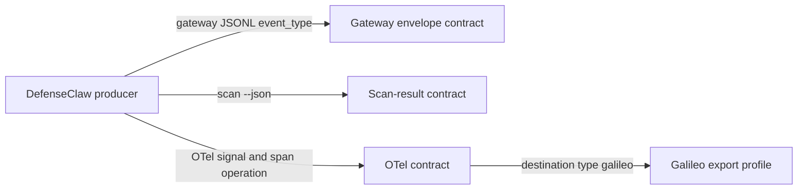

# Schema ownership and enforcement

`schemas/` is the canonical source for every public DefenseClaw wire contract.
Operators do not select a schema during setup. The producer and signal choose
the contract automatically:

There are three enforcement levels:

- **Runtime gate**: a payload is validated before it is written or accepted.
- **CI conformance**: tests emit the real Go payload and compare its shape to
  the schema. This avoids adding JSON-schema work to the hot path.
- **Reference contract**: published for consumers, but not presently used as a
  runtime validator. Do not describe these as runtime-enforced.

## Ownership map

| Canonical contract | Producer / consumer | Enforcement | Binary copy |
|---|---|---|---|
| `gateway-event-envelope.json` | `internal/gatewaylog.Writer`; JSONL and downstream SIEM consumers | Runtime gate in `internal/gatewaylog.Validator`; E2E golden validation | `internal/gatewaylog/schemas/` |
| `scan-event.json`, `scan-finding-event.json`, `activity-event.json` | Payloads selected by the gateway envelope's `event_type` discriminator | Runtime gate as referenced children of the gateway envelope | `internal/gatewaylog/schemas/` |
| `scan-result.json` | `defenseclaw scan code --json`; `--schema` prints the contract | Go shape tests and downstream validation | `internal/cli/embed/scan-result.json` |
| `audit-event.json` | SQLite audit rows and `defenseclaw audit export` | Audit action parity, exporter, and E2E tests | None |
| `hook-audit-envelope.json` | Structured connector-hook audit payload | Go/schema constant and parity tests | None |
| `network-egress-event.json` | Network-egress audit consumers | Reference contract; behavior is covered by Go tests | None |
| `registry-manifest.schema.json` | Python registry manifest loader | Runtime validation, with a security-equivalent fallback validator | None |
| `otel/resource.schema.json` | Shared OTel resource attributes | CI parity with configuration and connector enums | None |
| `otel/metrics.schema.json` | All DefenseClaw OTel metrics | CI compares the complete catalog to instruments declared in `metrics.go` | None |
| `otel/runtime-agent-span.schema.json` | Runtime agent spans | CI emits a real span and compares its complete attribute set | None |
| `otel/agent-lifecycle-event.schema.json` | Connector-neutral session, resume, root-agent, and subagent correlation shared by logs and spans | Reference invariant plus gateway/telemetry tests | None |
| `otel/runtime-llm-span.schema.json` | Runtime `chat {model}` spans | CI emits a real span and compares its complete attribute set | None |
| `otel/runtime-tool-span.schema.json` | Runtime tool-execution spans | CI emits a real span and compares its complete attribute set | None |
| `otel/runtime-approval-span.schema.json` | Runtime approval spans | CI emits a real span and compares its complete attribute set | None |
| `otel/galileo-export-profile.schema.json` | Galileo destination filter | CI parity with the LLM contract and Galileo setup preset | None |
| Other `otel/*-event.schema.json` files | OTel log/event consumers | Reference contracts plus subsystem tests | None |

## Why any copies exist

Go's `go:embed` packages schemas into a single DefenseClaw binary. Those files
must physically live under the Go package being compiled, so a small number of
byte-identical copies are intentional:

- Four gateway schemas under `internal/gatewaylog/schemas/` let strict JSONL
  validation work without a repository checkout.
- `internal/cli/embed/scan-result.json` lets `defenseclaw scan code --schema`
  work from an installed binary.

`make check-schemas` verifies those copies byte-for-byte. The CLI check derives
the allowed copies from actual `//go:embed` directives and fails on an
unreferenced JSON file, so a duplicate cannot silently become a second source
of truth.

## Similar names are transport projections

Some contracts describe the same domain event on different transports, but
they are not interchangeable duplicates:

| Domain concept | Gateway / CLI shape | OTel shape |
|---|---|---|
| Scan result | `scan-result.json` or `scan-event.json` | `otel/scan-result-event.schema.json` |
| Scan finding | `scan-finding-event.json` | `otel/scan-finding-event.schema.json` |
| Asset activity | `activity-event.json` | `otel/asset-lifecycle-event.schema.json` |
| LLM execution | Gateway audit/evidence fields | `otel/runtime-llm-span.schema.json` |

The domain meaning should stay aligned, while each transport owns its envelope
and field representation. OTel GenAI attributes (`gen_ai.*`) are the portable
semantic layer; `defenseclaw.*` attributes add the security and policy context.
The Galileo export profile selects a valid subset of that OTel contract and
does not redefine either layer.

## Change workflow

1. Edit the canonical file in `schemas/`.
2. If it has a binary copy, update that exact copy in the same change.
3. Update the real producer and its contract test; do not validate a hand-built
   fixture when the producer can emit the payload.
4. Run `make check-schemas` and the owning package tests.
5. Document breaking field, default, or routing changes for operators.

For OTel, a schema file does not route telemetry. Routing is controlled by the
configured destination. The Galileo profile admits completed `chat`,
`invoke_agent`, and `execute_tool` spans when their operation-specific GenAI
fields are present. The health API and TUI separate schema eligibility from
OTLP delivery acknowledgement; there is no schema picker in the setup wizard.
