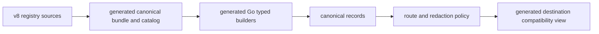

# Schema ownership and enforcement

DefenseClaw v8 has two schema authorities, one for configuration and one for
canonical telemetry:

- `config/v8/defenseclaw-config.schema.json` is the source-configuration
  authority. The YAML example and Markdown catalog in `config/v8/reference/`
  are generated views; do not edit them directly.
- `telemetry/v8/registry.yaml`, `genai.yaml`, `security.yaml`, and
  `operations.yaml` are the canonical telemetry authoring set. The semantic
  convention lock, curated examples, redaction detector catalog, and its schema
  are reviewed inputs to the same compiler.

Operators do not select a schema during setup. The v8 compiler resolves the
configured buckets, routes, redaction profiles, signals, and destination
capabilities; producers build canonical records through generated typed APIs;
destinations then render generated compatibility projections.



## Ownership map

| Path | Ownership | Enforcement / use |
|---|---|---|
| `config/v8/defenseclaw-config.schema.json` | Hand-authored canonical v8 configuration schema | Go/Python validation and observability graph compilation |
| `config/v8/reference/` | Generated configuration reference | Drift-checked presentation of the configuration schema |
| `telemetry/v8/registry.yaml`, `genai.yaml`, `security.yaml`, `operations.yaml` | Hand-authored canonical v8 telemetry registry | Compiled as one closed candidate; field ownership, buckets, privacy classes, mandatory fields, and family identities are validated together |
| `telemetry/v8/semconv.lock.yaml`, `examples.yaml`, `upstream/`, `redaction/` | Reviewed registry inputs | Pinned dependency provenance, conformance examples, and redaction detector contracts |
| `telemetry/runtime/telemetry.schema.json.gz`, `catalog.json.gz` | Generated canonical runtime views | Deterministic gzip assets embedded by Go and expanded to raw JSON for the Python wheel |
| `telemetry/runtime/compatibility/*.json.gz` | Generated destination/consumer views | Galileo, OpenInference, local-observability, and v7 migration projections; these do not become canonical producer schemas |
| `internal/observability/zz_generated_telemetry_*.go` (repo-root path, outside `schemas/`) | Generated runtime API and metadata | Typed family builders, IDs, catalog data, producer mappings, and builder fixtures |
| Top-level `*.json` and `otel/*.schema.json` | Retained public v7 compatibility/reference contracts | Fixed-path, Draft 2020-12, producer-parity, fixture, and mirror checks where applicable; not v8 telemetry authoring sources |
| `registry-manifest.schema.json` | Registry manifest contract outside the v8 telemetry family registry | Runtime validation by the manifest loader |

The compiler's logical artifact names use
`schemas/telemetry/generated/*.json`. Those raw JSON paths are not checked in.
Git stores their byte-equivalent deterministic gzip members under
`schemas/telemetry/runtime/`; package staging expands them back to stable raw
JSON resource names. Do not create a hand-maintained `telemetry/generated/`
tree.

## Compatibility and legacy public paths

The existing top-level event schemas and `schemas/otel/` family schemas remain
published because v7 consumers, embedded CLI surfaces, migration inventories,
and downstream integrations may depend on their paths. They are compatibility
and reference obligations, not a second source of canonical v8 semantics.

Some are still exercised by strict legacy runtime or CI gates. That enforcement
does not transfer v8 ownership back to them. A v8 family change begins in the
telemetry registry; compatibility impact on every retained public path is then
reviewed and checked explicitly. New v8 standalone schemas, when a consumer
requires one, must be generated views of the canonical bundle rather than a
separately authored contract.

## Generated v8 configuration reference

The exhaustive YAML and Markdown views under `config/v8/reference/` are
generated from the configuration schema. The generator validates the YAML
against the schema, requires coverage of observability source fields and
destination kinds, and renders the field catalog from the schema itself.

```sh
python scripts/generate_observability_v8_reference.py --write
make check-schemas
```

`make _bundle-data` stages byte-identical install-time copies under
`cli/defenseclaw/_data/config/v8/`. That tree is disposable package staging;
the checked-in configuration authority remains under `schemas/config/v8/`.

## Generated v8 telemetry workflow

For a telemetry family, attribute, bucket, privacy classification, or projection
change:

1. Edit the appropriate source under `telemetry/v8/`. Do not edit the runtime
   gzip members or generated Go files.
2. Regenerate the complete owned output set with `make telemetry-generate`.
3. Update producers through the generated typed builder API and update the
   destination/consumer fixtures affected by the semantic change.
4. Run `make telemetry-check`, `make check-schemas`, and the owning Go/Python
   tests.
5. Review the generated semantic diff and document any operator-visible field,
   default, privacy, routing, or compatibility change.

The generator publishes the runtime gzip assets and
`internal/observability/zz_generated_telemetry_*.go` as one deterministic
candidate set. CI rejects missing, stale, extra, or manually edited outputs.

### Bucket catalog changes

An operator never adds a bucket here; config may only reference catalog-v1 names.
A developer bucket change is a versioned contract change across both authorities:

1. Update the envelope bucket enum and affected family assignments in the
   telemetry v8 authoring set.
2. Update the config-v8 schema's closed `bucketName`/list bounds and regenerate
   `config/v8/reference/`.
3. Update the current closed runtime/compiler bindings in
   `internal/observability/taxonomy.go` and
   `scripts/telemetry_go_api_plan.py`; bump catalog/version contracts when the
   compatibility policy requires it.
4. Regenerate and review every runtime catalog, compatibility projection,
   producer fixture, route default, example, and dashboard query.
5. Run `make telemetry-check`, `make check-schemas`,
   `make check-observability-v8-spec`, and the affected Go/Python tests.

Do not add a bucket by editing a generated catalog or destination profile. A
destination selects canonical families; it does not own their classification.

### Redaction contract changes

Field class and sensitivity are authored with each canonical registry field.
Detector definitions and their closed version live in
`telemetry/v8/redaction/detector-catalog-v1.yaml`, validated by the adjacent
schema; Unicode normalization input is the pinned
`unicode-age-13.0.json`. Built-in profile composition and projection behavior are
implemented under `internal/observability/redaction/`, while operator custom
profile shape is owned by the config-v8 schema.

A detector, field-class, built-in mode, marker, key-domain, or failure-semantics
change must update cross-language golden/conformance fixtures and compatibility
projections in the same change. Run the telemetry/schema gates plus the complete
redaction package tests. Never weaken failure behavior to raw fallback: field
processing failures produce safe whole-field results, while record-level
classification/serialization failures make that destination projection
ineligible and leave independently successful destinations unchanged.

## Why some byte copies still exist

Go's `go:embed` requires files to live below the package being compiled, and an
installed CLI must be able to return certain compatibility schemas without a
repository checkout. The gateway and CLI therefore retain a small set of
byte-identical legacy schema mirrors. `make check-schemas` derives and verifies
the allowed mirrors, rejects unreferenced copies, validates the retained public
inventory, and also invokes the v8 telemetry compiler in check mode.

For runtime v8 access, `schemas/embed.go` exposes copy-safe configuration,
registry, lock, bundle, catalog, and compatibility-profile bytes. Callers must
not parse the authoring YAML to make routing or schema decisions at runtime.

## Transport projections do not change ownership

The same domain concept may have a retained v7 gateway/CLI schema, a canonical
v8 family, and one or more generated destination views. These are not
interchangeable sources:

| Domain concept | Retained compatibility/reference path | Canonical v8 / generated view |
|---|---|---|
| Scan result | `scan-result.json`, `scan-event.json`, `otel/scan-result-event.schema.json` | Registry scan family and generated bundle/catalog |
| Scan finding | `scan-finding-event.json`, `otel/scan-finding-event.schema.json` | Registry finding family and destination projection |
| Asset activity | `activity-event.json`, `otel/asset-lifecycle-event.schema.json` | Registry activity family and local-observability projection |
| LLM execution | `otel/runtime-llm-span.schema.json` | Canonical model-call span and Galileo/OpenInference projections |

OTel/GenAI attributes are the portable semantic layer;
`defenseclaw.*` adds security, policy, lifecycle, provenance, and privacy
context. A Galileo, OpenInference, or local-observability compatibility profile
selects or derives a closed view of an already-redacted canonical record. It
does not redefine the source family, change bucket ownership, or route telemetry
by itself.
